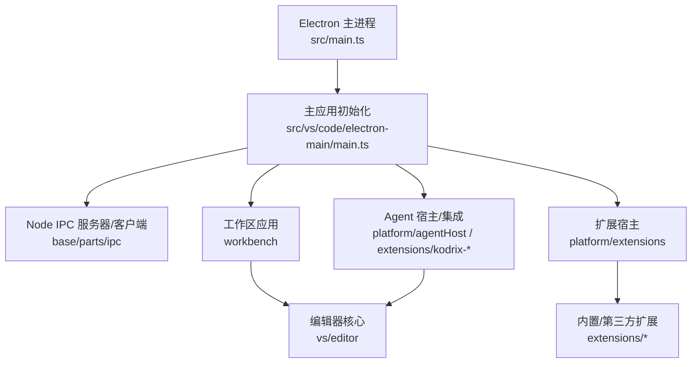
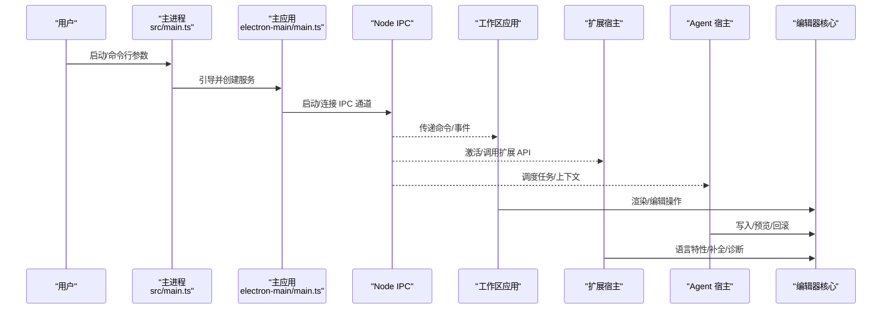
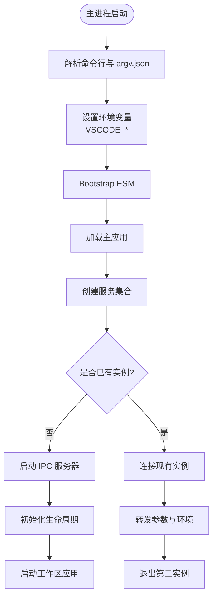
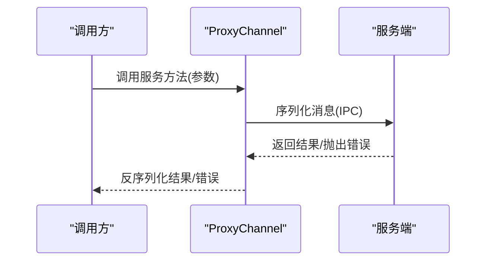
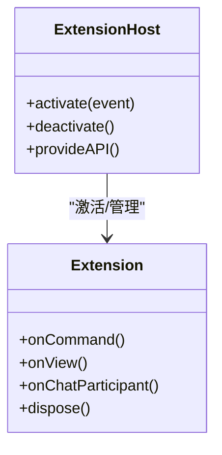
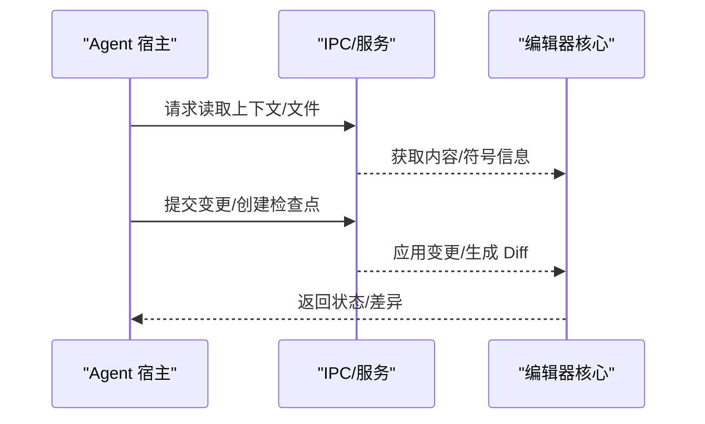
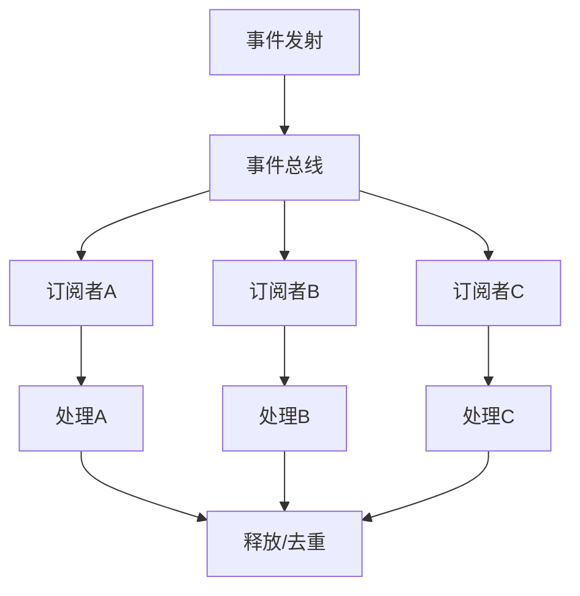
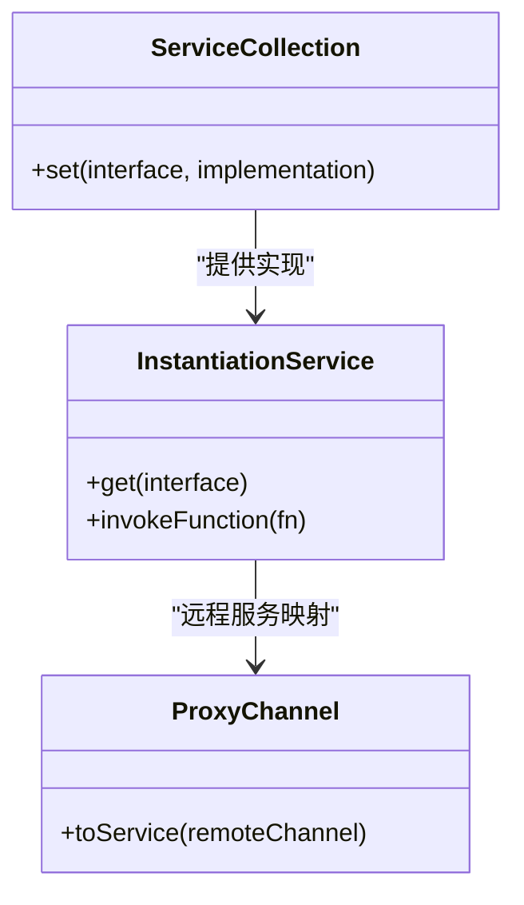
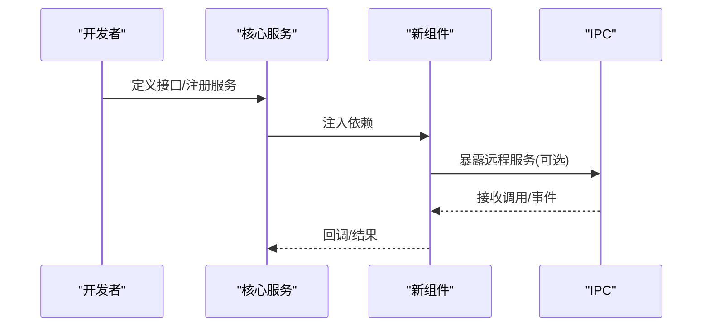
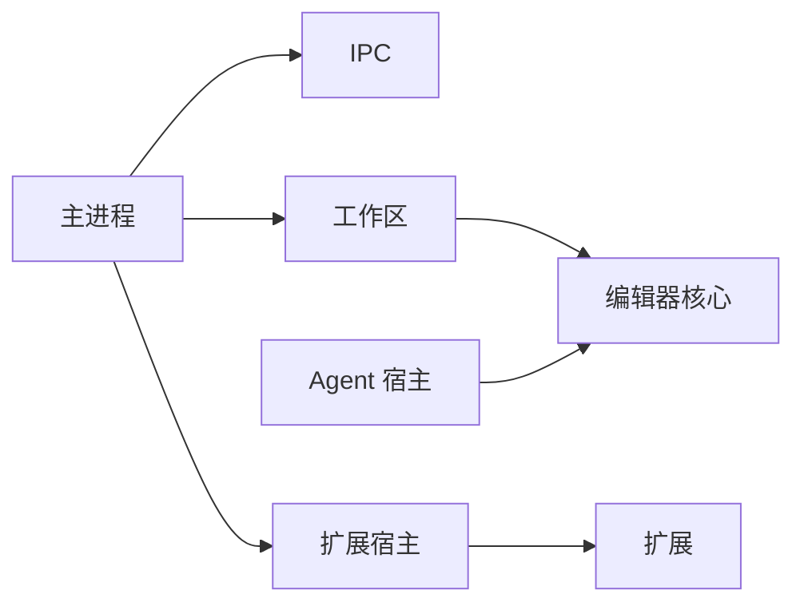

# 组件交互模式

<cite>
**本文引用的文件**
- [src/main.ts](file://src/main.ts)
- [src/vs/code/electron-main/main.ts](file://src/vs/code/electron-main/main.ts)
- [package.json](file://package.json)
- [extensions/kodrix-agent-os/package.json](file://extensions/kodrix-agent-os/package.json)
- [extensions/kodrix-local/package.json](file://extensions/kodrix-local/package.json)
- [extensions/kodrix-skills/package.json](file://extensions/kodrix-skills/package.json)
- [scripts/sync-agent-host-protocol.ts](file://scripts/sync-agent-host-protocol.ts)
</cite>

## 目录
1. [简介](#简介)
2. [项目结构](#项目结构)
3. [核心组件](#核心组件)
4. [架构总览](#架构总览)
5. [详细组件分析](#详细组件分析)
6. [依赖关系分析](#依赖关系分析)
7. [性能考虑](#性能考虑)
8. [故障排查指南](#故障排查指南)
9. [结论](#结论)
10. [附录：接口与消息约定](#附录接口与消息约定)

## 简介
本文件面向架构师与核心开发者，系统化梳理 Kodrix Code 的组件交互模式，覆盖以下关键主题：
- 主进程与渲染进程的通信机制（IPC）
- 扩展宿主与扩展之间的协议与生命周期
- Agent 系统与编辑器核心的协作方式
- 事件总线的设计与使用模式（事件类型、监听器管理、性能考量）
- 服务发现与服务注册机制
- 新增组件时的正确接入方式与设计原则

文档通过架构图、序列图、流程图和接口定义，帮助读者快速理解并安全地扩展系统。

## 项目结构
Kodrix Code 基于 Electron 的多进程架构，核心入口位于主进程，随后加载工作区应用；扩展以独立模块形式提供能力；Agent 相关能力通过扩展或专用宿主进行集成。

图表来源
- [src/main.ts:155-220](file://src/main.ts#L155-L220)
- [src/vs/code/electron-main/main.ts:101-160](file://src/vs/code/electron-main/main.ts#L101-L160)

章节来源
- [src/main.ts:155-220](file://src/main.ts#L155-L220)
- [src/vs/code/electron-main/main.ts:101-160](file://src/vs/code/electron-main/main.ts#L101-L160)

## 核心组件
- 主进程（Electron Main）：负责启动、配置、单实例控制、IPC 通道建立、崩溃上报等。
- 工作区应用（Workbench）：承载 UI、命令、视图、编辑器等。
- 扩展宿主（Extension Host）：加载、激活、隔离运行扩展代码，暴露 API。
- Agent 宿主/集成：协调 Agent 任务、上下文、记忆、技能等，与编辑器核心交互。
- 编辑器核心（Editor Core）：提供编辑、语言特性、命令、状态管理等。

章节来源
- [src/main.ts:155-220](file://src/main.ts#L155-L220)
- [src/vs/code/electron-main/main.ts:101-160](file://src/vs/code/electron-main/main.ts#L101-L160)

## 架构总览
下图展示主进程到工作区、扩展宿主、Agent 宿主的整体交互路径，以及 Node IPC 在其中的作用。

图表来源
- [src/main.ts:155-220](file://src/main.ts#L155-L220)
- [src/vs/code/electron-main/main.ts:101-160](file://src/vs/code/electron-main/main.ts#L101-L160)

## 详细组件分析

### 主进程与工作区应用的启动流程
主进程负责解析参数、设置环境变量、启动崩溃报告、加载主应用；主应用创建服务集合、建立 IPC、处理单实例冲突、启动工作区。

图表来源
- [src/main.ts:155-220](file://src/main.ts#L155-L220)
- [src/vs/code/electron-main/main.ts:351-479](file://src/vs/code/electron-main/main.ts#L351-L479)

章节来源
- [src/main.ts:155-220](file://src/main.ts#L155-L220)
- [src/vs/code/electron-main/main.ts:351-479](file://src/vs/code/electron-main/main.ts#L351-L479)

### IPC 通信机制与消息格式
- 传输层：基于 Node IPC（命名管道/套接字），通过 ProxyChannel 将远程服务映射为本地接口。
- 通道模型：主进程启动 IPC 服务器，工作区/扩展/Agent 通过通道调用服务方法。
- 消息格式：采用结构化对象（如命令名+参数），由框架序列化/反序列化；错误通过异常或结果对象返回。
- 典型用法：
  - 主进程向工作区发送“打开文件/窗口”命令
  - 扩展通过宿主 API 调用编辑器服务
  - Agent 宿主通过 IPC 请求编辑器执行变更

图表来源
- [src/vs/code/electron-main/main.ts:25-27](file://src/vs/code/electron-main/main.ts#L25-L27)
- [src/vs/code/electron-main/main.ts:431-433](file://src/vs/code/electron-main/main.ts#L431-L433)

章节来源
- [src/vs/code/electron-main/main.ts:25-27](file://src/vs/code/electron-main/main.ts#L25-L27)
- [src/vs/code/electron-main/main.ts:431-433](file://src/vs/code/electron-main/main.ts#L431-L433)

### 扩展宿主与扩展的交互
- 扩展清单：每个扩展通过 package.json 声明贡献点、激活事件、API 使用范围。
- 生命周期：按激活事件（命令、视图、聊天参与者等）懒加载，避免启动阻塞。
- 资源管理：所有定时器、监听器、I/O 必须在 deactivate 中释放，避免泄漏。
- 安全：对用户输入进行路径校验、网络请求超时与大小限制、禁止硬编码密钥。

图表来源
- [extensions/kodrix-agent-os/package.json](file://extensions/kodrix-agent-os/package.json)
- [extensions/kodrix-local/package.json](file://extensions/kodrix-local/package.json)
- [extensions/kodrix-skills/package.json](file://extensions/kodrix-skills/package.json)

章节来源
- [extensions/kodrix-agent-os/package.json](file://extensions/kodrix-agent-os/package.json)
- [extensions/kodrix-local/package.json](file://extensions/kodrix-local/package.json)
- [extensions/kodrix-skills/package.json](file://extensions/kodrix-skills/package.json)

### Agent 系统与编辑器核心的协作
- Agent 宿主负责编排任务、组装上下文（Memory/Wiki/Learning）、与编辑器交互（读取/写入/预览）。
- 编辑器核心提供变更、撤销、检查点、Diff 等能力；Agent 通过 IPC 或服务调用触发。
- 建议：对大改动采用 Checkpoint 与 Diff 画廊，支持逐文件接受/拒绝/修改。

图表来源
- [src/vs/code/electron-main/main.ts:101-160](file://src/vs/code/electron-main/main.ts#L101-L160)

章节来源
- [src/vs/code/electron-main/main.ts:101-160](file://src/vs/code/electron-main/main.ts#L101-L160)

### 事件总线设计与使用模式
- 事件类型：UI 事件、编辑器事件、文件系统事件、Agent 任务事件等，需明确命名空间与版本。
- 监听器管理：集中注册/注销，避免内存泄漏；在 deactivate 中清理。
- 性能考虑：批量事件合并、节流/防抖、按需订阅；避免在主线程同步处理耗时逻辑。
- 最佳实践：事件载荷最小化、使用不可变数据、失败重试与幂等设计。

[本节为概念性说明，不直接引用具体文件]

### 服务发现与服务注册机制
- 服务注册：通过服务集合（ServiceCollection）在服务初始化阶段注册抽象接口与实现。
- 服务发现：通过注入器（InstantiationService）按接口名称解析实现，支持同步/异步描述符。
- 扩展服务：扩展可通过贡献点注册服务，或由宿主统一装配。
- 代理服务：通过 ProxyChannel 将远程服务映射为本地接口，便于跨进程调用。

图表来源
- [src/vs/code/electron-main/main.ts:166-295](file://src/vs/code/electron-main/main.ts#L166-L295)
- [src/vs/code/electron-main/main.ts:431-433](file://src/vs/code/electron-main/main.ts#L431-L433)

章节来源
- [src/vs/code/electron-main/main.ts:166-295](file://src/vs/code/electron-main/main.ts#L166-L295)
- [src/vs/code/electron-main/main.ts:431-433](file://src/vs/code/electron-main/main.ts#L431-L433)

### 如何添加新组件并建立正确的交互关系
步骤建议：
1. 明确职责边界：确定组件属于主进程、工作区、扩展宿主还是 Agent 宿主。
2. 定义接口：在 common 层定义稳定接口，避免跨进程耦合。
3. 注册服务：在服务集合中注册实现，或通过扩展贡献点暴露。
4. 建立 IPC：如需跨进程，使用 ProxyChannel 暴露服务方法。
5. 事件发布：定义事件类型与载荷，确保订阅者能安全消费。
6. 生命周期：在 activate/deactivate 中管理资源，确保无泄漏。
7. 测试与验证：编写单元/集成测试，覆盖正常与异常路径。

[本节为概念性说明，不直接引用具体文件]

## 依赖关系分析
- 主进程依赖 Electron、Node IPC、日志、配置、文件系统等基础服务。
- 工作区依赖编辑器、命令、视图、主题、遥测等。
- 扩展宿主依赖扩展清单、激活事件、API 沙箱。
- Agent 宿主依赖编辑器核心、文件系统、存储、网络等。

图表来源
- [src/main.ts:155-220](file://src/main.ts#L155-L220)
- [src/vs/code/electron-main/main.ts:101-160](file://src/vs/code/electron-main/main.ts#L101-L160)

章节来源
- [src/main.ts:155-220](file://src/main.ts#L155-L220)
- [src/vs/code/electron-main/main.ts:101-160](file://src/vs/code/electron-main/main.ts#L101-L160)

## 性能考虑
- 启动优化：延迟创建重型服务（如 spdlog），减少主线程阻塞。
- IPC 效率：批量消息、避免频繁小消息；使用 ProxyChannel 减少序列化开销。
- 事件性能：合并高频事件、节流/防抖、异步处理耗时逻辑。
- 扩展激活：使用懒激活事件，避免一次性加载全部扩展。
- 内存管理：及时释放监听器、定时器、文件句柄；在 deactivate 中统一清理。

[本节为通用指导，不直接引用具体文件]

## 故障排查指南
常见问题与定位要点：
- 多实例冲突：主进程尝试启动 IPC 服务器失败时，会连接现有实例并转发参数；若连接失败，可能残留句柄需清理。
- 权限问题：无法写入用户数据目录时，显示提示并列出需要可写的目录。
- 崩溃上报：根据配置启用本地转储或上传至服务端；开发环境默认禁用上传。
- 扩展激活失败：检查激活事件、API 可用性、资源释放；查看输出通道日志。
- Agent 任务失败：确认上下文完整性、权限、网络超时；记录错误堆栈与重试策略。

章节来源
- [src/vs/code/electron-main/main.ts:351-479](file://src/vs/code/electron-main/main.ts#L351-L479)
- [src/vs/code/electron-main/main.ts:481-505](file://src/vs/code/electron-main/main.ts#L481-L505)
- [src/main.ts:509-599](file://src/main.ts#L509-L599)

## 结论
Kodrix Code 通过清晰的主进程-工作区-扩展-Agent 分层与稳定的 IPC 机制，实现了高内聚、低耦合的组件交互。遵循本文的接口定义、事件模式与服务注册规范，可安全扩展系统能力，同时保持性能与稳定性。

[本节为总结性内容，不直接引用具体文件]

## 附录：接口与消息约定
- IPC 通道命名：建议使用语义化名称（如 launch、diagnostics、editor、agent）。
- 消息结构：包含 method、params、id；响应包含 id、result/error。
- 错误码：统一错误分类（参数错误、权限错误、网络错误、内部错误）。
- 事件命名：使用命名空间前缀（如 editor、agent、extension）。
- 版本兼容：接口变更需向后兼容，废弃字段需标记并保留过渡期。

[本节为约定性说明，不直接引用具体文件]