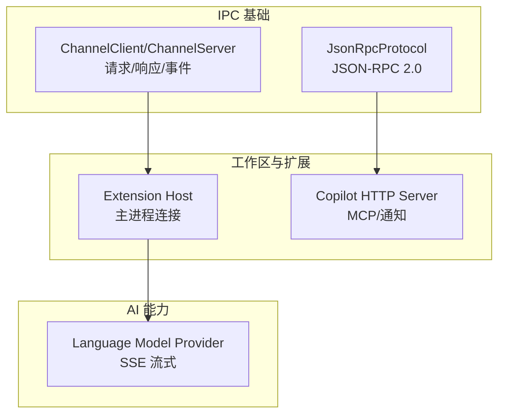
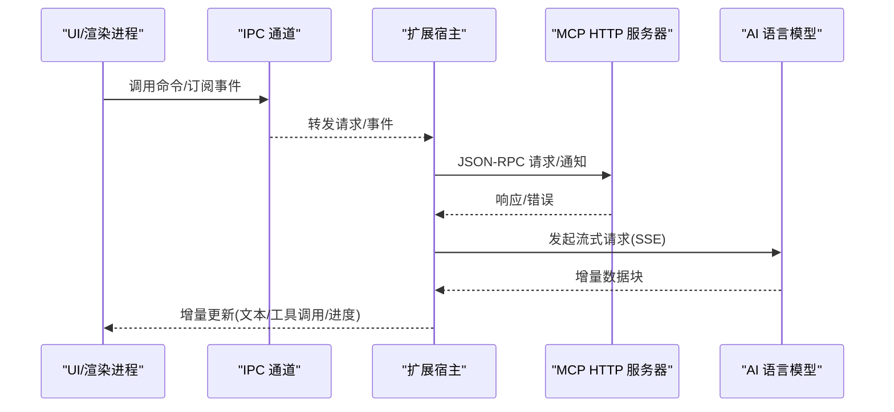
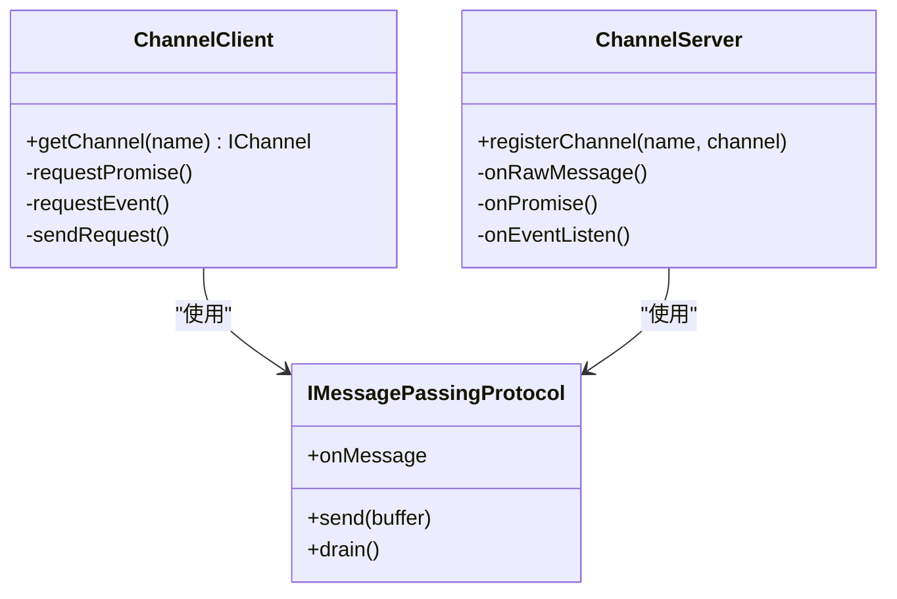
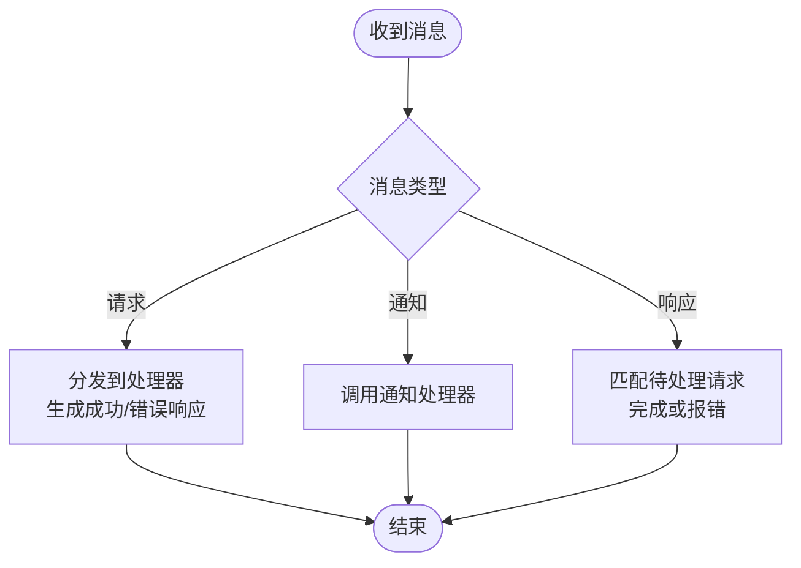
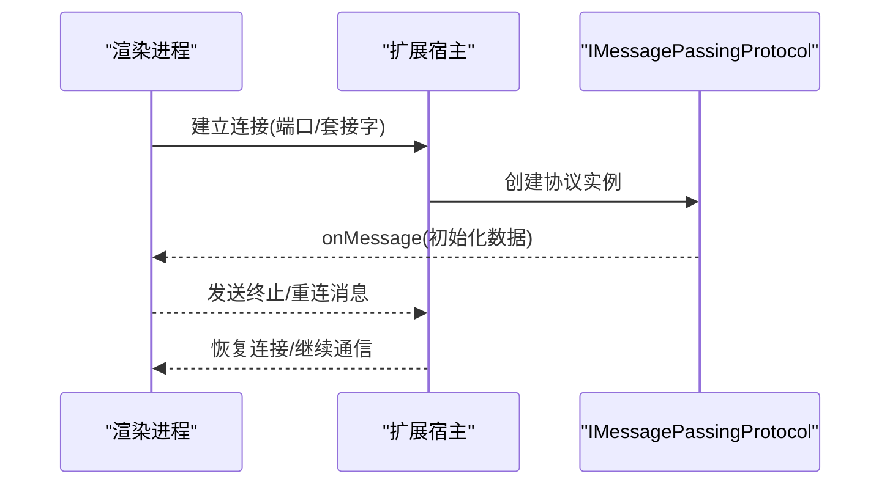
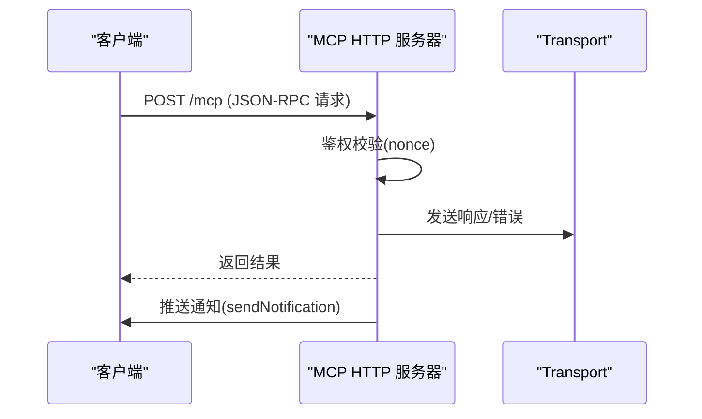
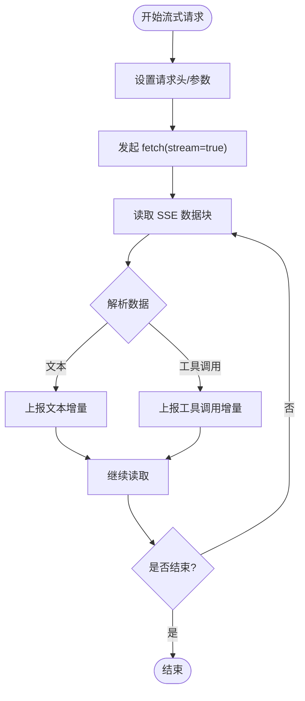
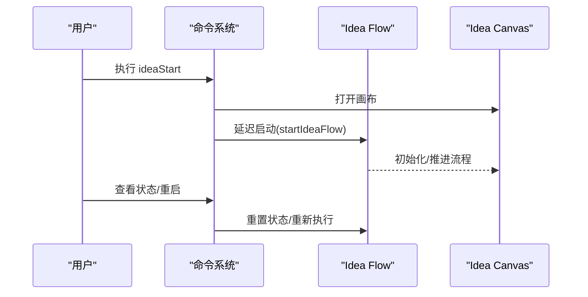
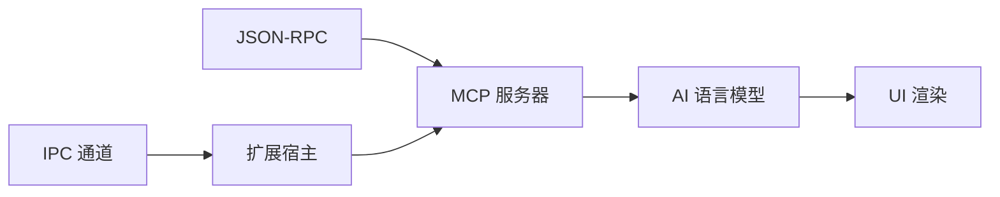

# 组件交互模式

<cite>
**本文引用的文件**
- [src/vs/base/parts/ipc/common/ipc.ts](file://src/vs/base/parts/ipc/common/ipc.ts)
- [src/vs/base/common/jsonRpcProtocol.ts](file://src/vs/base/common/jsonRpcProtocol.ts)
- [src/vs/workbench/api/node/extensionHostProcess.ts](file://src/vs/workbench/api/node/extensionHostProcess.ts)
- [extensions/copilot/src/extension/chatSessions/copilotcli/vscode-node/inProcHttpServer.ts](file://extensions/copilot/src/extension/chatSessions/copilotcli/vscode-node/inProcHttpServer.ts)
- [src/vs/platform/agentHost/common/state/protocol/common/messages.ts](file://src/vs/platform/agentHost/common/state/protocol/common/messages.ts)
- [extensions/kodrix-local/src/languageModelProvider.ts](file://extensions/kodrix-local/src/languageModelProvider.ts)
- [extensions/kodrix-agent-os/src/experience/ideaFlow.ts](file://extensions/kodrix-agent-os/src/experience/ideaFlow.ts)
</cite>

## 目录
1. [简介](#简介)
2. [项目结构](#项目结构)
3. [核心组件](#核心组件)
4. [架构总览](#架构总览)
5. [详细组件分析](#详细组件分析)
6. [依赖关系分析](#依赖关系分析)
7. [性能考虑](#性能考虑)
8. [故障排查指南](#故障排查指南)
9. [结论](#结论)
10. [附录：通信协议规范](#附录通信协议规范)

## 简介
本文件面向 KodrixCode 的系统集成与扩展开发，系统性说明各组件间的通信模式与协作机制，覆盖以下关键主题：
- 主进程与渲染进程的 IPC 通信（通道、请求/响应、事件订阅）
- 扩展与工作台的交互（命令、通知、流式数据）
- AI 服务与 UI 的同步（SSE 流、工具调用、进度反馈）
- 消息传递协议设计（请求响应、事件通知、流式传输）
- 组件依赖与解耦策略（服务注入、接口抽象、模块化）
- 跨进程安全与性能优化（认证、限流、缓冲、背压）
- 组件交互图与通信协议规范

## 项目结构
KodrixCode 采用分层与模块化组织：
- 基础 IPC 层：提供跨进程消息通道、序列化、请求/响应与事件模型
- 工作区与服务层：基于 IPC 暴露 Channel/ServerChannel，供上层服务使用
- 扩展层：通过命令、通知、HTTP/JSON-RPC 与工作台及外部服务交互
- AI 能力层：以语言模型提供者实现 SSE 流式响应，驱动 UI 实时渲染

图表来源
- [src/vs/base/parts/ipc/common/ipc.ts:19-127](file://src/vs/base/parts/ipc/common/ipc.ts#L19-L127)
- [src/vs/base/common/jsonRpcProtocol.ts:20-56](file://src/vs/base/common/jsonRpcProtocol.ts#L20-L56)
- [src/vs/workbench/api/node/extensionHostProcess.ts:152-200](file://src/vs/workbench/api/node/extensionHostProcess.ts#L152-L200)
- [extensions/copilot/src/extension/chatSessions/copilotcli/vscode-node/inProcHttpServer.ts:77-147](file://extensions/copilot/src/extension/chatSessions/copilotcli/vscode-node/inProcHttpServer.ts#L77-L147)
- [extensions/kodrix-local/src/languageModelProvider.ts:145-175](file://extensions/kodrix-local/src/languageModelProvider.ts#L145-L175)

章节来源
- [src/vs/base/parts/ipc/common/ipc.ts:19-127](file://src/vs/base/parts/ipc/common/ipc.ts#L19-L127)
- [src/vs/base/common/jsonRpcProtocol.ts:20-56](file://src/vs/base/common/jsonRpcProtocol.ts#L20-L56)
- [src/vs/workbench/api/node/extensionHostProcess.ts:152-200](file://src/vs/workbench/api/node/extensionHostProcess.ts#L152-L200)
- [extensions/copilot/src/extension/chatSessions/copilotcli/vscode-node/inProcHttpServer.ts:77-147](file://extensions/copilot/src/extension/chatSessions/copilotcli/vscode-node/inProcHttpServer.ts#L77-L147)
- [extensions/kodrix-local/src/languageModelProvider.ts:145-175](file://extensions/kodrix-local/src/languageModelProvider.ts#L145-L175)

## 核心组件
- 通道协议（Channel/ServerChannel）：定义跨进程的命令调用与事件监听，支持取消与超时处理
- JSON-RPC 协议：通用请求/响应/通知模型，便于多端互操作
- 扩展宿主连接：建立渲染进程与扩展宿主之间的持久化通道，支持重连与初始数据交换
- MCP/HTTP 服务器：在扩展内提供本地 HTTP 端点，承载 JSON-RPC 请求与推送通知
- AI 语言模型提供者：封装 OpenAI/Anthropic 等模型的 SSE 流式响应，映射为 UI 可消费的增量更新

章节来源
- [src/vs/base/parts/ipc/common/ipc.ts:19-127](file://src/vs/base/parts/ipc/common/ipc.ts#L19-L127)
- [src/vs/base/common/jsonRpcProtocol.ts:20-56](file://src/vs/base/common/jsonRpcProtocol.ts#L20-L56)
- [src/vs/workbench/api/node/extensionHostProcess.ts:152-200](file://src/vs/workbench/api/node/extensionHostProcess.ts#L152-L200)
- [extensions/copilot/src/extension/chatSessions/copilotcli/vscode-node/inProcHttpServer.ts:77-147](file://extensions/copilot/src/extension/chatSessions/copilotcli/vscode-node/inProcHttpServer.ts#L77-L147)
- [extensions/kodrix-local/src/languageModelProvider.ts:145-175](file://extensions/kodrix-local/src/languageModelProvider.ts#L145-L175)

## 架构总览
KodrixCode 的交互架构围绕“通道 + JSON-RPC + 流式”展开：
- 渲染进程与扩展宿主通过 IPC 通道进行命令调用与事件订阅
- 扩展内部通过 JSON-RPC 与 MCP 服务器交互，支持请求、通知与批量处理
- AI 能力通过 SSE 流将增量内容推送到 UI，保持低延迟与高吞吐

图表来源
- [src/vs/base/parts/ipc/common/ipc.ts:332-530](file://src/vs/base/parts/ipc/common/ipc.ts#L332-L530)
- [src/vs/base/common/jsonRpcProtocol.ts:71-151](file://src/vs/base/common/jsonRpcProtocol.ts#L71-L151)
- [extensions/copilot/src/extension/chatSessions/copilotcli/vscode-node/inProcHttpServer.ts:77-147](file://extensions/copilot/src/extension/chatSessions/copilotcli/vscode-node/inProcHttpServer.ts#L77-L147)
- [extensions/kodrix-local/src/languageModelProvider.ts:145-175](file://extensions/kodrix-local/src/languageModelProvider.ts#L145-L175)

## 详细组件分析

### 组件A：IPC 通道（请求/响应与事件）
- 职责：封装跨进程的消息发送与接收，提供 IChannel/IChannelServer 抽象
- 关键点：
  - 请求类型：Promise（call）、事件订阅（listen）
  - 响应类型：成功、错误对象、事件触发
  - 取消与超时：支持 CancellationToken 与未知通道超时处理
  - 序列化：自定义二进制格式，高效传输字符串、Buffer、数组、对象

图表来源
- [src/vs/base/parts/ipc/common/ipc.ts:99-127](file://src/vs/base/parts/ipc/common/ipc.ts#L99-L127)
- [src/vs/base/parts/ipc/common/ipc.ts:332-530](file://src/vs/base/parts/ipc/common/ipc.ts#L332-L530)
- [src/vs/base/parts/ipc/common/ipc.ts:542-800](file://src/vs/base/parts/ipc/common/ipc.ts#L542-L800)

章节来源
- [src/vs/base/parts/ipc/common/ipc.ts:99-127](file://src/vs/base/parts/ipc/common/ipc.ts#L99-L127)
- [src/vs/base/parts/ipc/common/ipc.ts:332-530](file://src/vs/base/parts/ipc/common/ipc.ts#L332-L530)
- [src/vs/base/parts/ipc/common/ipc.ts:542-800](file://src/vs/base/parts/ipc/common/ipc.ts#L542-L800)

### 组件B：JSON-RPC 协议（请求/响应/通知）
- 职责：提供标准化的 JSON-RPC 2.0 消息处理，支持请求、通知、成功与错误响应
- 关键点：
  - 发送通知与请求，维护待处理请求集合
  - 处理批量消息，返回对应响应
  - 错误码与解析错误统一处理

图表来源
- [src/vs/base/common/jsonRpcProtocol.ts:71-151](file://src/vs/base/common/jsonRpcProtocol.ts#L71-L151)
- [src/vs/base/common/jsonRpcProtocol.ts:172-269](file://src/vs/base/common/jsonRpcProtocol.ts#L172-L269)

章节来源
- [src/vs/base/common/jsonRpcProtocol.ts:20-56](file://src/vs/base/common/jsonRpcProtocol.ts#L20-L56)
- [src/vs/base/common/jsonRpcProtocol.ts:71-151](file://src/vs/base/common/jsonRpcProtocol.ts#L71-L151)
- [src/vs/base/common/jsonRpcProtocol.ts:172-269](file://src/vs/base/common/jsonRpcProtocol.ts#L172-L269)

### 组件C：扩展宿主连接（主进程与渲染进程）
- 职责：建立并管理渲染进程与扩展宿主之间的持久化通道，支持重连与初始数据交换
- 关键点：
  - 通过 MessagePort/Socket 创建协议通道
  - 处理终止消息与重连流程
  - 传递初始化数据（如提交信息、产品版本）

图表来源
- [src/vs/workbench/api/node/extensionHostProcess.ts:152-200](file://src/vs/workbench/api/node/extensionHostProcess.ts#L152-L200)
- [src/vs/workbench/api/node/extensionHostProcess.ts:220-246](file://src/vs/workbench/api/node/extensionHostProcess.ts#L220-L246)
- [src/vs/workbench/api/node/extensionHostProcess.ts:293-342](file://src/vs/workbench/api/node/extensionHostProcess.ts#L293-L342)

章节来源
- [src/vs/workbench/api/node/extensionHostProcess.ts:152-200](file://src/vs/workbench/api/node/extensionHostProcess.ts#L152-L200)
- [src/vs/workbench/api/node/extensionHostProcess.ts:220-246](file://src/vs/workbench/api/node/extensionHostProcess.ts#L220-L246)
- [src/vs/workbench/api/node/extensionHostProcess.ts:293-342](file://src/vs/workbench/api/node/extensionHostProcess.ts#L293-L342)

### 组件D：MCP/HTTP 服务器（扩展内通信）
- 职责：在扩展内启动 HTTP 服务器，处理 JSON-RPC 请求与推送通知
- 关键点：
  - 使用 Express 路由 /mcp 端点
  - 鉴权中间件（nonce）保护端点
  - 支持注册推送通知并在关闭时清理资源

图表来源
- [extensions/copilot/src/extension/chatSessions/copilotcli/vscode-node/inProcHttpServer.ts:77-147](file://extensions/copilot/src/extension/chatSessions/copilotcli/vscode-node/inProcHttpServer.ts#L77-L147)

章节来源
- [extensions/copilot/src/extension/chatSessions/copilotcli/vscode-node/inProcHttpServer.ts:77-147](file://extensions/copilot/src/extension/chatSessions/copilotcli/vscode-node/inProcHttpServer.ts#L77-L147)

### 组件E：AI 语言模型提供者（SSE 流式）
- 职责：封装 OpenAI/Anthropic 等模型的流式响应，转换为 UI 可消费的增量更新
- 关键点：
  - 设置请求头（Authorization/anthropic-version）
  - 启用 stream=true，读取 SSE 数据块
  - 将文本增量与工具调用增量上报给 Progress

图表来源
- [extensions/kodrix-local/src/languageModelProvider.ts:145-175](file://extensions/kodrix-local/src/languageModelProvider.ts#L145-L175)
- [extensions/kodrix-local/src/languageModelProvider.ts:270-312](file://extensions/kodrix-local/src/languageModelProvider.ts#L270-L312)

章节来源
- [extensions/kodrix-local/src/languageModelProvider.ts:145-175](file://extensions/kodrix-local/src/languageModelProvider.ts#L145-L175)
- [extensions/kodrix-local/src/languageModelProvider.ts:270-312](file://extensions/kodrix-local/src/languageModelProvider.ts#L270-L312)

### 组件F：Idea Flow（命令驱动的工作流）
- 职责：通过命令启动 Idea Canvas 并触发 Idea Flow 流程
- 关键点：
  - 注册命令（打开画布、启动流程、状态查看、重启）
  - 延迟启动以避免竞态条件
  - 清理旧状态确保流程一致性

图表来源
- [extensions/kodrix-agent-os/src/experience/ideaFlow.ts:1014-1045](file://extensions/kodrix-agent-os/src/experience/ideaFlow.ts#L1014-L1045)

章节来源
- [extensions/kodrix-agent-os/src/experience/ideaFlow.ts:1014-1045](file://extensions/kodrix-agent-os/src/experience/ideaFlow.ts#L1014-L1045)

## 依赖关系分析
- 耦合度：
  - IPC 通道与 JSON-RPC 作为基础设施，被扩展宿主与 MCP 服务器广泛依赖
  - 语言模型提供者依赖网络与流式处理，对 UI 层提供增量更新接口
- 解耦策略：
  - 通过 IChannel/IServerChannel 抽象，屏蔽底层传输细节
  - JSON-RPC 标准化消息结构，便于多端互操作
  - 服务注入（InstantiationService）降低模块间直接依赖
- 外部依赖：
  - Express（HTTP 服务器）
  - fetch/SSE（网络流式）
  - Node Socket/MessagePort（IPC 传输）

图表来源
- [src/vs/base/parts/ipc/common/ipc.ts:332-530](file://src/vs/base/parts/ipc/common/ipc.ts#L332-L530)
- [src/vs/base/common/jsonRpcProtocol.ts:71-151](file://src/vs/base/common/jsonRpcProtocol.ts#L71-L151)
- [extensions/copilot/src/extension/chatSessions/copilotcli/vscode-node/inProcHttpServer.ts:77-147](file://extensions/copilot/src/extension/chatSessions/copilotcli/vscode-node/inProcHttpServer.ts#L77-L147)
- [extensions/kodrix-local/src/languageModelProvider.ts:145-175](file://extensions/kodrix-local/src/languageModelProvider.ts#L145-L175)

章节来源
- [src/vs/base/parts/ipc/common/ipc.ts:332-530](file://src/vs/base/parts/ipc/common/ipc.ts#L332-L530)
- [src/vs/base/common/jsonRpcProtocol.ts:71-151](file://src/vs/base/common/jsonRpcProtocol.ts#L71-L151)
- [extensions/copilot/src/extension/chatSessions/copilotcli/vscode-node/inProcHttpServer.ts:77-147](file://extensions/copilot/src/extension/chatSessions/copilotcli/vscode-node/inProcHttpServer.ts#L77-L147)
- [extensions/kodrix-local/src/languageModelProvider.ts:145-175](file://extensions/kodrix-local/src/languageModelProvider.ts#L145-L175)

## 性能考虑
- 序列化与缓冲：
  - 使用 VSBuffer 与自定义序列化减少内存拷贝
  - 支持 drain 等待写缓冲清空，避免拥塞
- 背压与限流：
  - 事件订阅仅在首次监听时建立连接，减少无效开销
  - 未知通道请求设置超时，防止资源泄漏
- 流式传输：
  - SSE 流式响应降低首字节延迟，提升用户体验
  - 增量上报避免整段重绘，提高 UI 性能
- 连接管理：
  - 支持重连与恢复，保证稳定性
  - 关闭时清理所有传输与定时器，避免内存泄漏

章节来源
- [src/vs/base/parts/ipc/common/ipc.ts:332-530](file://src/vs/base/parts/ipc/common/ipc.ts#L332-L530)
- [src/vs/base/parts/ipc/common/ipc.ts:542-800](file://src/vs/base/parts/ipc/common/ipc.ts#L542-L800)
- [extensions/kodrix-local/src/languageModelProvider.ts:145-175](file://extensions/kodrix-local/src/languageModelProvider.ts#L145-L175)

## 故障排查指南
- 常见问题：
  - 未知通道：检查服务端是否正确注册 Channel，确认超时配置
  - 连接断开：检查 MessagePort/Socket 生命周期，确认重连逻辑
  - 鉴权失败：验证 nonce 与 Authorization 头，确认代理配置
  - 流式中断：检查 SSE 源是否持续输出，确认取消令牌
- 调试建议：
  - 启用 IPC 日志记录，观察入站/出站消息
  - 使用 MCP 服务器的连接会话 ID 追踪请求链路
  - 在 AI 提供者中打印请求头与响应状态，定位网络问题

章节来源
- [src/vs/base/parts/ipc/common/ipc.ts:482-520](file://src/vs/base/parts/ipc/common/ipc.ts#L482-L520)
- [src/vs/workbench/api/node/extensionHostProcess.ts:220-246](file://src/vs/workbench/api/node/extensionHostProcess.ts#L220-L246)
- [extensions/copilot/src/extension/chatSessions/copilotcli/vscode-node/inProcHttpServer.ts:77-147](file://extensions/copilot/src/extension/chatSessions/copilotcli/vscode-node/inProcHttpServer.ts#L77-L147)
- [extensions/kodrix-local/src/languageModelProvider.ts:145-175](file://extensions/kodrix-local/src/languageModelProvider.ts#L145-L175)

## 结论
KodrixCode 通过 IPC 通道与 JSON-RPC 协议构建了稳定高效的跨进程通信体系，结合 MCP 服务器与 SSE 流式传输，实现了扩展与工作台的紧密协作以及 AI 服务的实时同步。通过服务注入与接口抽象，系统具备良好的可扩展性与解耦性。在生产环境中，应重点关注连接管理、鉴权与安全、性能优化与故障排查，以确保系统的稳定性与用户体验。

## 附录：通信协议规范
- 通道协议（Channel）：
  - 请求：call(channelName, command, arg, token)
  - 事件：listen(channelName, event, arg) -> Event<T>
  - 响应：成功/错误对象/事件触发
- JSON-RPC 2.0：
  - 请求：{jsonrpc: "2.0", id, method, params}
  - 通知：{jsonrpc: "2.0", method, params}
  - 响应：{jsonrpc: "2.0", id, result} 或 {jsonrpc: "2.0", id, error}
- MCP 服务器：
  - 端点：POST/GET/DELETE /mcp
  - 鉴权：nonce 中间件
  - 通知：sendNotification(sessionId, method, params)
- AI 流式：
  - 请求：stream=true，携带模型与消息
  - 响应：SSE 增量文本与工具调用
  - 取消：AbortSignal/CancellationToken

章节来源
- [src/vs/base/parts/ipc/common/ipc.ts:19-127](file://src/vs/base/parts/ipc/common/ipc.ts#L19-L127)
- [src/vs/base/common/jsonRpcProtocol.ts:20-56](file://src/vs/base/common/jsonRpcProtocol.ts#L20-L56)
- [extensions/copilot/src/extension/chatSessions/copilotcli/vscode-node/inProcHttpServer.ts:77-147](file://extensions/copilot/src/extension/chatSessions/copilotcli/vscode-node/inProcHttpServer.ts#L77-L147)
- [extensions/kodrix-local/src/languageModelProvider.ts:145-175](file://extensions/kodrix-local/src/languageModelProvider.ts#L145-L175)
- [src/vs/platform/agentHost/common/state/protocol/common/messages.ts:25-70](file://src/vs/platform/agentHost/common/state/protocol/common/messages.ts#L25-L70)
- [src/vs/platform/agentHost/common/state/protocol/common/messages.ts:72-174](file://src/vs/platform/agentHost/common/state/protocol/common/messages.ts#L72-L174)
- [src/vs/platform/agentHost/common/state/protocol/common/messages.ts:176-312](file://src/vs/platform/agentHost/common/state/protocol/common/messages.ts#L176-L312)