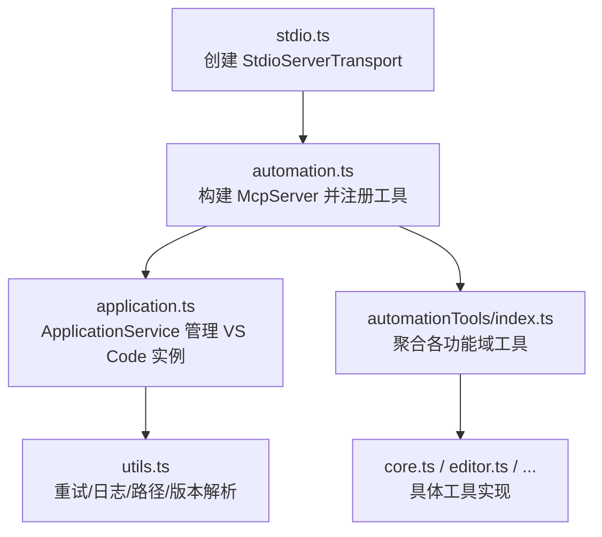
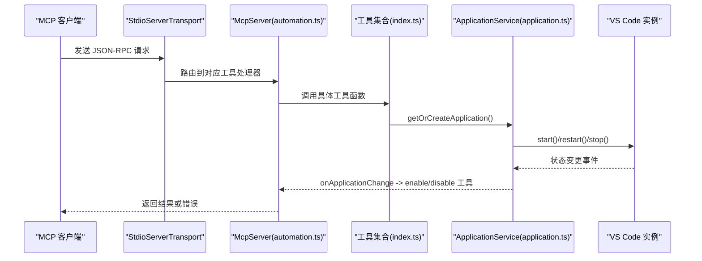
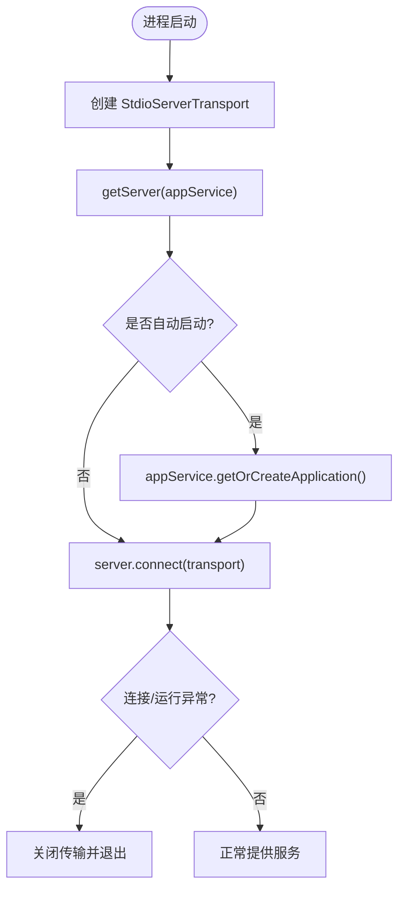
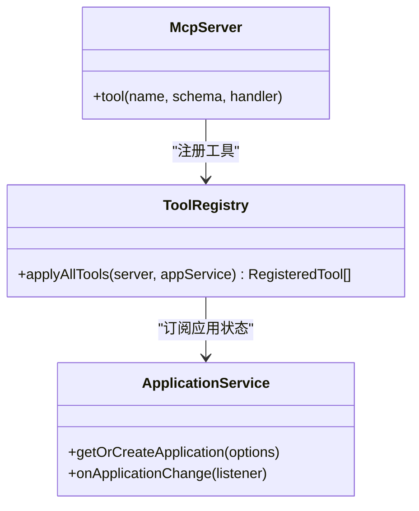
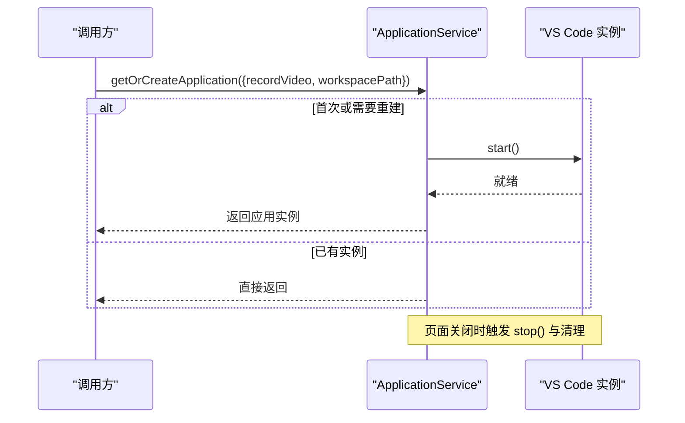
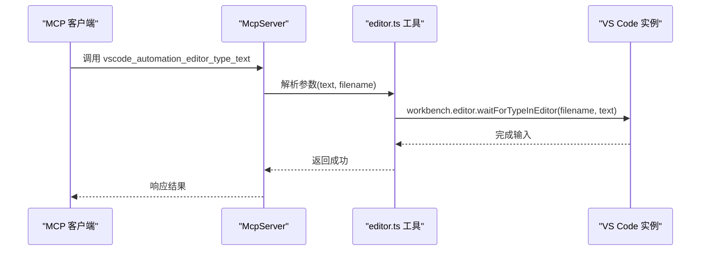
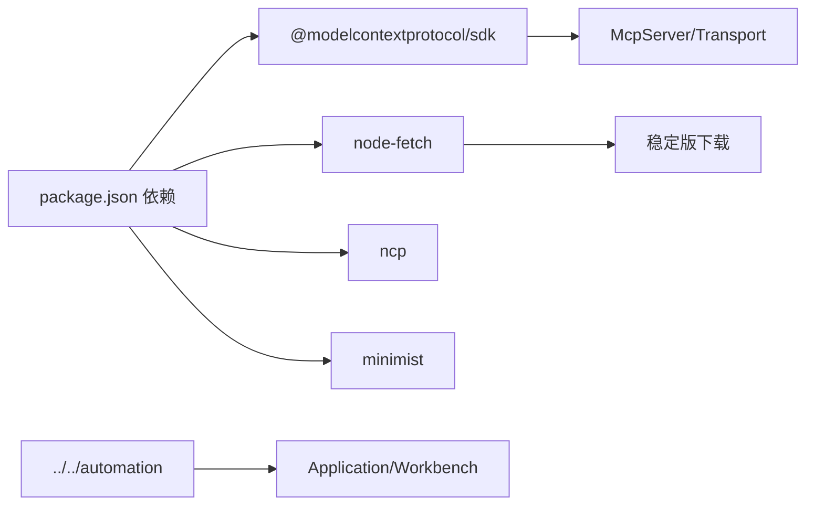

# MCP 测试

<cite>
**本文引用的文件**
- [README.md](file://test/mcp/README.md)
- [package.json](file://test/mcp/package.json)
- [stdio.ts](file://test/mcp/src/stdio.ts)
- [automation.ts](file://test/mcp/src/automation.ts)
- [application.ts](file://test/mcp/src/application.ts)
- [index.ts](file://test/mcp/src/automationTools/index.ts)
- [core.ts](file://test/mcp/src/automationTools/core.ts)
- [editor.ts](file://test/mcp/src/automationTools/editor.ts)
- [utils.ts](file://test/mcp/src/utils.ts)
</cite>

## 目录
1. [简介](#简介)
2. [项目结构](#项目结构)
3. [核心组件](#核心组件)
4. [架构总览](#架构总览)
5. [详细组件分析](#详细组件分析)
6. [依赖关系分析](#依赖关系分析)
7. [性能考虑](#性能考虑)
8. [故障排查指南](#故障排查指南)
9. [结论](#结论)
10. [附录](#附录)

## 简介
本文件面向 Kodrix 的 MCP（Model Context Protocol）测试框架，聚焦 test/mcp 子项目。该 MCP 服务器通过标准输入输出流与客户端通信，暴露一系列 VS Code 自动化能力工具，用于验证 UI 行为、执行端到端交互、以及进行协议兼容性测试。文档涵盖消息传递、上下文管理、工具调用、错误处理、并发请求、Mock 策略、测试数据准备、版本升级测试、调试技巧与性能优化建议等主题，并提供可操作的流程图与时序图以辅助理解。

## 项目结构
test/mcp 采用“入口 + 服务 + 应用生命周期 + 模块化工具”的分层组织：
- 入口与传输层：stdio.ts 负责创建 stdio 传输并连接 MCP 服务器
- 服务装配：automation.ts 构建 McpServer，注册基础工具并按应用状态启用/禁用工具
- 应用生命周期：application.ts 封装 VS Code 应用的启动、停止、重启、日志/崩溃/视频路径、质量/版本解析、稳定版下载等
- 工具模块：automationTools/* 按功能域拆分（编辑器、终端、调试、搜索、扩展、设置、任务、聊天、窗口等），由 index.ts 统一聚合注册
- 配置与脚本：package.json 提供编译与启动脚本；scripts/start-stdio.sh 用于快速启动

图示来源
- [stdio.ts:1-25](file://test/mcp/src/stdio.ts#L1-L25)
- [automation.ts:1-57](file://test/mcp/src/automation.ts#L1-L57)
- [application.ts:218-318](file://test/mcp/src/application.ts#L218-L318)
- [index.ts:1-127](file://test/mcp/src/automationTools/index.ts#L1-L127)
- [core.ts:1-163](file://test/mcp/src/automationTools/core.ts#L1-L163)
- [editor.ts:1-257](file://test/mcp/src/automationTools/editor.ts#L1-L257)
- [utils.ts:1-82](file://test/mcp/src/utils.ts#L1-L82)

章节来源
- [README.md:1-170](file://test/mcp/README.md#L1-L170)
- [package.json:1-27](file://test/mcp/package.json#L1-L27)

## 核心组件
- 传输与启动：stdio.ts 使用 StdioServerTransport 建立进程间通信，并在可选模式下自动启动应用
- 服务装配：automation.ts 初始化 McpServer，注册基础工具 vscode_automation_start，并通过 applyAllTools 批量注册功能域工具；根据 ApplicationService 的状态动态启用/禁用工具
- 应用服务：application.ts 提供 ApplicationService，封装 getOrCreateApplication、onApplicationChange、stopTracing 等；支持 Electron/Web、headless、远程模式、录制视频、日志/崩溃/视频输出路径、稳定版下载与迁移场景
- 工具注册中心：automationTools/index.ts 集中导入并调用各 applyXxxTools，返回 RegisteredTool[] 供上层启用/禁用
- 工具示例：core.ts 提供重启/停止等核心工具；editor.ts 提供编辑器类型输入、新建未命名文件、保存当前文件等

章节来源
- [stdio.ts:1-25](file://test/mcp/src/stdio.ts#L1-L25)
- [automation.ts:1-57](file://test/mcp/src/automation.ts#L1-L57)
- [application.ts:218-318](file://test/mcp/src/application.ts#L218-L318)
- [index.ts:1-127](file://test/mcp/src/automationTools/index.ts#L1-L127)
- [core.ts:1-163](file://test/mcp/src/automationTools/core.ts#L1-L163)
- [editor.ts:1-257](file://test/mcp/src/automationTools/editor.ts#L1-L257)

## 架构总览
MCP 测试框架基于 MCP SDK 的 Server/Tool 模型，结合 VS Code 自动化基础设施（@vscode/test-electron、Playwright 驱动的工作台对象）实现对真实 VS Code 实例的操控。整体流程如下：

图示来源
- [stdio.ts:10-24](file://test/mcp/src/stdio.ts#L10-L24)
- [automation.ts:12-55](file://test/mcp/src/automation.ts#L12-L55)
- [application.ts:267-318](file://test/mcp/src/application.ts#L267-L318)
- [index.ts:37-101](file://test/mcp/src/automationTools/index.ts#L37-L101)

## 详细组件分析

### 传输与启动（stdio.ts）
- 职责：创建 StdioServerTransport，构造 ApplicationService，获取 McpServer，按需自动启动应用，连接传输并处理异常关闭
- 关键点：
  - 若 opts.autostart 为真，则在连接前启动应用
  - 连接失败时关闭传输并以非零退出码退出，便于 CI 感知失败

图示来源
- [stdio.ts:10-24](file://test/mcp/src/stdio.ts#L10-L24)

章节来源
- [stdio.ts:1-25](file://test/mcp/src/stdio.ts#L1-L25)

### 服务装配与工具启用/禁用（automation.ts）
- 职责：创建 McpServer，注册基础工具 vscode_automation_start，批量注册功能域工具，并根据应用存在与否启用/禁用工具
- 关键点：
  - 工具参数使用 Zod 校验，保证入参安全
  - 监听 ApplicationService 的应用变化事件，动态切换工具可用性

图示来源
- [automation.ts:12-55](file://test/mcp/src/automation.ts#L12-L55)
- [index.ts:37-101](file://test/mcp/src/automationTools/index.ts#L37-L101)

章节来源
- [automation.ts:1-57](file://test/mcp/src/automation.ts#L1-L57)

### 应用生命周期管理（application.ts）
- 职责：封装 VS Code 应用的生命周期（启动、停止、重启）、环境准备（日志/崩溃/视频路径、用户数据隔离）、质量/版本解析、稳定版下载、Web/Remote/Electron 多模式支持
- 关键点：
  - 通过 createApp 与 @vscode/test-electron 启动实例
  - 提供 ApplicationService 单例式管理与事件通知
  - 支持 headless、浏览器选择、额外参数注入、录制视频
  - 在页面关闭时清理临时数据与资源

图示来源
- [application.ts:229-318](file://test/mcp/src/application.ts#L229-L318)

章节来源
- [application.ts:1-318](file://test/mcp/src/application.ts#L1-L318)

### 工具模块与典型用例
- 核心工具（core.ts）：
  - vscode_automation_restart：重启 VS Code，支持指定工作区与额外参数
  - vscode_automation_stop：停止追踪并关闭应用
- 编辑器工具（editor.ts）：
  - vscode_automation_editor_type_text：在当前活动编辑器中键入文本（针对 Monaco 输入稳定性）
  - vscode_automation_editor_new_untitled_file：新建未命名文件
  - vscode_automation_editor_save_file：保存当前活动文件

图示来源
- [editor.ts:35-53](file://test/mcp/src/automationTools/editor.ts#L35-L53)

章节来源
- [core.ts:13-51](file://test/mcp/src/automationTools/core.ts#L13-L51)
- [editor.ts:1-257](file://test/mcp/src/automationTools/editor.ts#L1-L257)

### 工具注册中心（index.ts）
- 职责：集中导入并调用各 applyXxxTools，汇总 RegisteredTool[]，供 automation.ts 启用/禁用
- 设计优势：高内聚低耦合，新增工具只需添加一个 applyXxxTools 并在 index.ts 中注册

章节来源
- [index.ts:1-127](file://test/mcp/src/automationTools/index.ts#L1-L127)

### 通用工具与重试机制（utils.ts）
- 提供版本解析、随机用户数据目录、应用创建、超时封装、重试机制等
- 重试机制可用于网络请求、进程启动、UI 元素等待等不稳定场景

章节来源
- [utils.ts:1-82](file://test/mcp/src/utils.ts#L1-L82)

## 依赖关系分析
- 运行时依赖：
  - @modelcontextprotocol/sdk：MCP 协议 SDK，提供 Server/Tool/Transport
  - minimist：命令行参数解析
  - ncp：文件复制
  - node-fetch：HTTP 请求（用于稳定版下载）
- 开发依赖：
  - TypeScript、@types/node、npm-run-all2 等
- 内部依赖：
  - ../../automation：VS Code 自动化基础设施（Application、Quality、Logger 等）
  - @vscode/test-electron：驱动 VS Code 实例

图示来源
- [package.json:14-25](file://test/mcp/package.json#L14-L25)
- [application.ts:6-11](file://test/mcp/src/application.ts#L6-L11)

章节来源
- [package.json:1-27](file://test/mcp/package.json#L1-L27)

## 性能考虑
- 启动与复用：
  - 使用 ApplicationService 的单例模式复用 VS Code 实例，避免重复启动开销
  - 通过 opts.headless 与浏览器选项减少渲染开销
- I/O 与日志：
  - 将日志写入固定目录并按套件分片，便于定位问题与性能分析
  - 仅在 verbose 模式下输出控制台日志，降低 IO 压力
- 重试与超时：
  - 对不稳定操作（如网络下载、进程启动）使用 retry 与 timeout，提高鲁棒性
- 资源清理：
  - 在页面关闭时清理浏览器上下文与临时数据，防止资源泄漏
- 录制与追踪：
  - 按需开启视频录制与追踪，避免不必要的磁盘与 CPU 占用

[本节为通用指导，不直接分析具体文件]

## 故障排查指南
- 服务器无法启动：
  - 确认已至少运行一次 VS Code（生成必要产物）
  - 检查依赖安装与编译产物是否存在
- 自动化失败：
  - 检查日志目录与崩溃转储路径是否正确
  - 核对工作区路径与环境变量（VSCODE_DEV/VSCODE_REPOSITORY）
- 传输异常：
  - 查看 stdio.ts 的错误捕获逻辑，必要时增加更详细的日志
- 工具不可用：
  - 确认 ApplicationService 已成功创建应用，工具才会被启用
- 稳定版下载失败：
  - 检查网络与更新服务器可达性，必要时手动指定 stable-build

章节来源
- [README.md:147-166](file://test/mcp/README.md#L147-L166)
- [application.ts:142-216](file://test/mcp/src/application.ts#L142-L216)
- [stdio.ts:20-24](file://test/mcp/src/stdio.ts#L20-L24)

## 结论
Kodrix 的 MCP 测试框架通过标准化的 MCP 协议暴露 VS Code 自动化能力，具备清晰的层次结构与可扩展的工具体系。借助 ApplicationService 的生命周期管理与 utils 的重试机制，能够在多种运行模式下稳定执行端到端测试。配合合理的日志、录制与资源清理策略，可满足复杂交互场景的验证需求，并为协议兼容性与版本升级测试提供坚实基础。

[本节为总结，不直接分析具体文件]

## 附录

### 测试用例设计模式
- 端到端交互：通过 MCP 客户端调用工具，驱动 VS Code 完成打开文件、编辑、保存、搜索、调试等操作
- 状态同步：利用 ApplicationService 的 onApplicationChange 监听应用状态，确保工具可用性与测试步骤顺序正确
- 并发请求：在同一会话中并发调用多个工具（如同时打开多个编辑器），验证资源竞争与状态一致性
- 错误处理：构造非法参数、缺失文件、网络失败等场景，验证工具的健壮性与错误信息可读性

### Mock 策略
- 外部依赖 Mock：对网络请求（如稳定版下载）使用本地代理或缓存，避免 CI 网络波动
- UI 元素 Mock：优先使用 Workbench API（如编辑器、终端、搜索）而非 CSS 选择器，降低界面变动影响
- 时间相关 Mock：使用统一的 timeout/retry 封装，避免硬编码等待

### 测试数据准备方法
- 随机用户数据目录：通过 getRandomUserDataDir 隔离每次测试的用户数据，避免相互干扰
- 工作区与文件：在测试前准备最小化工作区与必要文件，确保可重复性
- 日志与崩溃转储：按套件分目录存储，便于回溯与分析

### 协议兼容性与版本升级测试
- 兼容性验证：在不同 MCP 客户端下调用同一套工具，验证消息格式与语义一致
- 版本升级：
  - 使用 ensureStableCode 下载并切换到上一稳定版本，验证迁移与兼容性
  - 对比新旧版本的工具行为差异，记录回归点

### 调试技巧
- 启用 verbose 日志与视频录制，定位 UI 与交互问题
- 使用 dev 模式下的 watch 与调试配置，快速迭代工具实现
- 在关键路径增加断点与日志，观察 ApplicationService 状态变化

### 性能优化建议
- 复用应用实例，减少启动次数
- 合理设置 headless 与浏览器参数，平衡速度与可视化需求
- 控制日志级别与输出量，避免 I/O 瓶颈
- 对耗时操作使用异步与重试，提升吞吐与稳定性

[本节为补充说明，不直接分析具体文件]