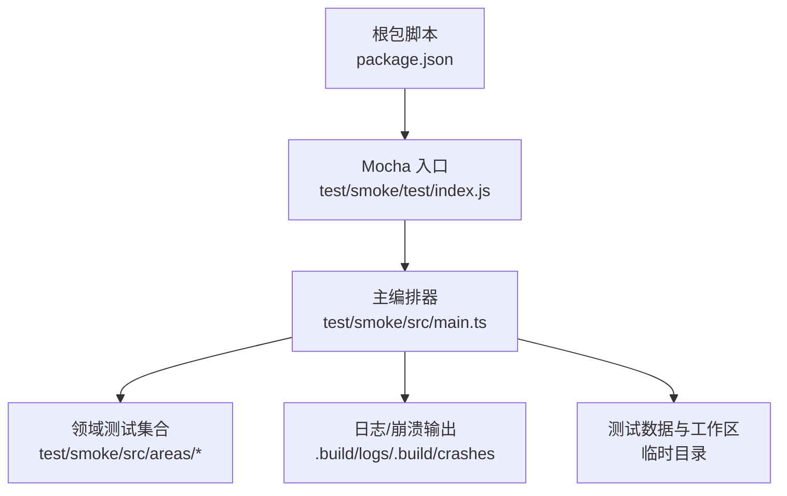
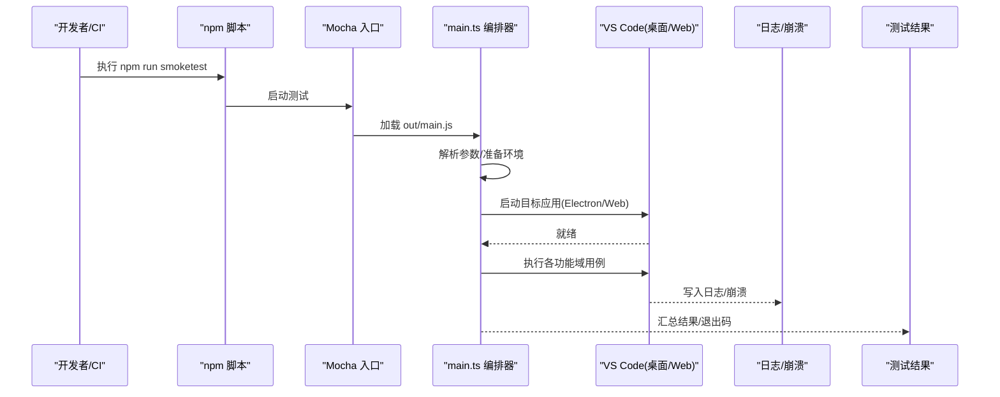
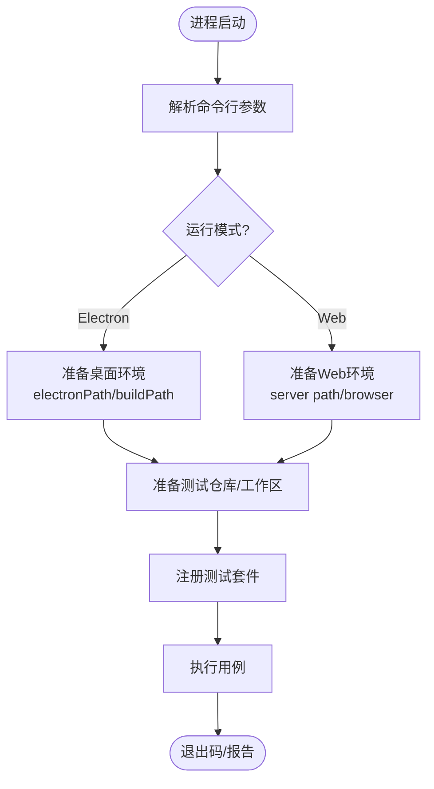
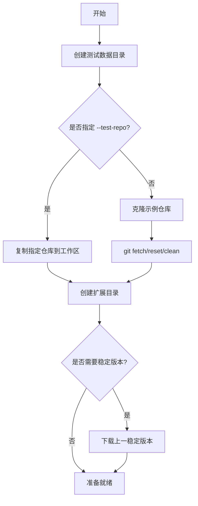
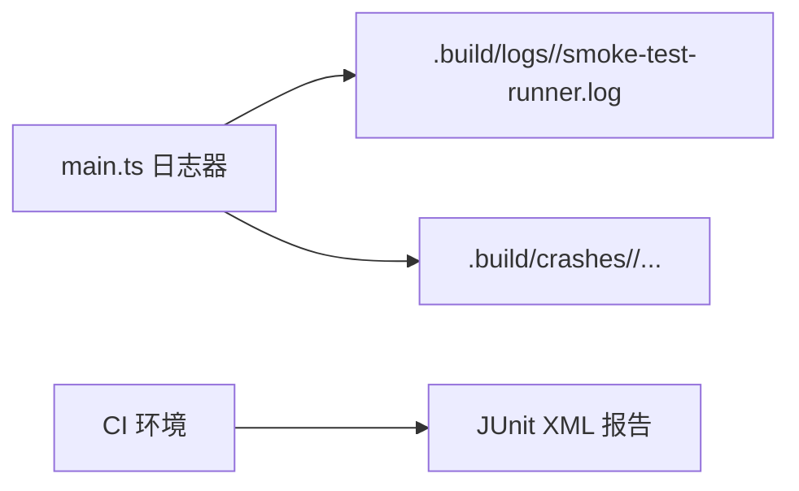
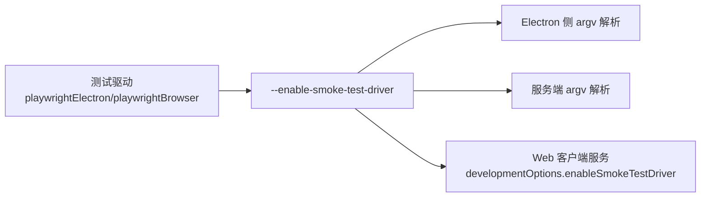
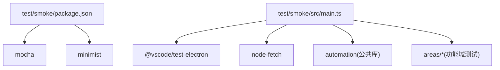
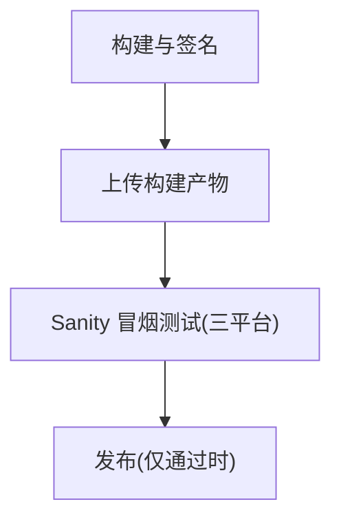

# 冒烟测试

<cite>
**本文引用的文件**   
- [test/smoke/README.md](file://test/smoke/README.md)
- [test/smoke/package.json](file://test/smoke/package.json)
- [test/smoke/src/main.ts](file://test/smoke/src/main.ts)
- [test/smoke/test/index.js](file://test/smoke/test/index.js)
- [package.json](file://package.json)
- [.github/workflows/release.yml](file://.github/workflows/release.yml)
- [scripts/chat-simulation/common/utils.js](file://scripts/chat-simulation/common/utils.js)
- [src/vs/platform/environment/common/argv.ts](file://src/vs/platform/environment/common/argv.ts)
- [src/vs/platform/environment/node/argv.ts](file://src/vs/platform/environment/node/argv.ts)
- [src/vs/server/node/webClientServer.ts](file://src/vs/server/node/webClientServer.ts)
</cite>

## 目录
1. [简介](#简介)
2. [项目结构](#项目结构)
3. [核心组件](#核心组件)
4. [架构总览](#架构总览)
5. [详细组件分析](#详细组件分析)
6. [依赖关系分析](#依赖关系分析)
7. [性能与稳定性考量](#性能与稳定性考量)
8. [故障排查指南](#故障排查指南)
9. [结论](#结论)
10. [附录](#附录)

## 简介
本文件系统性梳理 Kodrix（基于 VS Code）的冒烟测试体系，覆盖用例设计原则、测试范围定义、执行策略、自动化脚本编写、环境准备、结果收集与分析、CI/CD 集成、失败告警与报告生成，以及典型场景示例与维护方法。目标是帮助读者快速理解并高效使用冒烟测试保障构建质量与回归稳定性。

## 项目结构
冒烟测试位于 test/smoke 目录，采用“入口驱动 + 领域分组”的组织方式：
- 顶层入口：test/smoke/test/index.js 负责 Mocha 启动、参数解析与报告输出
- 主编排器：test/smoke/src/main.ts 负责应用生命周期、环境准备、日志/崩溃路径、工作区与扩展目录初始化、各功能域测试注册
- 领域测试：test/smoke/src/areas/* 按功能域组织（如 preferences、search、terminal、extensions、chat、accessibility 等）
- 运行脚本：根 package.json 提供 smoketest 命令；test/smoke/package.json 提供编译与 watch 脚本

图示来源
- [package.json:62-63](file://package.json#L62-L63)
- [test/smoke/test/index.js:1-96](file://test/smoke/test/index.js#L1-L96)
- [test/smoke/src/main.ts:36-443](file://test/smoke/src/main.ts#L36-L443)

章节来源
- [test/smoke/README.md:1-87](file://test/smoke/README.md#L1-L87)
- [test/smoke/package.json:1-24](file://test/smoke/package.json#L1-L24)
- [test/smoke/test/index.js:1-96](file://test/smoke/test/index.js#L1-L96)
- [test/smoke/src/main.ts:1-443](file://test/smoke/src/main.ts#L1-L443)

## 核心组件
- 命令行与运行模式
  - 支持 Electron/Web/Remote 三种运行模式，通过 --web/--remote/--build 等参数控制
  - 支持 headless、tracing、verbose、browser 等调试与可观测性选项
- 环境与数据准备
  - 自动创建隔离的测试数据目录、用户数据目录、扩展目录
  - 克隆或复制测试仓库作为工作区
  - 可选下载稳定版用于迁移/升级类测试
- 日志与崩溃采集
  - 统一将日志写入 .build/logs，崩溃转储写入 .build/crashes
  - 支持多目标日志（控制台+文件），便于 CI 归档与本地诊断
- 测试套件编排
  - 在 before/after 钩子中完成全局初始化与清理
  - 根据 quality（stable/insider/exploration/oss/dev）与环境条件动态启用不同测试域
- 报告与退出码
  - 在 CI 环境下输出 JUnit XML 报告，便于平台聚合
  - 非零退出码表示失败，便于流水线阻断

章节来源
- [test/smoke/src/main.ts:39-69](file://test/smoke/src/main.ts#L39-L69)
- [test/smoke/src/main.ts:71-119](file://test/smoke/src/main.ts#L71-L119)
- [test/smoke/src/main.ts:149-165](file://test/smoke/src/main.ts#L149-L165)
- [test/smoke/src/main.ts:264-381](file://test/smoke/src/main.ts#L264-L381)
- [test/smoke/src/main.ts:383-443](file://test/smoke/src/main.ts#L383-L443)
- [test/smoke/test/index.js:21-38](file://test/smoke/test/index.js#L21-L38)
- [test/smoke/test/index.js:42-95](file://test/smoke/test/index.js#L42-L95)

## 架构总览
冒烟测试的执行链路如下：
- 根脚本触发 npm run smoketest
- Mocha 加载编译后的 main.js
- main.ts 解析参数、准备环境、创建工作区与扩展目录
- 根据运行模式选择 Electron 或 Web 驱动
- 注册并执行各功能域测试
- 输出日志、崩溃转储与测试报告

图示来源
- [package.json:62-63](file://package.json#L62-L63)
- [test/smoke/test/index.js:1-96](file://test/smoke/test/index.js#L1-L96)
- [test/smoke/src/main.ts:36-443](file://test/smoke/src/main.ts#L36-L443)

## 详细组件分析

### 运行入口与参数解析
- Mocha 入口
  - 解析 web 模式与过滤参数 f/g
  - 在 CI 环境变量下配置 mocha-multi-reporters 与 JUnit 输出
- 主编排器
  - 解析浏览器、构建路径、远程模式、headless、tracing 等参数
  - 设置日志与崩溃目录、测试数据目录、扩展目录
  - 根据 quality 与运行模式决定启用哪些测试域

图示来源
- [test/smoke/test/index.js:13-26](file://test/smoke/test/index.js#L13-L26)
- [test/smoke/src/main.ts:39-69](file://test/smoke/src/main.ts#L39-L69)
- [test/smoke/src/main.ts:207-258](file://test/smoke/src/main.ts#L207-L258)
- [test/smoke/src/main.ts:264-381](file://test/smoke/src/main.ts#L264-L381)

章节来源
- [test/smoke/test/index.js:1-96](file://test/smoke/test/index.js#L1-L96)
- [test/smoke/src/main.ts:39-69](file://test/smoke/src/main.ts#L39-L69)

### 环境准备与工作区管理
- 测试数据目录
  - 基于系统临时目录生成唯一路径，避免并发冲突
  - 进程退出时尝试清理
- 工作区与扩展目录
  - 默认克隆示例仓库，或从 --test-repo 指定路径复制
  - 扩展目录用于注入冒烟测试专用扩展
- 稳定版本获取（可选）
  - 当以 --build 运行且非 Web/Remote 时，自动查询更新接口并下载上一稳定版本，用于迁移/升级相关测试

图示来源
- [test/smoke/src/main.ts:137-165](file://test/smoke/src/main.ts#L137-L165)
- [test/smoke/src/main.ts:264-381](file://test/smoke/src/main.ts#L264-L381)

章节来源
- [test/smoke/src/main.ts:137-165](file://test/smoke/src/main.ts#L137-L165)
- [test/smoke/src/main.ts:264-381](file://test/smoke/src/main.ts#L264-L381)

### 日志、崩溃与可观测性
- 日志
  - 控制台（verbose 开启时）+ 文件（始终）
  - 按运行模式区分目录：smoke-tests-electron / smoke-tests-browser / smoke-tests-remote
- 崩溃
  - 按运行模式区分目录：smoke-tests-electron / smoke-tests-browser / smoke-tests-remote
- Playwright Trace
  - 在 CI 或显式 tracing 时启用，便于回放 UI 交互

图示来源
- [test/smoke/src/main.ts:71-119](file://test/smoke/src/main.ts#L71-L119)
- [test/smoke/test/index.js:28-38](file://test/smoke/test/index.js#L28-L38)

章节来源
- [test/smoke/src/main.ts:71-119](file://test/smoke/src/main.ts#L71-L119)
- [test/smoke/test/index.js:28-38](file://test/smoke/test/index.js#L28-L38)

### 测试套件注册与功能域
- 已注册的领域包括：数据丢失、偏好设置、搜索、笔记本、语言、状态栏、扩展、扩展主机重启、多根工作区、本地化、启动、终端、任务、聊天、Copilot CLI、聊天会话、聊天模型配置、辅助功能、Agent 窗口等
- 根据 quality 与运行模式选择性启用（例如 Dev/OSS 跳过部分能力）

```mermaid
classDiagram
class SmokeRunner {
+before()
+after()
+describe()
}
class Areas {
<<domain>>
}
class DataLoss
class Preferences
class Search
class Notebook
class Languages
class Statusbar
class Extensions
class ExtensionHostRestart
class Multiroot
class Localization
class Launch
class Terminal
class Task
class Chat
class CopilotCli
class ChatSessions
class ChatModelConfig
class Accessibility
class AgentsWindow
SmokeRunner --> DataLoss : "setupDataLossTests"
SmokeRunner --> Preferences : "setupPreferencesTests"
SmokeRunner --> Search : "setupSearchTests"
SmokeRunner --> Notebook : "setupNotebookTests"
SmokeRunner --> Languages : "setupLanguagesTests"
SmokeRunner --> Statusbar : "setupStatusbarTests"
SmokeRunner --> Extensions : "setupExtensionTests"
SmokeRunner --> ExtensionHostRestart : "setupExtensionHostRestartTests"
SmokeRunner --> Multiroot : "setupMultirootTests"
SmokeRunner --> Localization : "setupLocalizationTests"
SmokeRunner --> Launch : "setupLaunchTests"
SmokeRunner --> Terminal : "setupTerminalTests"
SmokeRunner --> Task : "setupTaskTests"
SmokeRunner --> Chat : "setupChatTests"
SmokeRunner --> CopilotCli : "setupCopilotCliTests"
SmokeRunner --> ChatSessions : "setupChatSessionsTests"
SmokeRunner --> ChatModelConfig : "setupChatModelConfigTests"
SmokeRunner --> Accessibility : "setupAccessibilityTests"
SmokeRunner --> AgentsWindow : "setupAgentsWindowTests"
```

图示来源
- [test/smoke/src/main.ts:17-35](file://test/smoke/src/main.ts#L17-L35)
- [test/smoke/src/main.ts:422-442](file://test/smoke/src/main.ts#L422-L442)

章节来源
- [test/smoke/src/main.ts:17-35](file://test/smoke/src/main.ts#L17-L35)
- [test/smoke/src/main.ts:422-442](file://test/smoke/src/main.ts#L422-L442)

### 与 VS Code 的集成开关
- 冒烟测试通过 --enable-smoke-test-driver 向 VS Code 传递自动化信号，影响开发工具行为、扩展宿主行为与服务端行为
- 该开关在客户端、服务端与 Electron 侧均有处理逻辑

图示来源
- [scripts/chat-simulation/common/utils.js:240](file://scripts/chat-simulation/common/utils.js#L240)
- [src/vs/platform/environment/common/argv.ts:130](file://src/vs/platform/environment/common/argv.ts#L130)
- [src/vs/platform/environment/node/argv.ts:182](file://src/vs/platform/environment/node/argv.ts#L182)
- [src/vs/server/node/webClientServer.ts:325-378](file://src/vs/server/node/webClientServer.ts#L325-L378)

章节来源
- [scripts/chat-simulation/common/utils.js:240](file://scripts/chat-simulation/common/utils.js#L240)
- [src/vs/platform/environment/common/argv.ts:130](file://src/vs/platform/environment/common/argv.ts#L130)
- [src/vs/platform/environment/node/argv.ts:182](file://src/vs/platform/environment/node/argv.ts#L182)
- [src/vs/server/node/webClientServer.ts:325-378](file://src/vs/server/node/webClientServer.ts#L325-L378)

## 依赖关系分析
- 外部依赖
  - Mocha：测试框架
  - minimist：参数解析
  - @vscode/test-electron：Electron 应用驱动
  - node-fetch：网络请求（版本查询/下载）
- 内部依赖
  - automation：Quality、Logger、ApplicationOptions 等公共类型与工具
  - areas/*：具体功能域测试实现

图示来源
- [test/smoke/package.json:6-22](file://test/smoke/package.json#L6-L22)
- [test/smoke/src/main.ts:6-15](file://test/smoke/src/main.ts#L6-L15)

章节来源
- [test/smoke/package.json:1-24](file://test/smoke/package.json#L1-L24)
- [test/smoke/src/main.ts:6-15](file://test/smoke/src/main.ts#L6-L15)

## 性能与稳定性考量
- 超时与慢用例
  - Mocha 默认超时较长，适合 UI 自动化；对关键路径建议细化等待策略而非盲目 sleep
- 并行与隔离
  - 每个运行实例拥有独立的工作区与用户数据目录，避免状态污染
  - 单例资源（端口、句柄、路径）需确保可并发安全
- 等待策略
  - 优先等待 DOM 元素就绪与焦点切换，避免时间猜测
- 可观测性
  - 开启 tracing 与 verbose 日志有助于定位偶发问题

[本节为通用指导，不直接分析具体文件]

## 故障排查指南
- 常见错误
  - Windows 临时目录 t 文件夹导致 tmp 模块异常：删除 C:\Users\<username>\AppData\Local\Temp\t 后重试
- 日志与崩溃
  - 查看 .build/logs 下的 smoke-test-runner.log 与各 suite 日志
  - 检查 .build/crashes 下的崩溃转储
- CI 产物
  - 在 GitHub Actions 中，测试失败会输出提示，说明如何下载日志与崩溃转储，以及如何打开 Playwright trace

章节来源
- [test/smoke/README.md:70-87](file://test/smoke/README.md#L70-L87)
- [test/smoke/test/index.js:44-95](file://test/smoke/test/index.js#L44-L95)

## 结论
Kodrix 的冒烟测试体系围绕“快速验证核心功能、保障构建质量、支撑回归测试”的目标构建。通过清晰的入口与编排、完善的运行模式与参数、严格的隔离与可观测性，以及与 CI/CD 的无缝集成，能够在每次提交与发布前快速发现阻塞性问题。建议在新增功能时同步补充对应领域的冒烟用例，并在 CI 中保持最小集的稳定运行，持续优化等待策略与可观测性，提升整体交付效率与质量。

[本节为总结性内容，不直接分析具体文件]

## 附录

### 执行策略与常用命令
- 开发模式（Electron）
  - npm run smoketest
- Web 模式
  - npm run smoketest -- --web --browser chromium
- 指定构建产物
  - npm run smoketest -- --build <路径>
- Remote 模式
  - npm run smoketest -- --build <路径> --remote
- 过滤用例
  - 使用 -f/-g 传入 Mocha 过滤表达式

章节来源
- [test/smoke/README.md:5-26](file://test/smoke/README.md#L5-L26)
- [package.json:62-63](file://package.json#L62-L63)

### CI/CD 集成与报告
- GitHub Actions Release 流程
  - 构建产物后执行 Sanity（冒烟）阶段，跨三平台矩阵运行
  - 失败即阻断后续发布
- 报告与产物
  - 在 CI 环境下输出 JUnit XML 报告
  - 日志与崩溃转储作为构建产物上传，可在 Summary 页面下载

图示来源
- [.github/workflows/release.yml:33-47](file://.github/workflows/release.yml#L33-L47)

章节来源
- [.github/workflows/release.yml:1-55](file://.github/workflows/release.yml#L1-L55)
- [test/smoke/test/index.js:28-38](file://test/smoke/test/index.js#L28-L38)

### 测试场景示例
- 应用启动测试
  - 通过 Electron/Web 驱动启动 VS Code，验证基本 UI 可用
- 基本功能验证
  - 偏好设置、搜索、终端、任务、语言、状态栏、多根工作区等
- 扩展与插件生态
  - 扩展安装、扩展主机重启、扩展通信等
- 聊天与 Agent
  - 聊天会话、模型配置、Copilot CLI、Agent 窗口等
- 辅助功能
  - 无障碍相关断言与交互路径

章节来源
- [test/smoke/src/main.ts:422-442](file://test/smoke/src/main.ts#L422-L442)

### 测试维护指南
- 新增功能
  - 在 areas/* 下新增对应测试域，并在 main.ts 中注册
- 用例编写原则
  - 避免依赖焦点与时序猜测，优先等待 DOM 就绪
  - 保证并发安全，避免共享单例资源
- 调试技巧
  - 使用 --verbose 打印底层驱动调用
  - 使用 --headless 与 tracing 辅助定位 UI 问题
  - 通过 -f/-g 过滤用例快速复现

章节来源
- [test/smoke/README.md:55-87](file://test/smoke/README.md#L55-L87)