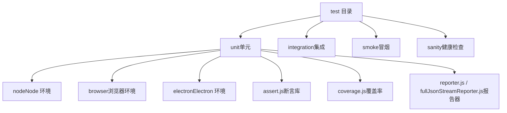
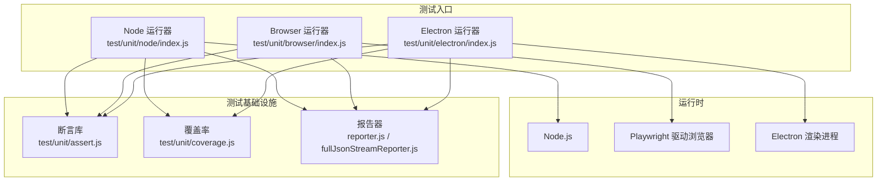
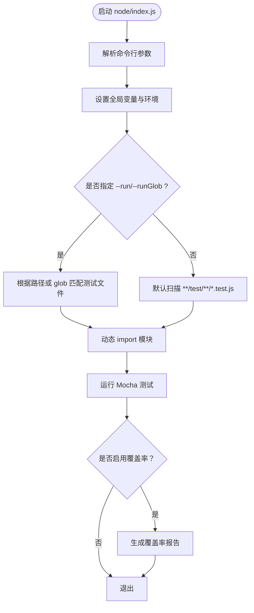
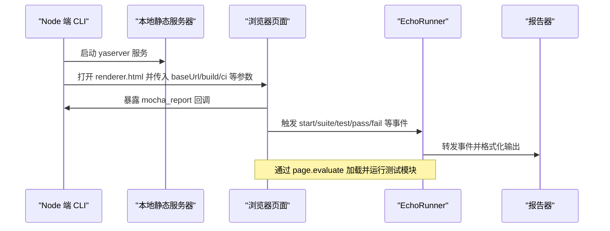
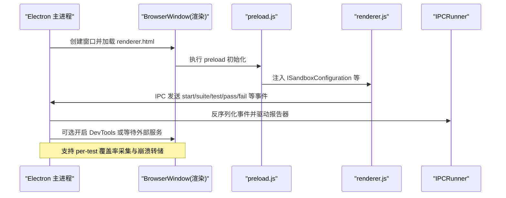
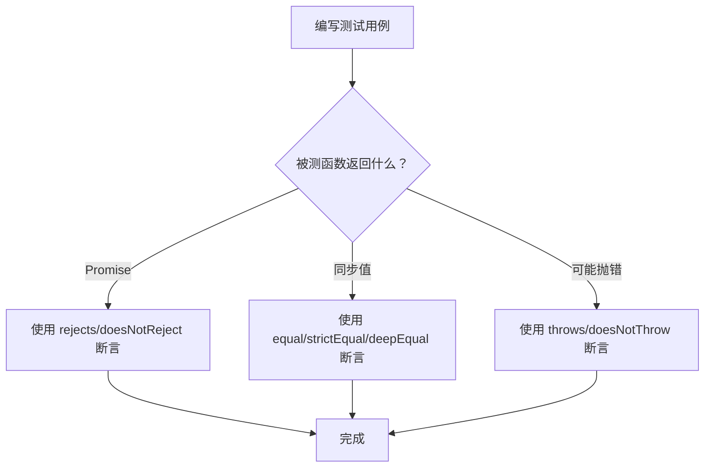
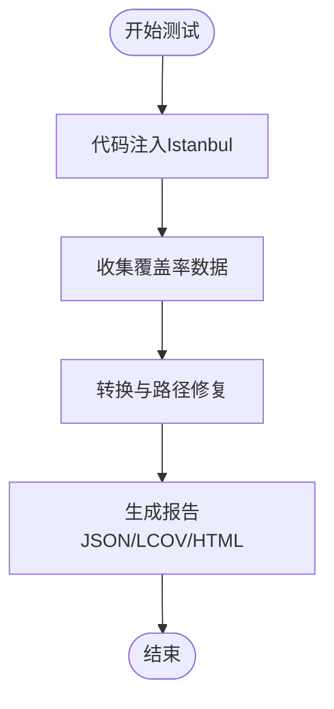
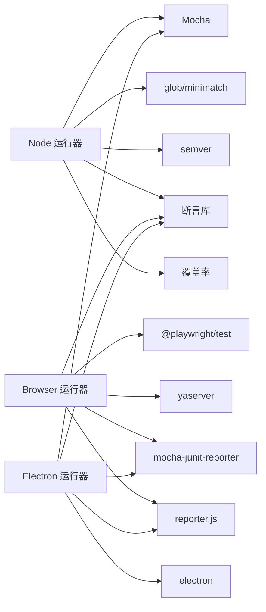

# 单元测试

<cite>
**本文引用的文件**   
- [test\.mocharc.json](file://test/.mocharc.json)
- [test\package.json](file://test/package.json)
- [test\README.md](file://test/README.md)
- [test\unit\README.md](file://test/unit/README.md)
- [test\unit\assert.js](file://test/unit/assert.js)
- [test\unit\coverage.js](file://test/unit/coverage.js)
- [test\unit\node\index.js](file://test/unit/node/index.js)
- [test\unit\browser\index.js](file://test/unit/browser/index.js)
- [test\unit\electron\index.js](file://test/unit/electron/index.js)
</cite>

## 目录
1. [简介](#简介)
2. [项目结构](#项目结构)
3. [核心组件](#核心组件)
4. [架构总览](#架构总览)
5. [详细组件分析](#详细组件分析)
6. [依赖关系分析](#依赖关系分析)
7. [性能与稳定性考虑](#性能与稳定性考虑)
8. [故障排查指南](#故障排查指南)
9. [结论](#结论)
10. [附录：运行命令与最佳实践清单](#附录运行命令与最佳实践清单)

## 简介
本文件系统性梳理 Kodrix 的单元测试体系，覆盖基于 Mocha 的测试环境配置、Node/Browser/Electron 三种运行环境的差异与配置方法、测试用例组织与命名约定、断言库使用、Mock 策略、异步测试处理、覆盖率报告生成与调试方式。目标是帮助开发者快速上手并高质量地编写与维护测试。

## 项目结构
Kodrix 将测试入口统一放在 test 目录下，按运行环境划分：
- Node 环境：test/unit/node
- Browser 环境：test/unit/browser
- Electron 环境：test/unit/electron
- 公共工具：断言库、覆盖率收集、Reporter 等位于 test/unit 根目录
- 顶层 Mocha 配置：test/.mocharc.json

**图示来源**
- [test\README.md:1-11](file://test/README.md#L1-L11)
- [test\unit\README.md:1-43](file://test/unit/README.md#L1-L43)

**章节来源**
- [test\README.md:1-11](file://test/README.md#L1-L11)
- [test\unit\README.md:1-43](file://test/unit/README.md#L1-L43)

## 核心组件
- Mocha 配置与运行器
  - 全局配置：test/.mocharc.json（TDD UI、超时）
  - Node 运行器：test/unit/node/index.js
  - Browser 运行器：test/unit/browser/index.js
  - Electron 运行器：test/unit/electron/index.js
- 断言库：test/unit/assert.js（兼容 Node assert API，支持 Promise 断言）
- 覆盖率：test/unit/coverage.js（Istanbul 注入与报告生成）
- 报告器：test/reporter.js、fullJsonStreamReporter.js（跨环境统一输出）

**章节来源**
- [test\.mocharc.json:1-6](file://test/.mocharc.json#L1-L6)
- [test\unit\assert.js:1-530](file://test/unit/assert.js#L1-L530)
- [test\unit\coverage.js:1-100](file://test/unit/coverage.js#L1-L100)
- [test\unit\node\index.js:1-255](file://test/unit/node/index.js#L1-L255)
- [test\unit\browser\index.js:1-425](file://test/unit/browser/index.js#L1-L425)
- [test\unit\electron\index.js:1-430](file://test/unit/electron/index.js#L1-L430)

## 架构总览
Kodrix 的测试架构围绕“多环境 + 统一断言 + 统一报告”展开：
- Node 环境：直接以 Node 进程加载编译后的 .js 测试，适合纯逻辑与 Node API 相关测试
- Browser 环境：通过 Playwright 在 Chromium/Firefox/WebKit 中执行 common/browser 层测试，验证跨浏览器兼容性
- Electron 环境：启动真实 Electron 渲染进程，模拟 VS Code 运行环境，可访问 DOM 与 Node API

**图示来源**
- [test\unit\node\index.js:1-255](file://test/unit/node/index.js#L1-L255)
- [test\unit\browser\index.js:1-425](file://test/unit/browser/index.js#L1-L425)
- [test\unit\electron\index.js:1-430](file://test/unit/electron/index.js#L1-L430)
- [test\unit\assert.js:1-530](file://test/unit/assert.js#L1-L530)
- [test\unit\coverage.js:1-100](file://test/unit/coverage.js#L1-L100)

## 详细组件分析

### Node 环境测试
- 目标：在 Node 进程中运行测试，适合不依赖 DOM 的逻辑与 Node API
- 关键能力
  - 参数解析：--run、--runGlob、--build、--coverage 等
  - 模块加载：动态 import 编译后的 .js 测试文件
  - 错误捕获：uncaughtException/unhandledRejection 收集
  - 覆盖率：可选 Istanbul 注入与报告生成
- 典型流程

**图示来源**
- [test\unit\node\index.js:25-44](file://test/unit/node/index.js#L25-L44)
- [test\unit\node\index.js:150-250](file://test/unit/node/index.js#L150-L250)
- [test\unit\coverage.js:17-38](file://test/unit/coverage.js#L17-L38)

**章节来源**
- [test\unit\node\index.js:1-255](file://test/unit/node/index.js#L1-L255)
- [test\unit\coverage.js:1-100](file://test/unit/coverage.js#L1-L100)

### Browser 环境测试
- 目标：在多种浏览器内核下运行 common/browser 层测试，确保跨平台一致性
- 关键能力
  - Playwright 驱动 Chromium/Firefox/WebKit
  - 本地静态服务器提供测试资源
  - 跨上下文事件桥接（EchoRunner）将浏览器内测试结果回传到 Node
  - 支持 --debug、--sequential、--grep、--run 等
- 典型流程

**图示来源**
- [test\unit\browser\index.js:176-241](file://test/unit/browser/index.js#L176-L241)
- [test\unit\browser\index.js:243-328](file://test/unit/browser/index.js#L243-L328)
- [test\unit\browser\index.js:330-381](file://test/unit/browser/index.js#L330-L381)

**章节来源**
- [test\unit\browser\index.js:1-425](file://test/unit/browser/index.js#L1-L425)

### Electron 环境测试
- 目标：在真实 Electron 渲染环境中运行测试，最接近产品实际运行态
- 关键能力
  - 启动 BrowserWindow，preload 脚本注入类 VS Code 环境
  - IPC 通信（IPCRunner）将渲染进程中的 Mocha 事件上报到主进程
  - 支持 per-test 覆盖率（V8 Profiler）、崩溃转储、等待外部服务就绪
  - 安全校验：限制文件访问路径在项目根目录内
- 典型流程

**图示来源**
- [test\unit\electron\index.js:233-348](file://test/unit/electron/index.js#L233-L348)
- [test\unit\electron\index.js:377-429](file://test/unit/electron/index.js#L377-L429)

**章节来源**
- [test\unit\electron\index.js:1-430](file://test/unit/electron/index.js#L1-L430)

### 断言库与异步测试
- 断言库特性
  - 提供 Node assert 风格 API：ok、equal、strictEqual、deepEqual、throws、rejects 等
  - 支持 Promise 断言：rejects、doesNotReject
  - 正则匹配：match、doesNotMatch
- 异步测试建议
  - 优先使用 rejects/doesNotReject 进行 Promise 行为断言
  - 避免在断言中抛出未捕获异常；必要时用 throws 包裹同步代码块

**图示来源**
- [test\unit\assert.js:435-530](file://test/unit/assert.js#L435-L530)

**章节来源**
- [test\unit\assert.js:1-530](file://test/unit/assert.js#L1-L530)

### 覆盖率与报告
- 覆盖率
  - Node 环境：通过 coverage.js 的 initialize 注入 instrumenter，createReport 生成 JSON/LCOV/HTML
  - Electron 环境：可通过 per-test-coverage 选项结合 V8 Profiler 采集逐测试覆盖率
- 报告
  - 统一通过 reporter.js/fullJsonStreamReporter.js 适配不同环境
  - 支持 TFS/JUnit XML 输出，便于 CI 集成

**图示来源**
- [test\unit\coverage.js:17-76](file://test/unit/coverage.js#L17-L76)
- [test\unit\electron\index.js:203-229](file://test/unit/electron/index.js#L203-L229)

**章节来源**
- [test\unit\coverage.js:1-100](file://test/unit/coverage.js#L1-L100)
- [test\unit\electron\index.js:177-231](file://test/unit/electron/index.js#L177-L231)

## 依赖关系分析
- 运行器依赖
  - Node 运行器依赖 Mocha、glob、minimatch、semver、module.createRequire 等
  - Browser 运行器依赖 Playwright、yaserver、mocha-junit-reporter 等
  - Electron 运行器依赖 electron、mocha、mocha-junit-reporter 等
- 共享依赖
  - 断言库：test/unit/assert.js
  - 覆盖率：test/unit/coverage.js
  - 报告器：test/reporter.js、fullJsonStreamReporter.js

**图示来源**
- [test\unit\node\index.js:11-20](file://test/unit/node/index.js#L11-L20)
- [test\unit\browser\index.js:9-24](file://test/unit/browser/index.js#L9-L24)
- [test\unit\electron\index.js:13-24](file://test/unit/electron/index.js#L13-L24)

**章节来源**
- [test\unit\node\index.js:1-255](file://test/unit/node/index.js#L1-L255)
- [test\unit\browser\index.js:1-425](file://test/unit/browser/index.js#L1-L425)
- [test\unit\electron\index.js:1-430](file://test/unit/electron/index.js#L1-L430)

## 性能与稳定性考虑
- 并行与串行
  - Browser 运行器支持 --sequential 串行执行，减少并发导致的资源竞争
- 超时与重试
  - 全局 Mocha 超时由 test/.mocharc.json 控制；Electron 运行器支持 --timeout
- 资源隔离
  - Electron 运行器在非 dev 模式下使用临时 userData 目录，避免状态污染
- 崩溃与诊断
  - Node 运行器启用 process.report 写入崩溃转储
  - Electron 运行器支持自定义 crashDumps 目录

[本节为通用指导，不直接分析具体文件]

## 故障排查指南
- 常见失败原因
  - 路径问题：Electron 运行器对文件访问路径进行项目根目录校验，越权访问会报错
  - 原生模块：Node 运行器排除部分依赖 Electron 编译的原生模块测试
  - 浏览器差异：webkit/chromium/firefox 之间行为差异导致偶发失败
- 定位手段
  - 使用 --debug 打开浏览器 DevTools 或 Electron DevTools
  - 使用 --run/--runGlob 聚焦单文件或单组测试
  - 查看生成的 JUnit XML 或 HTML 覆盖率报告
- 日志与断点
  - Browser 运行器通过 page.on('console') 转发控制台日志
  - Electron 运行器在 render-process-gone 时记录崩溃详情

**章节来源**
- [test\unit\electron\index.js:267-321](file://test/unit/electron/index.js#L267-L321)
- [test\unit\node\index.js:57-65](file://test/unit/node/index.js#L57-L65)
- [test\unit\browser\index.js:281-283](file://test/unit/browser/index.js#L281-L283)
- [test\unit\electron\index.js:388-394](file://test/unit/electron/index.js#L388-L394)

## 结论
Kodrix 的单元测试体系以 Mocha 为核心，通过 Node/Browser/Electron 三套运行器覆盖从纯逻辑到完整 UI 的全链路场景。统一的断言库与报告器降低了环境差异带来的维护成本，Istanbul 与 V8 Profiler 提供了完善的覆盖率方案。遵循本文的组织规范与最佳实践，可显著提升测试质量与可维护性。

[本节为总结性内容，不直接分析具体文件]

## 附录：运行命令与最佳实践清单

- 运行方式
  - Electron 环境：scripts/test.[sh|bat]
  - Browser 环境：npm run test-browser -- --browser chromium --browser webkit
  - Node 环境：npm run test-node -- --run <相对路径>
  - 覆盖率：scripts/test.sh --coverage 或 scripts/test --coverage（Windows）

- 常用参数
  - --run/--runGlob：仅运行指定文件或匹配模式
  - --debug：非 headless 模式，便于调试
  - --sequential：串行执行浏览器测试套件
  - --grep/-g/-f：按标题过滤测试
  - --build：使用 out-build 产物运行
  - --coverage/--per-test-coverage：生成覆盖率（Node/Electron）

- 测试组织与命名
  - 测试文件后缀：.test.js（TypeScript 源码对应 .test.ts）
  - 分组：按功能域或模块组织，如 vs/base/common/strings.test.ts
  - 描述：describe/test 名称应清晰表达意图

- Mock 策略
  - 优先替换依赖模块（ESM dynamic import 或 AMD 模块）
  - 对于网络请求，建议使用本地 HTTP 服务器或拦截器
  - 对于文件系统操作，可使用测试专用 API（Node/Browser 运行器已提供）

- 异步测试处理
  - 使用 rejects/doesNotReject 断言 Promise
  - 避免在测试中遗漏 await 或未处理的 Promise rejection

- 覆盖率与报告
  - 生成 HTML/LCOV/JSON 报告用于 CI 与本地分析
  - 使用 per-test-coverage 定位慢测试与热点代码

**章节来源**
- [test\unit\README.md:1-43](file://test/unit/README.md#L1-L43)
- [test\unit\node\index.js:25-44](file://test/unit/node/index.js#L25-L44)
- [test\unit\browser\index.js:41-68](file://test/unit/browser/index.js#L41-L68)
- [test\unit\electron\index.js:50-87](file://test/unit/electron/index.js#L50-L87)
- [test\unit\coverage.js:40-76](file://test/unit/coverage.js#L40-L76)