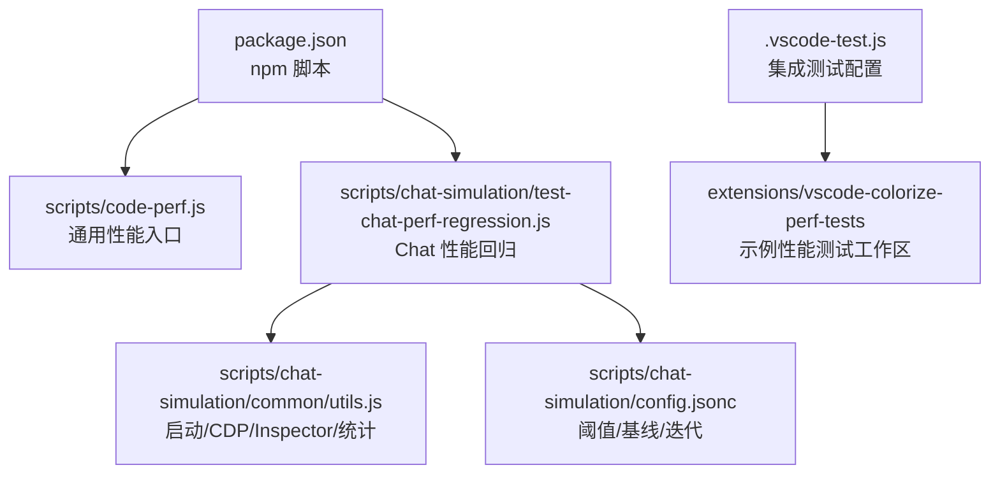
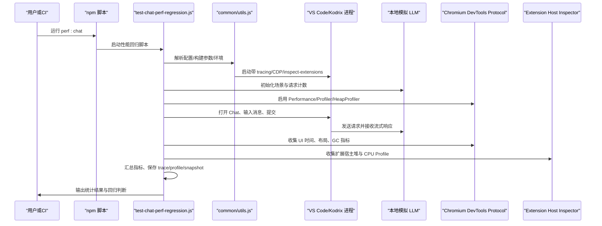
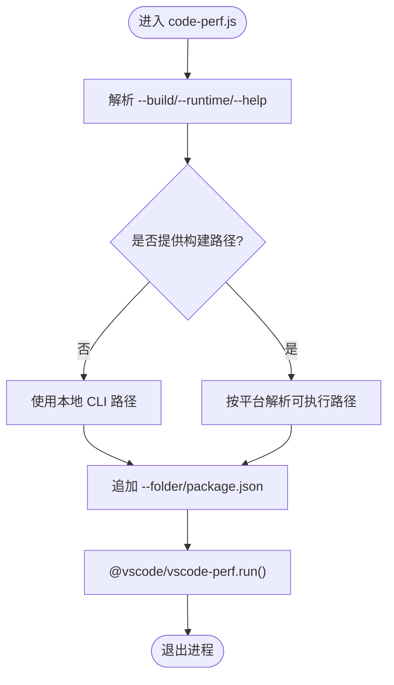
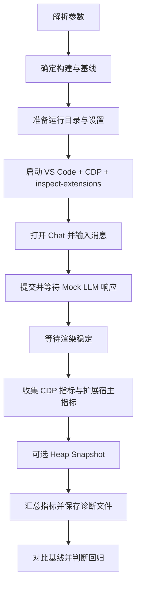
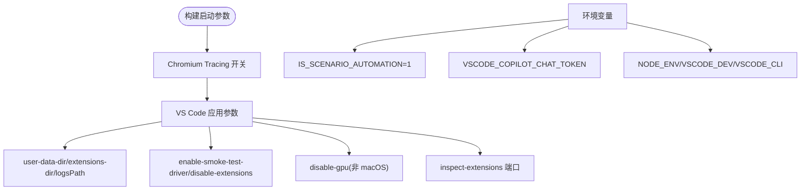
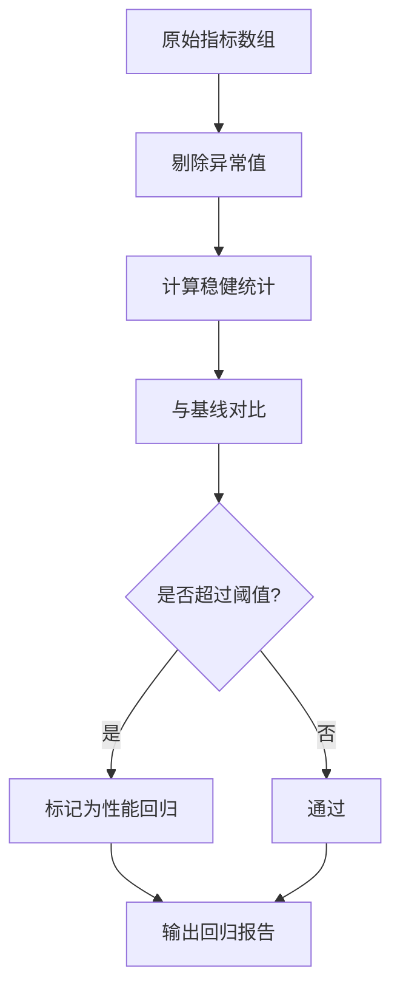
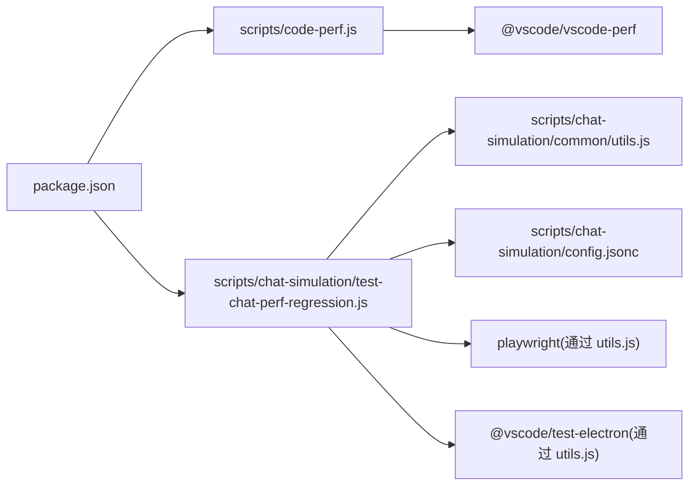
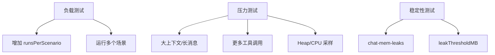

# 性能测试

<cite>
**本文引用的文件**   
- [scripts/code-perf.js](file://scripts/code-perf.js)
- [scripts/chat-simulation/test-chat-perf-regression.js](file://scripts/chat-simulation/test-chat-perf-regression.js)
- [scripts/chat-simulation/common/utils.js](file://scripts/chat-simulation/common/utils.js)
- [scripts/chat-simulation/config.jsonc](file://scripts/chat-simulation/config.jsonc)
- [package.json](file://package.json)
- [.vscode-test.js](file://.vscode-test.js)
- [docs/项目非常有必要新实现的核心功能总报告.md](file://docs/项目非常有必要新实现的核心功能总报告.md)
</cite>

## 目录
1. [引言](#引言)
2. [项目结构](#项目结构)
3. [核心组件](#核心组件)
4. [架构总览](#架构总览)
5. [详细组件分析](#详细组件分析)
6. [依赖关系分析](#依赖关系分析)
7. [性能指标与基准](#性能指标与基准)
8. [负载、压力与稳定性测试](#负载压力与稳定性测试)
9. [性能优化与瓶颈定位](#性能优化与瓶颈定位)
10. [自动化与持续监控](#自动化与持续监控)
11. [故障排查指南](#故障排查指南)
12. [结论](#结论)

## 引言
本文件面向 Kodrix 的性能测试体系，目标是建立一套可重复、可比较、可回归检测的性能测试方案。围绕应用启动时间、内存使用、响应时间、渲染与布局开销、垃圾回收行为等关键指标，文档说明如何基于仓库内已有的脚本与工具链完成：
- 应用启动与端到端交互的性能测量
- Chat/Agent 场景的响应时间与内存基线建立
- 负载、压力与稳定性测试的实施方法
- 性能回归阈值与统计检验
- 自动化执行、持续监控与回归阻断

Kodrix 在工程层面已经提供了两类性能相关能力：
- 通用性能入口：通过 `scripts/code-perf.js` 调用 `@vscode/vscode-perf` 对 VS Code/Kodrix 构建进行性能采集。
- Chat/Agent 场景性能回归测试：通过 `scripts/chat-simulation/test-chat-perf-regression.js` 驱动真实扩展、模拟 LLM、录制 CDP 追踪、抓取堆快照与扩展宿主指标，并与基线版本对比。

此外，产品规划文档中也明确将“性能”作为 P2 持续优化项，强调 Webview 延迟加载、大工程索引增量优化、检索缓存等方向。

**章节来源**
- [scripts/code-perf.js:1-98](file://scripts/code-perf.js#L1-L98)
- [scripts/chat-simulation/test-chat-perf-regression.js:1-22](file://scripts/chat-simulation/test-chat-perf-regression.js#L1-L22)
- [docs/项目非常有必要新实现的核心功能总报告.md:92-99](file://docs/项目非常有必要新实现的核心功能总报告.md#L92-L99)

## 项目结构
与性能测试直接相关的代码主要位于以下位置：
- `scripts/code-perf.js`：通用性能脚本入口，封装 `@vscode/vscode-perf`，支持本地 CLI、桌面可执行或 Web URL 模式。
- `scripts/chat-simulation/`：Chat/Agent 性能回归测试套件，包含主测试脚本、公共工具、配置与模拟数据。
- `scripts/chat-simulation/common/utils.js`：VS Code 启动、CDP 连接、扩展宿主 Inspector 连接、设置注入、统计计算等基础设施。
- `scripts/chat-simulation/config.jsonc`：性能回归阈值、基线版本、迭代次数、内存泄漏阈值等配置。
- `package.json`：暴露 `perf:chat`、`perf:chat-leak` 等 npm 脚本。
- `.vscode-test.js`：集成测试配置中引用了颜色化性能测试工作区，体现项目对性能测试用例的组织方式。

**图表来源**
- [package.json:92-93](file://package.json#L92-L93)
- [scripts/code-perf.js:10-52](file://scripts/code-perf.js#L10-L52)
- [scripts/chat-simulation/test-chat-perf-regression.js:24-33](file://scripts/chat-simulation/test-chat-perf-regression.js#L24-L33)
- [scripts/chat-simulation/common/utils.js:22-38](file://scripts/chat-simulation/common/utils.js#L22-L38)
- [scripts/chat-simulation/config.jsonc:1-26](file://scripts/chat-simulation/config.jsonc#L1-L26)
- [.vscode-test.js:51-52](file://.vscode-test.js#L51-L52)

**章节来源**
- [scripts/code-perf.js:1-98](file://scripts/code-perf.js#L1-L98)
- [scripts/chat-simulation/test-chat-perf-regression.js:1-33](file://scripts/chat-simulation/test-chat-perf-regression.js#L1-L33)
- [scripts/chat-simulation/common/utils.js:1-38](file://scripts/chat-simulation/common/utils.js#L1-L38)
- [scripts/chat-simulation/config.jsonc:1-38](file://scripts/chat-simulation/config.jsonc#L1-L38)
- [package.json:92-93](file://package.json#L92-L93)
- [.vscode-test.js:51-52](file://.vscode-test.js#L51-L52)

## 核心组件
### 通用性能入口：`scripts/code-perf.js`
该脚本负责：
- 解析命令行参数，包括 `--build`、`--runtime`、`--help` 等。
- 自动识别本地 CLI 或桌面可执行路径。
- 向被测应用传入工作区与目标文件参数。
- 调用 `@vscode/vscode-perf` 执行性能采集流程。

适用场景：
- 快速验证某次构建的启动与基础交互性能。
- 在 CI 中作为轻量级性能门禁（需配合阈值策略）。

**章节来源**
- [scripts/code-perf.js:14-52](file://scripts/code-perf.js#L14-L52)
- [scripts/code-perf.js:55-95](file://scripts/code-perf.js#L55-L95)

### Chat/Agent 性能回归测试：`test-chat-perf-regression.js`
该脚本是 Kodrix 性能测试的核心，覆盖：
- 多场景 Chat 交互：文本、代码块、工具调用、思考过程、终端、多轮对话等。
- 端到端指标：首次 Token 时间、完整响应时间、渲染完成时间、UI 更新耗时。
- 内存与 GC：堆使用量变化、GC 后残留增长、Major/Minor GC 次数与耗时。
- 渲染与布局：布局次数、样式重计算、强制回流、长任务、长帧数量与耗时。
- 扩展宿主指标：Extension Host 堆使用、CPU Profile、Heap Snapshot。
- 基线对比：按版本或路径对比，支持分数阈值与绝对阈值。
- 统计检验：Welch t 检验、稳健统计、异常值剔除。

**章节来源**
- [scripts/chat-simulation/test-chat-perf-regression.js:8-22](file://scripts/chat-simulation/test-chat-perf-regression.js#L8-L22)
- [scripts/chat-simulation/test-chat-perf-regression.js:35-150](file://scripts/chat-simulation/test-chat-perf-regression.js#L35-L150)
- [scripts/chat-simulation/test-chat-perf-regression.js:311-350](file://scripts/chat-simulation/test-chat-perf-regression.js#L311-L350)

### 公共工具：`common/utils.js`
提供性能测试运行所需的基础设施：
- 配置加载：从 `config.jsonc` 读取性能回归与内存泄漏配置。
- Electron/VS Code 路径解析：支持 dev build、stable、insiders、版本号、commit hash。
- 预置存储：通过 sqlite3 写入全局状态，避免内置迁移影响性能测试。
- 启动参数与环境变量：注入 mock LLM、禁用遥测、启用 smoke test driver、开启 tracing。
- CDP 连接与工作页发现：等待 Chromium DevTools Protocol 端口可用并找到 workbench page。
- Extension Host Inspector：通过 WebSocket 连接扩展宿主 Node 调试器，获取 Heap/Profile。
- 统计函数：中位数、IQR 异常值剔除、Welch t 检验、稳健统计摘要、标记持续时间。

**章节来源**
- [scripts/chat-simulation/common/utils.js:25-39](file://scripts/chat-simulation/common/utils.js#L25-L39)
- [scripts/chat-simulation/common/utils.js:41-151](file://scripts/chat-simulation/common/utils.js#L41-L151)
- [scripts/chat-simulation/common/utils.js:153-173](file://scripts/chat-simulation/common/utils.js#L153-L173)
- [scripts/chat-simulation/common/utils.js:175-258](file://scripts/chat-simulation/common/utils.js#L175-L258)
- [scripts/chat-simulation/common/utils.js:260-318](file://scripts/chat-simulation/common/utils.js#L260-L318)
- [scripts/chat-simulation/common/utils.js:320-426](file://scripts/chat-simulation/common/utils.js#L320-L426)
- [scripts/chat-simulation/common/utils.js:428-578](file://scripts/chat-simulation/common/utils.js#L428-L578)
- [scripts/chat-simulation/common/utils.js:580-800](file://scripts/chat-simulation/common/utils.js#L580-L800)

### 配置：`config.jsonc`
定义性能回归与内存泄漏的关键参数：
- `baselineBuild`：默认基线版本。
- `runsPerScenario`：每个场景的迭代次数。
- `regressionThreshold`：默认回归阈值（百分比）。
- `metricThresholds`：按指标设置的阈值，支持分数或绝对单位。
- `memLeaks.iterations`：内存泄漏测试循环次数。
- `memLeaks.leakThresholdMB`：允许的最大残留堆增长。

**章节来源**
- [scripts/chat-simulation/config.jsonc:1-38](file://scripts/chat-simulation/config.jsonc#L1-L38)

## 架构总览
Kodrix 的性能测试架构由“测试编排层 + 被测应用层 + 数据采集层 + 统计与基线层”组成：

**图表来源**
- [package.json:92-93](file://package.json#L92-L93)
- [scripts/chat-simulation/test-chat-perf-regression.js:367-407](file://scripts/chat-simulation/test-chat-perf-regression.js#L367-L407)
- [scripts/chat-simulation/common/utils.js:220-258](file://scripts/chat-simulation/common/utils.js#L220-L258)
- [scripts/chat-simulation/common/utils.js:504-578](file://scripts/chat-simulation/common/utils.js#L504-L578)

## 详细组件分析

### 应用启动与通用性能测量
`scripts/code-perf.js` 的职责是统一入口，它会根据参数决定被测对象：
- 若未指定 `--build`，则尝试使用本地 CLI。
- 若指定 `--build`，则根据平台解析可执行路径。
- 最终调用 `@vscode/vscode-perf.run()` 执行性能采集。

该方式适合快速评估一次构建的整体性能，但不具备 Chat/Agent 场景下的细粒度指标。

**图表来源**
- [scripts/code-perf.js:14-52](file://scripts/code-perf.js#L14-L52)
- [scripts/code-perf.js:55-95](file://scripts/code-perf.js#L55-L95)

**章节来源**
- [scripts/code-perf.js:14-52](file://scripts/code-perf.js#L14-L52)
- [scripts/code-perf.js:55-95](file://scripts/code-perf.js#L55-L95)

### Chat/Agent 性能回归测试流程
`test-chat-perf-regression.js` 实现了完整的端到端性能回归流程，包括：
- 解析 CLI 参数：运行次数、场景、构建、基线、阈值、CI 模式、堆快照、恢复上次运行等。
- 构建模式识别：dev、production、release。
- 生产构建支持：通过 `gulp vscode` 构建本地打包产物。
- 单轮执行：准备运行目录、启动 VS Code、连接 CDP、打开 Chat、输入并提交、等待响应、停止 Profiler、收集指标、可选 Heap Snapshot。
- 统计与回归：稳健统计、异常值剔除、Welch t 检验、阈值判断。

**图表来源**
- [scripts/chat-simulation/test-chat-perf-regression.js:35-150](file://scripts/chat-simulation/test-chat-perf-regression.js#L35-L150)
- [scripts/chat-simulation/test-chat-perf-regression.js:367-407](file://scripts/chat-simulation/test-chat-perf-regression.js#L367-L407)
- [scripts/chat-simulation/test-chat-perf-regression.js:424-547](file://scripts/chat-simulation/test-chat-perf-regression.js#L424-L547)
- [scripts/chat-simulation/test-chat-perf-regression.js:626-793](file://scripts/chat-simulation/test-chat-perf-regression.js#L626-L793)

**章节来源**
- [scripts/chat-simulation/test-chat-perf-regression.js:35-150](file://scripts/chat-simulation/test-chat-perf-regression.js#L35-L150)
- [scripts/chat-simulation/test-chat-perf-regression.js:367-407](file://scripts/chat-simulation/test-chat-perf-regression.js#L367-L407)
- [scripts/chat-simulation/test-chat-perf-regression.js:424-547](file://scripts/chat-simulation/test-chat-perf-regression.js#L424-L547)
- [scripts/chat-simulation/test-chat-perf-regression.js:626-793](file://scripts/chat-simulation/test-chat-perf-regression.js#L626-L793)

### 启动参数与环境控制
`utils.js` 中的 `buildArgs` 和 `buildEnv` 是关键：
- `buildArgs`：注入 Chromium tracing、用户数据目录、扩展目录、日志目录、smoke test driver、禁用扩展、GPU 开关、extension host inspector 端口等。
- `buildEnv`：注入环境变量以启用自动化、mock LLM、禁用遥测、开发模式标志等。
- `writeSettings`：写入 Copilot 代理地址、匿名访问、MCP 关闭、工具自动批准等设置，确保性能测试不受外部服务与确认弹窗干扰。

**图表来源**
- [scripts/chat-simulation/common/utils.js:220-258](file://scripts/chat-simulation/common/utils.js#L220-L258)
- [scripts/chat-simulation/common/utils.js:183-211](file://scripts/chat-simulation/common/utils.js#L183-L211)
- [scripts/chat-simulation/common/utils.js:266-284](file://scripts/chat-simulation/common/utils.js#L266-L284)

**章节来源**
- [scripts/chat-simulation/common/utils.js:220-258](file://scripts/chat-simulation/common/utils.js#L220-L258)
- [scripts/chat-simulation/common/utils.js:183-211](file://scripts/chat-simulation/common/utils.js#L183-L211)
- [scripts/chat-simulation/common/utils.js:266-284](file://scripts/chat-simulation/common/utils.js#L266-L284)

### 统计方法与回归判定
`utils.js` 提供了统计工具箱：
- `median`：计算中位数。
- `removeOutliers`：IQR 方法剔除异常值。
- `robustStats`：返回 median/p95/min/max/mean/stddev/cv/n/outliers。
- `welchTTest`：Welch t 检验，返回 t、自由度、pValue、显著性、置信等级。
- `summarize`：格式化指标输出。
- `markDuration`：从内部标记计算持续时间。

回归判定逻辑在 `test-chat-perf-regression.js` 中结合 `config.jsonc` 的阈值：
- 支持全局阈值与按指标阈值。
- 支持分数阈值与绝对阈值。
- 在 CI 模式下自动启用 heap snapshots 与清理诊断文件。

**图表来源**
- [scripts/chat-simulation/common/utils.js:580-736](file://scripts/chat-simulation/common/utils.js#L580-L736)
- [scripts/chat-simulation/test-chat-perf-regression.js:260-309](file://scripts/chat-simulation/test-chat-perf-regression.js#L260-L309)
- [scripts/chat-simulation/config.jsonc:1-26](file://scripts/chat-simulation/config.jsonc#L1-L26)

**章节来源**
- [scripts/chat-simulation/common/utils.js:580-736](file://scripts/chat-simulation/common/utils.js#L580-L736)
- [scripts/chat-simulation/test-chat-perf-regression.js:260-309](file://scripts/chat-simulation/test-chat-perf-regression.js#L260-L309)
- [scripts/chat-simulation/config.jsonc:1-26](file://scripts/chat-simulation/config.jsonc#L1-L26)

## 依赖关系分析
性能测试相关依赖主要体现在脚本与工具库之间：

**图表来源**
- [package.json:92-93](file://package.json#L92-L93)
- [scripts/code-perf.js:10-11](file://scripts/code-perf.js#L10-L11)
- [scripts/chat-simulation/test-chat-perf-regression.js:24-33](file://scripts/chat-simulation/test-chat-perf-regression.js#L24-L33)
- [scripts/chat-simulation/common/utils.js:107-151](file://scripts/chat-simulation/common/utils.js#L107-L151)
- [scripts/chat-simulation/common/utils.js:504-506](file://scripts/chat-simulation/common/utils.js#L504-L506)

**章节来源**
- [package.json:92-93](file://package.json#L92-L93)
- [scripts/code-perf.js:10-11](file://scripts/code-perf.js#L10-L11)
- [scripts/chat-simulation/test-chat-perf-regression.js:24-33](file://scripts/chat-simulation/test-chat-perf-regression.js#L24-L33)
- [scripts/chat-simulation/common/utils.js:107-151](file://scripts/chat-simulation/common/utils.js#L107-L151)
- [scripts/chat-simulation/common/utils.js:504-506](file://scripts/chat-simulation/common/utils.js#L504-L506)

## 性能指标与基准
### 关键指标
根据 `test-chat-perf-regression.js` 与 `utils.js`，Kodrix 性能测试关注以下指标：
- 时间类：
  - `timeToUIUpdated`
  - `timeToFirstToken`
  - `timeToComplete`
  - `timeToRenderComplete`
  - `instructionCollectionTime`
  - `agentInvokeTime`
- 内存与 GC 类：
  - `heapUsedBefore` / `heapUsedAfter` / `heapDelta` / `heapDeltaPostGC`
  - `majorGCs` / `minorGCs` / `gcDurationMs`
- 渲染与布局类：
  - `layoutCount` / `layoutDurationMs`
  - `recalcStyleCount` / `forcedReflowCount`
  - `longTaskCount` / `longAnimationFrameCount` / `longAnimationFrameTotalMs`
  - `frameCount` / `compositeLayers` / `paintCount`

这些指标通过 CDP 与 Extension Host Inspector 采集，并在每轮运行后汇总。

**章节来源**
- [scripts/chat-simulation/test-chat-perf-regression.js:311-350](file://scripts/chat-simulation/test-chat-perf-regression.js#L311-L350)
- [scripts/chat-simulation/common/utils.js:785-800](file://scripts/chat-simulation/common/utils.js#L785-L800)

### 基准建立方法
- 选择基线版本：通过 `config.jsonc` 的 `baselineBuild` 或命令行 `--baseline-build`。
- 运行多次迭代：通过 `runsPerScenario` 控制每个场景的运行次数。
- 保存基线：通过 `--save-baseline` 将当前结果保存为新基线。
- 对比策略：使用稳健统计与 Welch t 检验，结合阈值判断是否回归。

**章节来源**
- [scripts/chat-simulation/config.jsonc:1-26](file://scripts/chat-simulation/config.jsonc#L1-L26)
- [scripts/chat-simulation/test-chat-perf-regression.js:260-309](file://scripts/chat-simulation/test-chat-perf-regression.js#L260-L309)
- [scripts/chat-simulation/common/utils.js:680-736](file://scripts/chat-simulation/common/utils.js#L680-L736)

## 负载、压力与稳定性测试
### 负载测试
Kodrix 的 Chat/Agent 性能回归脚本支持多场景并发与多轮对话，可通过以下方式模拟负载：
- 增加 `runsPerScenario`，提高每个场景的迭代次数。
- 使用多个 scenario 并行执行（脚本已支持遍历所有场景）。
- 通过 `--setting` 调整 Chat 行为，例如启用更多工具调用或更复杂的上下文。

### 压力测试
压力测试的目标是观察系统在极端条件下的表现：
- 增大单次消息长度与上下文规模。
- 启用更多工具调用与 Agent 操作。
- 开启 Heap Snapshot 与 CPU Profile，观察内存峰值与长任务。

### 稳定性测试
稳定性测试关注长时间运行后的内存泄漏与性能退化：
- 使用 `perf:chat-leak` 脚本进行内存泄漏测试。
- 通过 `memLeaks.iterations` 控制 open→work→reset 循环次数。
- 通过 `memLeaks.leakThresholdMB` 判断是否出现明显内存增长。

**图表来源**
- [scripts/chat-simulation/config.jsonc:27-36](file://scripts/chat-simulation/config.jsonc#L27-L36)
- [package.json:92-93](file://package.json#L92-L93)

**章节来源**
- [scripts/chat-simulation/config.jsonc:27-36](file://scripts/chat-simulation/config.jsonc#L27-L36)
- [package.json:92-93](file://package.json#L92-L93)

## 性能优化与瓶颈定位
### 定位方法
- 使用 CDP Profiler 捕获 CPU Profile，分析主线程热点。
- 使用 Heap Snapshot 对比前后堆差异，定位内存泄漏。
- 使用 Trace 分析 V8 GC、Blink 渲染、用户计时事件。
- 使用 Extension Host Inspector 分析扩展宿主的性能问题。

### 常见瓶颈
- 启动阶段静态导入导致同步加载，影响启动时间。
- 大量 DOM 操作与样式重计算导致布局抖动。
- 长任务阻塞主线程，影响交互流畅度。
- 扩展宿主内存持续增长，GC 无法及时回收。

### 优化建议
- 延迟加载非关键模块，避免启动时同步加载。
- 批量 DOM 操作，减少强制回流。
- 拆分长任务，使用 requestIdleCallback 或 Web Worker。
- 优化扩展宿主数据结构，避免闭包持有大对象。

**章节来源**
- [scripts/chat-simulation/test-chat-perf-regression.js:626-793](file://scripts/chat-simulation/test-chat-perf-regression.js#L626-L793)
- [scripts/chat-simulation/common/utils.js:220-258](file://scripts/chat-simulation/common/utils.js#L220-L258)
- [docs/项目非常有必要新实现的核心功能总报告.md:92-99](file://docs/项目非常有必要新实现的核心功能总报告.md#L92-L99)

## 自动化与持续监控
### 自动化执行
- 通过 `npm run perf:chat` 执行 Chat 性能回归测试。
- 通过 `npm run perf:chat-leak` 执行内存泄漏测试。
- 在 CI 中启用 `--ci` 模式，自动输出 Markdown 总结、启用 heap snapshots、清理诊断文件。

### 持续监控
- 将性能测试结果纳入 CI 流水线，失败时阻断合并。
- 定期运行基线对比，记录趋势。
- 将性能指标与业务指标关联，如 Agent 响应时间对用户满意度影响。

### 性能回归检测
- 使用 `regressionThreshold` 与 `metricThresholds` 定义回归标准。
- 使用 Welch t 检验判断统计显著性。
- 在报告中展示 median、p95、cv、outliers 等稳健统计信息。

**章节来源**
- [package.json:92-93](file://package.json#L92-L93)
- [scripts/chat-simulation/test-chat-perf-regression.js:100-133](file://scripts/chat-simulation/test-chat-perf-regression.js#L100-L133)
- [scripts/chat-simulation/config.jsonc:1-26](file://scripts/chat-simulation/config.jsonc#L1-L26)
- [scripts/chat-simulation/common/utils.js:680-736](file://scripts/chat-simulation/common/utils.js#L680-L736)

## 故障排查指南
### 常见问题
- VS Code 启动超时：检查 CDP 端口是否可用，确认 `waitForCDP` 是否成功。
- Extension Host Inspector 连接失败：确认 `--inspect-extensions` 参数是否正确，端口是否被占用。
- Heap Snapshot 过大：在 CI 中启用 `--cleanup-diagnostics` 清理快照。
- 性能结果不稳定：增加 `runsPerScenario`，使用稳健统计剔除异常值。

### 诊断文件
- `trace.json`：Chromium 追踪文件。
- `profile.cpuprofile`：主线程 CPU Profile。
- `exthost-profile.cpuprofile`：扩展宿主 CPU Profile。
- `heap.heapsnapshot`：渲染进程堆快照。
- `exthost-heap.heapsnapshot`：扩展宿主堆快照。

**章节来源**
- [scripts/chat-simulation/common/utils.js:428-578](file://scripts/chat-simulation/common/utils.js#L428-L578)
- [scripts/chat-simulation/test-chat-perf-regression.js:626-793](file://scripts/chat-simulation/test-chat-perf-regression.js#L626-L793)

## 结论
Kodrix 的性能测试体系以 `scripts/code-perf.js` 和 `scripts/chat-simulation/test-chat-perf-regression.js` 为核心，结合 `common/utils.js` 提供的启动、CDP、Inspector、统计能力，形成了从通用性能到 Chat/Agent 场景性能的完整闭环。通过 `config.jsonc` 的阈值配置与 Welch t 检验，系统能够自动判断性能回归；通过 Heap Snapshot、CPU Profile、Trace 等诊断文件，开发者可以精准定位瓶颈。

建议后续继续完善：
- 扩大性能测试场景覆盖，包括大文件处理、大量代码补全、Agent 复杂任务。
- 将性能测试纳入 CI 门禁，防止性能退化。
- 建立性能看板，长期跟踪关键指标趋势。
- 结合产品规划中的性能优化项，持续改进 Webview 延迟加载、索引增量、检索缓存等。