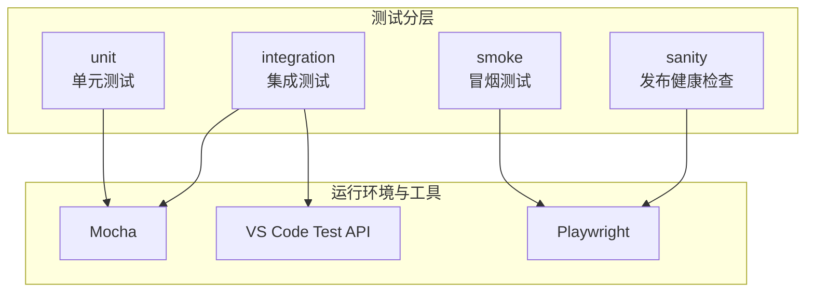
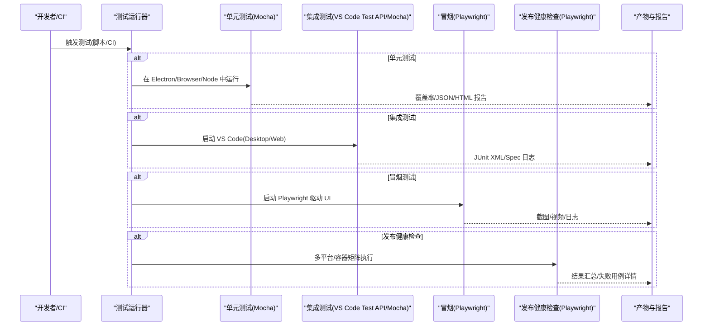
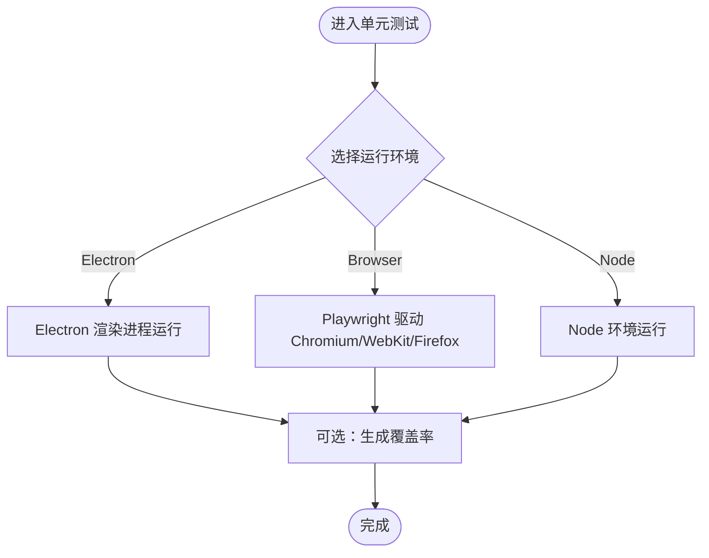
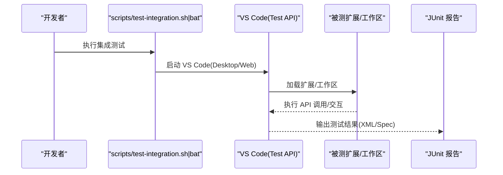
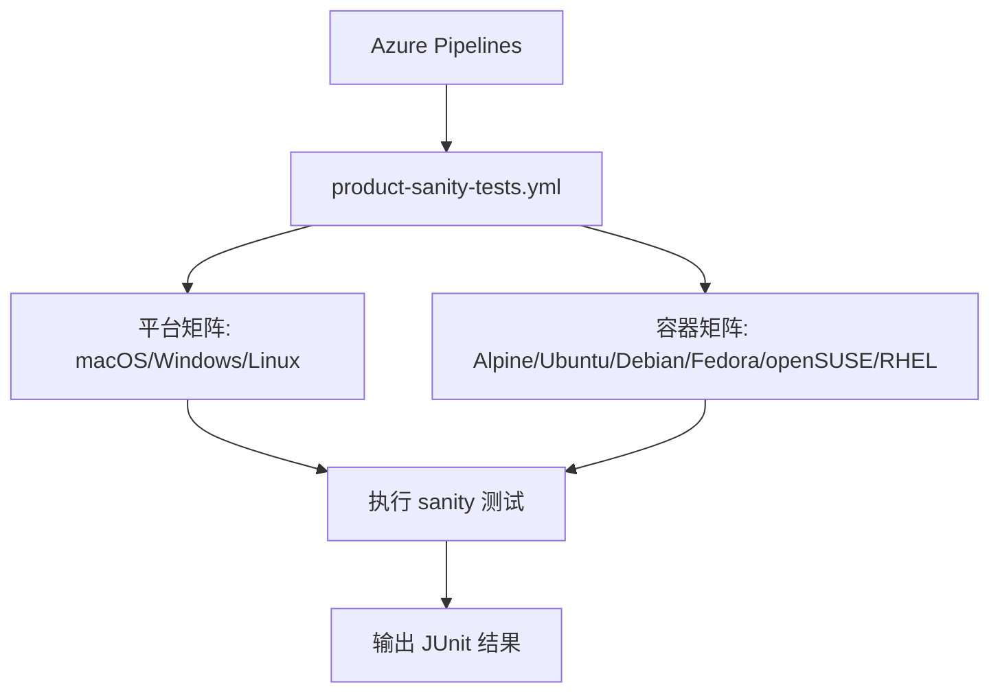
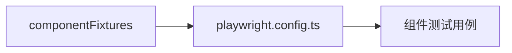
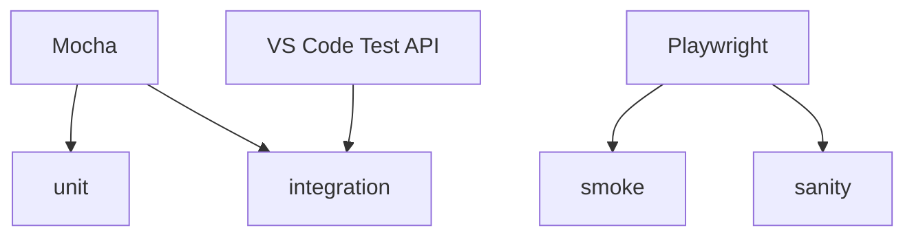

# 测试策略

<cite>
**本文引用的文件**   
- [test/README.md](file://test/README.md)
- [test/.mocharc.json](file://test/.mocharc.json)
- [test/package.json](file://test/package.json)
- [test/unit/README.md](file://test/unit/README.md)
- [test/integration/browser/README.md](file://test/integration/browser/README.md)
- [test/smoke/README.md](file://test/smoke/README.md)
- [test/sanity/README.md](file://test/sanity/README.md)
- [.vscode-test.js](file://.vscode-test.js)
- [test/componentFixtures/playwright/playwright.config.ts](file://test/componentFixtures/playwright/playwright.config.ts)
</cite>

## 目录
1. [简介](#简介)
2. [项目结构](#项目结构)
3. [核心组件](#核心组件)
4. [架构总览](#架构总览)
5. [详细组件分析](#详细组件分析)
6. [依赖分析](#依赖分析)
7. [性能考虑](#性能考虑)
8. [故障排查指南](#故障排查指南)
9. [结论](#结论)
10. [附录](#附录)

## 简介
本文件系统化阐述 Kodrix 的多层次测试体系与质量保证方案，覆盖单元测试、集成测试、冒烟测试、端到端（发布健康检查）测试等类型；说明测试框架选型与配置（Mocha、Playwright、VS Code Test API），给出用例编写规范、文件组织与命名约定、断言最佳实践；解释自动化执行流程与 CI/CD 集成方式；并提供性能测试与负载测试方法、测试数据管理与环境搭建指南，帮助测试工程师与开发者构建稳定高效的测试流水线。

## 项目结构
Kodrix 的测试代码集中在 test 目录下，按测试类型分层组织：
- unit：单元层测试，支持 Electron、浏览器与 Node 三种运行环境
- integration：API 与功能集成测试，支持 Electron 与 Web 两种运行环境
- smoke：冒烟测试，基于 Playwright 驱动 UI 进行快速验证
- sanity：发布健康检查，跨平台/容器对已发布构建做端到端验证
- automation：UI 自动化能力封装（供 smoke 等使用）
- componentFixtures：组件级测试夹具与 Playwright 配置示例
- mcp：MCP 相关测试与工具



图示来源
- [test/README.md:1-11](file://test/README.md#L1-L11)
- [test/unit/README.md:1-43](file://test/unit/README.md#L1-L43)
- [test/integration/browser/README.md:1-30](file://test/integration/browser/README.md#L1-L30)
- [test/smoke/README.md:1-87](file://test/smoke/README.md#L1-L87)
- [test/sanity/README.md:1-157](file://test/sanity/README.md#L1-L157)

章节来源
- [test/README.md:1-11](file://test/README.md#L1-L11)
- [test/package.json:1-4](file://test/package.json#L1-L4)

## 核心组件
- 测试框架与运行时
  - Mocha：统一测试运行器，TDD 风格，全局超时默认 10s
  - Playwright：用于冒烟与发布健康检查的浏览器/桌面自动化
  - VS Code Test API：用于扩展与集成测试的启动与调试
- 测试分层
  - 单元测试：Electron/Browser/Node 三环境，便于覆盖 common/browser 层
  - 集成测试：Electron/Web 双模式，覆盖 API 与关键工作流
  - 冒烟测试：快速 UI 冒烟，支持本地开发、Web 与远程场景
  - 发布健康检查：跨平台/容器矩阵，验证安装、签名、基础功能
- 配置中心
  - .mocharc.json：Mocha 全局配置
  - .vscode-test.js：VS Code Test API 配置，定义扩展测试集与报告输出
  - playwright.config.ts：Playwright 组件测试配置示例

章节来源
- [test/.mocharc.json:1-6](file://test/.mocharc.json#L1-L6)
- [.vscode-test.js:1-149](file://.vscode-test.js#L1-L149)
- [test/componentFixtures/playwright/playwright.config.ts](file://test/componentFixtures/playwright/playwright.config.ts)

## 架构总览
下图展示从“触发测试”到“执行与产出”的整体流程，涵盖不同测试类型的入口、运行环境与产物。



图示来源
- [test/unit/README.md:1-43](file://test/unit/README.md#L1-L43)
- [test/integration/browser/README.md:1-30](file://test/integration/browser/README.md#L1-L30)
- [test/smoke/README.md:1-87](file://test/smoke/README.md#L1-L87)
- [test/sanity/README.md:1-157](file://test/sanity/README.md#L1-L157)
- [.vscode-test.js:95-149](file://.vscode-test.js#L95-L149)

## 详细组件分析

### 单元测试（Unit Tests）
- 目标与范围
  - 覆盖 common 与 browser 层逻辑，确保核心算法与模块行为正确
- 运行环境
  - Electron：最接近生产环境的渲染进程
  - Browser（Chromium/WebKit/Firefox）：通过 Playwright 在浏览器中运行
  - Node：纯 Node 环境下的测试
- 常用命令
  - 在 Electron 中运行并调试
  - 在浏览器中运行指定引擎
  - 在 Node 中运行单个测试文件
  - 生成覆盖率报告
- 注意事项
  - 使用 --debug 打开 DevTools
  - 使用 --run/--glob 筛选测试
  - 启用 DEBUG=playwright:* 查看浏览器日志



图示来源
- [test/unit/README.md:1-43](file://test/unit/README.md#L1-L43)

章节来源
- [test/unit/README.md:1-43](file://test/unit/README.md#L1-L43)

### 集成测试（Integration Tests）
- 目标与范围
  - 验证 VS Code API 与工作区/单文件夹场景下的交互行为
- 运行环境
  - Electron：本地桌面实例
  - Web：浏览器实例（Chromium/WebKit）
- 调试与报告
  - 可在 VS Code 内直接调试
  - 通过 VS Code Test API 配置 JUnit 报告输出路径
- 环境变量
  - INTEGRATION_TEST_ELECTRON_PATH：指定要测试的 VS Code 可执行路径
  - VSCODE_REMOTE_SERVER_PATH：包含远程服务器测试时设置



图示来源
- [test/integration/browser/README.md:1-30](file://test/integration/browser/README.md#L1-L30)
- [.vscode-test.js:95-149](file://.vscode-test.js#L95-L149)

章节来源
- [test/integration/browser/README.md:1-30](file://test/integration/browser/README.md#L1-L30)
- [.vscode-test.js:1-149](file://.vscode-test.js#L1-L149)

### 冒烟测试（Smoke Tests）
- 目标与范围
  - 快速验证关键 UI 流程与基本可用性
- 运行模式
  - 开发模式（Electron/Web）
  - 构建模式（指向已构建产物）
  - 远程模式（Remote）
- 调试与过滤
  - --verbose 打印底层驱动调用
  - -f/-g 过滤测试用例
  - --headless 在无头模式下运行 Web
- 注意事项
  - 避免依赖 DOM 焦点状态
  - 避免硬编码等待，优先等待元素就绪
  - 注意工作区状态与单例资源隔离

```mermaid
flowchart TD
A["准备构建产物/环境"] --> B{"运行模式"}
B --> |Dev(Electron)| C["npm run smoketest"]
B --> |Dev(Web)| D["npm run smoketest --web --browser ..."]
B --> |Build| E["npm run smoketest --build <path>"]
B --> |Remote| F["npm run smoketest --remote"]
C --> G["Playwright 驱动 UI 执行用例"]
D --> G
E --> G
F --> G
G --> H["收集截图/日志/失败堆栈"]
```

图示来源
- [test/smoke/README.md:1-87](file://test/smoke/README.md#L1-L87)

章节来源
- [test/smoke/README.md:1-87](file://test/smoke/README.md#L1-L87)

### 发布健康检查（Sanity Tests）
- 目标与范围
  - 针对已发布的 VS Code 构建，在多平台/架构/容器中验证安装、签名、基础功能
- 运行方式
  - 提供各平台脚本（Windows/macOS/Linux/Docker）
  - 支持 Docker 容器矩阵（Alpine/Ubuntu/Debian/Fedora/openSUSE/RHEL 等）
- CI/CD 集成
  - Azure Pipelines 任务 product-sanity-tests.yml
  - 参数化质量级别、提交 SHA、NPM 源等
- 输出
  - JUnit 格式测试结果，便于聚合与可视化



图示来源
- [test/sanity/README.md:100-157](file://test/sanity/README.md#L100-L157)

章节来源
- [test/sanity/README.md:1-157](file://test/sanity/README.md#L1-L157)

### 组件级测试与 Playwright 配置
- 组件夹具
  - 提供组件测试所需的 fixtures 与共享脚本
- Playwright 配置
  - playwright.config.ts 作为组件测试的配置示例，便于扩展复用



图示来源
- [test/componentFixtures/playwright/playwright.config.ts](file://test/componentFixtures/playwright/playwright.config.ts)

章节来源
- [test/componentFixtures/playwright/playwright.config.ts](file://test/componentFixtures/playwright/playwright.config.ts)

## 依赖分析
- 测试框架耦合关系
  - Mocha：贯穿 unit、integration 与部分扩展测试
  - Playwright：承担 smoke 与 sanity 的 UI 自动化
  - VS Code Test API：负责扩展与集成测试的启动、调试与报告
- 外部依赖
  - 浏览器内核（Chromium/WebKit/Firefox）
  - Docker 镜像（Linux 发行版）
- 风险点
  - 浏览器版本差异导致的不稳定
  - 单例/端口/路径等资源竞争导致的并发问题
  - 远程/网络依赖引入的时序问题



图示来源
- [test/unit/README.md:1-43](file://test/unit/README.md#L1-L43)
- [test/integration/browser/README.md:1-30](file://test/integration/browser/README.md#L1-L30)
- [test/smoke/README.md:1-87](file://test/smoke/README.md#L1-L87)
- [test/sanity/README.md:1-157](file://test/sanity/README.md#L1-L157)
- [.vscode-test.js:1-149](file://.vscode-test.js#L1-L149)

章节来源
- [test/unit/README.md:1-43](file://test/unit/README.md#L1-L43)
- [test/integration/browser/README.md:1-30](file://test/integration/browser/README.md#L1-L30)
- [test/smoke/README.md:1-87](file://test/smoke/README.md#L1-L87)
- [test/sanity/README.md:1-157](file://test/sanity/README.md#L1-L157)
- [.vscode-test.js:1-149](file://.vscode-test.js#L1-L149)

## 性能考虑
- 基准与回归
  - 利用 unit 层的 Node/Browser 环境执行轻量基准，关注 CPU/内存/渲染帧率
  - 将关键路径纳入 smoke 的回归用例，监控耗时趋势
- 负载与并发
  - 在集成测试中模拟多工作区/多扩展并发，观察资源占用与稳定性
  - 使用 Playwright 的并行能力（合理分片）缩短冒烟与发布健康检查时间
- 指标采集
  - 结合覆盖率与性能采样，定位热点函数与慢查询
  - 在 CI 中记录关键指标，建立基线与告警阈值

[本节为通用指导，不直接分析具体文件]

## 故障排查指南
- 冒烟测试常见错误
  - Windows 下 tmp 目录冲突：清理临时目录后重试
  - 焦点与等待问题：避免依赖 DOM 焦点类名，改用等待活跃元素的 API
  - 单例与状态污染：确保用例间状态隔离，避免端口/路径/IPC 句柄冲突
- 集成测试调试
  - 使用 VS Code 内置调试配置直接调试 Electron/Web 集成测试
  - 开启 DEBUG=playwright:* 获取浏览器侧详细日志
- 发布健康检查
  - 根据平台脚本逐步验证环境依赖（Xvfb、Snap、Edge/WebKit 等）
  - 使用 --no-signing-check 跳过签名校验以定位非签名相关问题

章节来源
- [test/smoke/README.md:70-87](file://test/smoke/README.md#L70-L87)
- [test/integration/browser/README.md:27-30](file://test/integration/browser/README.md#L27-L30)
- [test/sanity/README.md:17-32](file://test/sanity/README.md#L17-L32)

## 结论
Kodrix 的测试体系以分层清晰、工具链完备为核心特征：Mocha 保障单元与集成测试的可控性，Playwright 支撑冒烟与发布健康检查的可靠性，VS Code Test API 打通扩展与集成测试的调试体验。通过合理的用例组织、严格的等待与隔离策略、以及 CI/CD 中的矩阵化执行，能够持续保障产品质量与交付效率。建议在此基础上进一步完善性能基线、数据工厂与环境标准化，形成更稳健的质量闭环。

[本节为总结性内容，不直接分析具体文件]

## 附录

### 测试用例编写规范与最佳实践
- 文件组织
  - 按功能域划分目录，测试文件与被测模块就近放置
  - 使用 .test.ts/.test.js 后缀，保持与源码一致的层级结构
- 命名约定
  - describe 块按功能分组，it/test 描述预期行为
  - 用例名称应表达“输入/前置条件 -> 期望结果”
- 断言方法
  - 使用 assert 或测试框架提供的断言库，明确区分相等性、存在性与异步断言
- 异步与等待
  - 避免固定延时，优先等待元素/事件/状态就绪
  - 对网络/IO 操作设置合理超时与重试
- 数据管理
  - 使用 fixture 或工厂函数生成测试数据，避免硬编码
  - 对敏感数据使用环境变量或密钥管理服务
- 隔离与并发
  - 每个用例独立初始化与清理资源
  - 避免共享可变状态，必要时使用唯一标识符

[本节为通用指导，不直接分析具体文件]

### 自动化执行与 CI/CD 集成
- 本地执行
  - 单元测试：Electron/Browser/Node 三种模式
  - 集成测试：Electron/Web 两种模式
  - 冒烟测试：开发/构建/远程多种模式
  - 发布健康检查：平台脚本或 Docker 容器
- CI/CD
  - 使用 Azure Pipelines 触发 sanity 测试矩阵
  - 在 GitHub Actions/GitLab CI 中编排 unit/integration/smoke 的执行顺序与并行度
  - 聚合 JUnit 报告与覆盖率，设置质量门禁

章节来源
- [test/unit/README.md:1-43](file://test/unit/README.md#L1-L43)
- [test/integration/browser/README.md:1-30](file://test/integration/browser/README.md#L1-L30)
- [test/smoke/README.md:1-87](file://test/smoke/README.md#L1-L87)
- [test/sanity/README.md:100-157](file://test/sanity/README.md#L100-L157)

### 测试环境与数据管理
- 环境搭建
  - 安装 Node 与浏览器内核（Chromium/WebKit/Firefox）
  - Linux 环境准备 Xvfb、D-Bus、Snap 等依赖
  - Docker 镜像按需拉取对应发行版
- 数据管理
  - 使用 fixtures 与 mock 服务隔离外部依赖
  - 对数据库/文件系统使用临时目录与事务回滚
  - 对第三方 API 使用 stub/mock 或本地代理

[本节为通用指导，不直接分析具体文件]