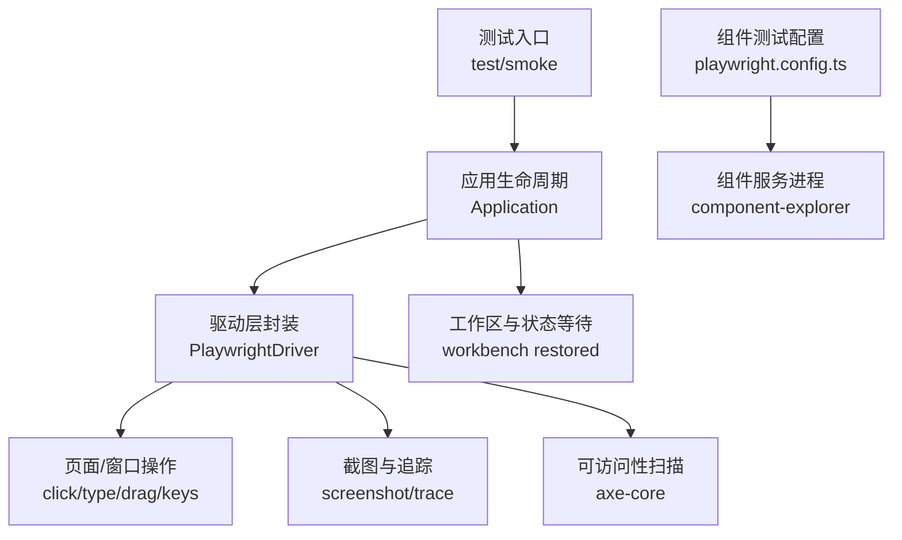
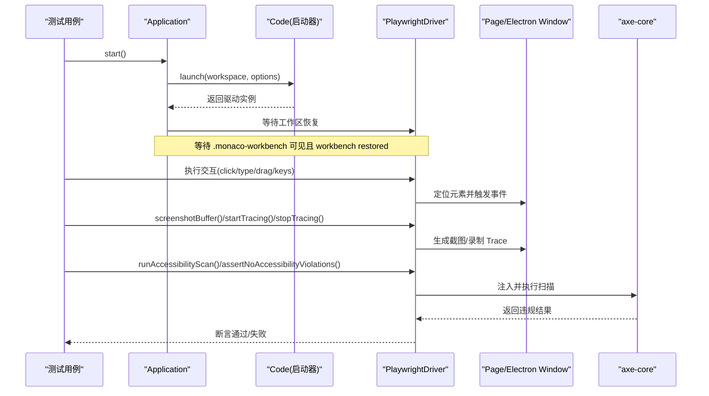
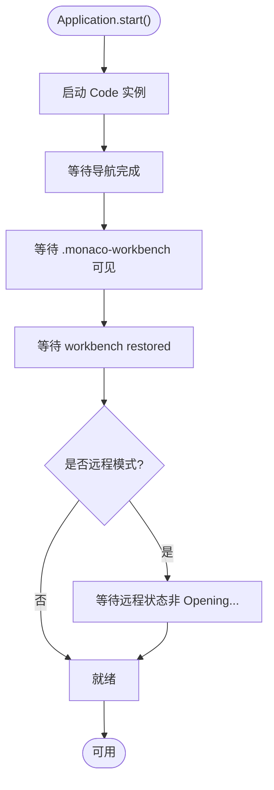
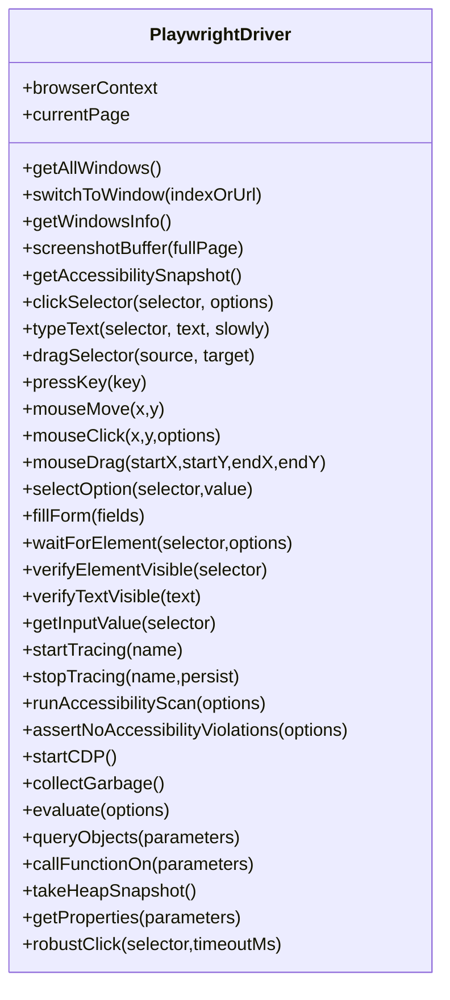
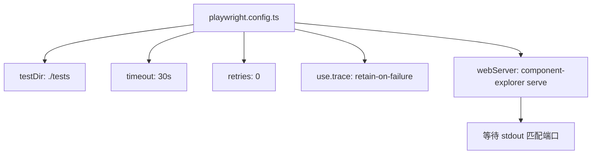
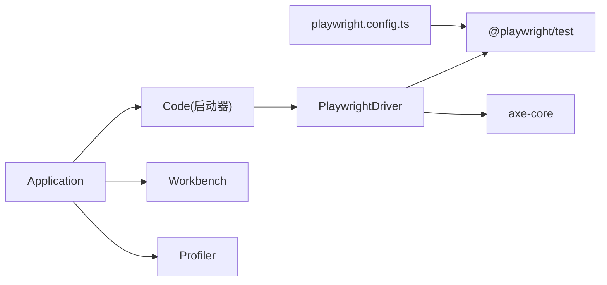

# 端到端测试

<cite>
**本文引用的文件**
- [test/automation/src/playwrightDriver.ts](file://test/automation/src/playwrightDriver.ts)
- [test/automation/src/application.ts](file://test/automation/src/application.ts)
- [test/automation/src/index.ts](file://test/automation/src/index.ts)
- [test/smoke/README.md](file://test/smoke/README.md)
- [test/componentFixtures/playwright/playwright.config.ts](file://test/componentFixtures/playwright/playwright.config.ts)
</cite>

## 目录
1. [简介](#简介)
2. [项目结构](#项目结构)
3. [核心组件](#核心组件)
4. [架构总览](#架构总览)
5. [详细组件分析](#详细组件分析)
6. [依赖关系分析](#依赖关系分析)
7. [性能与稳定性](#性能与稳定性)
8. [故障排除指南](#故障排除指南)
9. [结论](#结论)
10. [附录](#附录)

## 简介
本文件面向 Kodrix 的端到端（E2E）测试体系，聚焦基于 Playwright 的自动化测试实现。文档覆盖以下主题：
- 测试页面对象模型与高层封装（Application、Workbench、PlaywrightDriver）
- 用户交互模拟（点击、输入、拖拽、键盘组合键、窗口切换等）
- 截图与追踪（截图保存、Trace 录制、控制台日志采集）
- 可访问性扫描（axe-core 注入与规则配置）
- 测试用例组织方式（smoke 测试套件、组件级 Playwright 配置）
- 测试数据与环境管理（工作区、扩展路径、日志输出）
- 跨浏览器兼容性（Web 模式下的多浏览器执行）
- 复杂操作流程（Agent 对话、文件编辑、终端命令执行）
- 调试技巧、性能优化与常见问题排查

## 项目结构
Kodrix 的 E2E 测试主要分布在 test 目录下：
- test/automation：提供驱动层与高层 API，用于启动/控制 VS Code（Electron/Web），并暴露 Workbench、Editor、Terminal、Chat、AgentsWindow 等对象模型。
- test/smoke：冒烟测试套件，覆盖关键用户流程；通过脚本在 Electron 或 Web 模式下运行。
- test/componentFixtures/playwright：组件级 Playwright 测试配置，用于组件可视化与回归验证。

**图表来源**
- [test/automation/src/application.ts:77-154](file://test/automation/src/application.ts#L77-L154)
- [test/automation/src/playwrightDriver.ts:146-163](file://test/automation/src/playwrightDriver.ts#L146-L163)
- [test/componentFixtures/playwright/playwright.config.ts:12-27](file://test/componentFixtures/playwright/playwright.config.ts#L12-L27)

**章节来源**
- [test/smoke/README.md:1-87](file://test/smoke/README.md#L1-L87)
- [test/automation/src/index.ts:1-32](file://test/automation/src/index.ts#L1-L32)
- [test/componentFixtures/playwright/playwright.config.ts:1-28](file://test/componentFixtures/playwright/playwright.config.ts#L1-L28)

## 核心组件
- Application：负责启动/重启/停止 VS Code，等待工作区就绪，提供日志、性能分析器与质量级别信息。
- PlaywrightDriver：基于 Playwright 的底层驱动封装，提供窗口管理、元素交互、截图、追踪、CDP 能力、可访问性扫描等。
- Workbench/Editor/Terminal/Chat/AgentsWindow：由 automation 包导出的高层对象模型，便于编写可读性强的测试用例。

**章节来源**
- [test/automation/src/application.ts:23-154](file://test/automation/src/application.ts#L23-L154)
- [test/automation/src/playwrightDriver.ts:47-800](file://test/automation/src/playwrightDriver.ts#L47-L800)
- [test/automation/src/index.ts:6-31](file://test/automation/src/index.ts#L6-L31)

## 架构总览
下图展示了从测试入口到页面操作的调用链，以及截图、追踪与可访问性扫描的集成点。

**图表来源**
- [test/automation/src/application.ts:77-154](file://test/automation/src/application.ts#L77-L154)
- [test/automation/src/playwrightDriver.ts:146-163](file://test/automation/src/playwrightDriver.ts#L146-L163)
- [test/automation/src/playwrightDriver.ts:360-396](file://test/automation/src/playwrightDriver.ts#L360-L396)
- [test/automation/src/playwrightDriver.ts:717-800](file://test/automation/src/playwrightDriver.ts#L717-L800)

## 详细组件分析

### 应用生命周期与就绪等待（Application）
- 启动流程：构造时记录工作区路径与扩展路径；start() 调用内部 _start() 启动 Code 并检查窗口就绪。
- 就绪条件：等待导航提交、DOM 中 .monaco-workbench 可见、workbench restored；远程模式额外等待连接状态变化。
- 资源清理：stop() 安全退出应用；restart() 支持带参数重启。

**图表来源**
- [test/automation/src/application.ts:77-154](file://test/automation/src/application.ts#L77-L154)

**章节来源**
- [test/automation/src/application.ts:23-154](file://test/automation/src/application.ts#L23-L154)

### 驱动层封装（PlaywrightDriver）
- 窗口管理：getAllWindows()、switchToWindow()、getWindowsInfo()，支持按索引或 URL 切换。
- 元素交互：clickSelector()、typeText()、dragSelector()、pressKey()、mouseMove/click/drag、selectOption()、fillForm()。
- 文本与状态：waitForElement()、verifyElementVisible()、verifyTextVisible()、getInputValue()、evaluateExpression()。
- 截图与追踪：screenshotBuffer()、takeScreenshot()、startTracing()/stopTracing()，支持持久化 Trace 与失败截图。
- 可访问性扫描：runAccessibilityScan() 注入 axe-core，支持 tags、disableRules、excludeRules；assertNoAccessibilityViolations() 断言无违规。
- CDP 能力：startCDP()、collectGarbage()、evaluate()、queryObjects()、callFunctionOn()、takeHeapSnapshot()、getProperties()。
- 健壮点击：robustClick() 在遇到指针拦截时回退到稳定坐标点击，减少 TOCTOU 竞争。

**图表来源**
- [test/automation/src/playwrightDriver.ts:47-800](file://test/automation/src/playwrightDriver.ts#L47-L800)

**章节来源**
- [test/automation/src/playwrightDriver.ts:47-800](file://test/automation/src/playwrightDriver.ts#L47-L800)

### 组件级测试配置（Component Fixtures）
- 使用 @playwright/test 定义测试目录、超时、重试策略。
- 通过 webServer 启动 component-explorer 服务，监听 stdout 中的端口信息以确认服务就绪。
- 启用 trace 保留于失败场景，便于问题复现。

**图表来源**
- [test/componentFixtures/playwright/playwright.config.ts:12-27](file://test/componentFixtures/playwright/playwright.config.ts#L12-L27)

**章节来源**
- [test/componentFixtures/playwright/playwright.config.ts:1-28](file://test/componentFixtures/playwright/playwright.config.ts#L1-L28)

### 冒烟测试与用例组织（Smoke Tests）
- 支持 Electron 与 Web 两种运行模式；Web 模式需指定浏览器类型。
- 提供 --build 指向构建产物路径，便于对发布版本进行回归测试。
- 调试参数包括 --verbose、-f/-g 过滤、--headless 等。
- 注意事项：避免依赖 DOM focus 类、避免长时等待、避免单例冲突、确保并行安全。

**章节来源**
- [test/smoke/README.md:1-87](file://test/smoke/README.md#L1-L87)

## 依赖关系分析
- Application 依赖 Code 启动器与 Workbench 对象模型；通过 logger 与 profiler 增强可观测性。
- PlaywrightDriver 依赖 @playwright/test 与 axe-core（可选），并通过 CDP 深入页面运行时。
- 组件测试依赖 playwright.config.ts 提供的 webServer 与 trace 配置。

**图表来源**
- [test/automation/src/application.ts:23-154](file://test/automation/src/application.ts#L23-L154)
- [test/automation/src/playwrightDriver.ts:6-25](file://test/automation/src/playwrightDriver.ts#L6-L25)
- [test/componentFixtures/playwright/playwright.config.ts:6-27](file://test/componentFixtures/playwright/playwright.config.ts#L6-L27)

**章节来源**
- [test/automation/src/application.ts:23-154](file://test/automation/src/application.ts#L23-L154)
- [test/automation/src/playwrightDriver.ts:6-25](file://test/automation/src/playwrightDriver.ts#L6-L25)
- [test/componentFixtures/playwright/playwright.config.ts:6-27](file://test/componentFixtures/playwright/playwright.config.ts#L6-L27)

## 性能与稳定性
- 等待策略：优先等待 DOM 状态（visible/hidden）而非固定延时；避免不必要的 setTimeout。
- 健壮点击：robustClick() 处理指针拦截导致的 actionability 失败，降低不稳定点击。
- 追踪与截图：startTracing()/stopTracing() 仅在启用时记录；失败时自动持久化 Trace 与截图。
- 可访问性扫描：默认包含 WCAG 2.1 AA 标签；可通过 excludeRules 精准排除已知区域（如编辑器行、终端画布）。
- 并发与隔离：测试应避免共享状态（工作区、端口、句柄），确保可并行执行。

[本节为通用指导，不直接分析具体文件]

## 故障排除指南
- 工作区未就绪：确认 .monaco-workbench 已渲染且 workbench restored；远程模式需等待连接状态变化。
- 点击失败：若出现“intercepts pointer events”，使用 robustClick() 回退到稳定坐标点击。
- 可访问性扫描误报：通过 excludeRules 排除特定规则或元素；必要时添加 issue 跟踪修复。
- Trace 过大：仅对失败用例开启持久化 Trace；合理设置 timeout 与 retries。
- Web 模式浏览器差异：在不同浏览器（chromium/webkit）下验证 UI 行为与可访问性。

**章节来源**
- [test/automation/src/playwrightDriver.ts:592-642](file://test/automation/src/playwrightDriver.ts#L592-L642)
- [test/automation/src/playwrightDriver.ts:717-800](file://test/automation/src/playwrightDriver.ts#L717-L800)
- [test/automation/src/application.ts:129-154](file://test/automation/src/application.ts#L129-L154)

## 结论
Kodrix 的端到端测试体系以 Application 作为入口，结合 PlaywrightDriver 提供丰富的页面交互、截图、追踪与可访问性能力。配合 smoke 测试套件与组件级 Playwright 配置，能够覆盖从冒烟到回归的多层次验证。通过稳健的等待策略、健壮点击与可访问性扫描，测试具备较高的稳定性与可维护性。建议在编写复杂流程（如 Agent 对话、文件编辑、终端命令）时，遵循“等待状态、最小化延时、隔离环境”的原则，以获得更可靠的测试结果。

[本节为总结，不直接分析具体文件]

## 附录

### 复杂用户操作流程示例（概念性）
- Agent 对话流程：打开 Chat 面板 → 输入消息 → 等待响应 → 验证工具调用结果 → 截图/Trace。
- 文件编辑操作：打开文件 → 定位编辑器 → 输入文本 → 保存 → 验证变更 → 可访问性扫描。
- 终端命令执行：打开 Terminal → 写入命令 → 等待输出 → 校验结果 → 截图/Trace。

[本节为概念性说明，不直接分析具体文件]