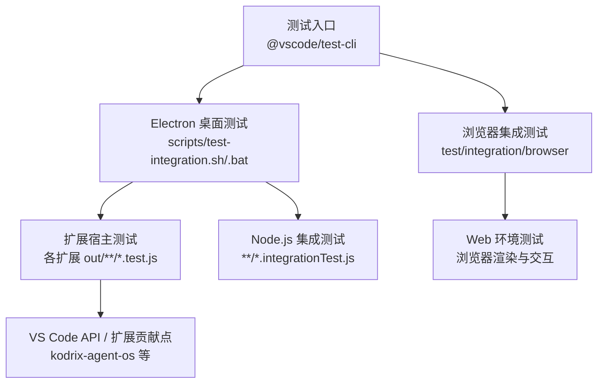
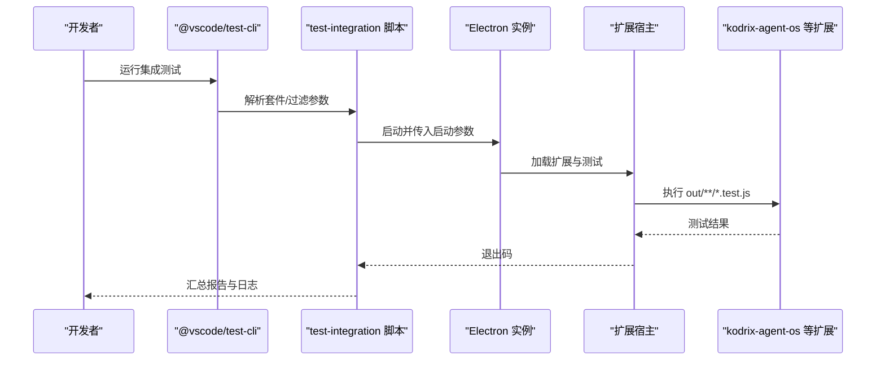
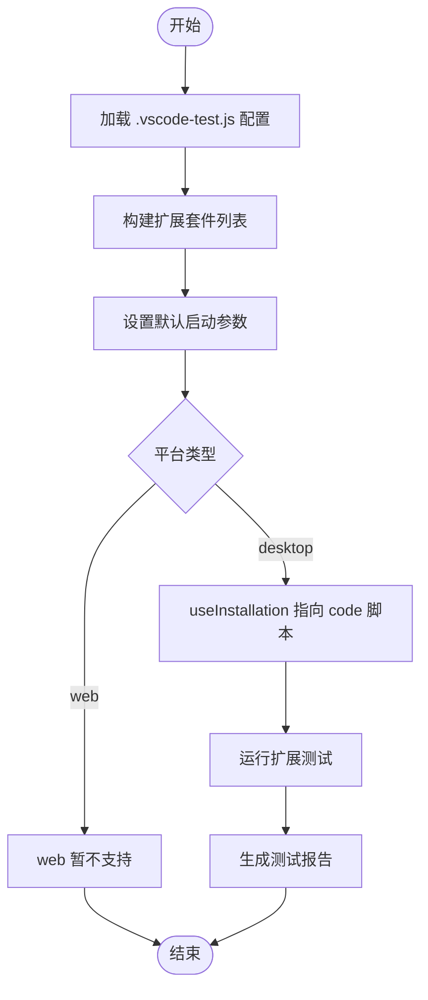
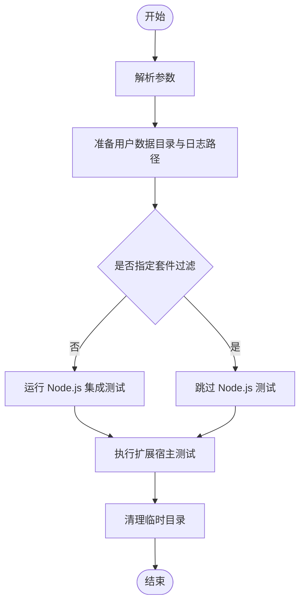
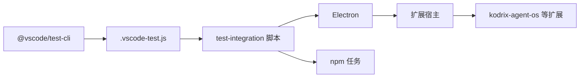

# 集成测试

<cite>
**本文引用的文件**
- [.vscode-test.js](file://.vscode-test.js)
- [scripts/test-integration.sh](file://scripts/test-integration.sh)
- [scripts/test-integration.bat](file://scripts/test-integration.bat)
- [scripts/test.sh](file://scripts/test.sh)
- [scripts/test.bat](file://scripts/test.bat)
- [extensions/kodrix-agent-os/package.json](file://extensions/kodrix-agent-os/package.json)
- [test/integration/browser/README.md](file://test/integration/browser/README.md)
</cite>

## 目录
1. [简介](#简介)
2. [项目结构](#项目结构)
3. [核心组件](#核心组件)
4. [架构总览](#架构总览)
5. [详细组件分析](#详细组件分析)
6. [依赖关系分析](#依赖关系分析)
7. [性能考虑](#性能考虑)
8. [故障排查指南](#故障排查指南)
9. [结论](#结论)
10. [附录](#附录)

## 简介
本文件面向 Kodrix 的集成测试体系，覆盖浏览器环境与 Electron 环境的集成测试实现。重点说明 VS Code Test API 的使用方式、测试工作区设置、扩展加载机制，以及多进程通信、文件系统操作、数据库集成等常见场景的测试方法。文档同时给出如何模拟外部依赖、管理测试数据、处理异步操作的实践建议，并提供 Agent OS 功能、扩展交互与用户界面集成的复杂场景示例。最后包含测试环境搭建、执行流程与结果分析的完整指南。

## 项目结构
Kodrix 的集成测试由根级配置与脚本共同驱动：
- 根级测试配置通过 @vscode/test-cli 定义多个扩展测试套件，统一注入启动参数、日志与崩溃报告路径，并支持按平台（desktop/web）运行。
- scripts 下的 test-integration.* 脚本负责编排 Node.js 集成测试与扩展宿主（Extension Host）测试，支持按套件过滤、grep 筛选、临时用户数据目录隔离等。
- 浏览器集成测试位于 test/integration/browser，提供独立的 README 与构建产物 out 目录。
- 各扩展（如 kodrix-agent-os）在 package.json 中声明命令、视图、菜单、配置项等贡献点，便于在集成测试中通过命令或 UI 进行端到端验证。

图表来源
- [.vscode-test.js:18-92](file://.vscode-test.js#L18-L92)
- [scripts/test-integration.sh:167-332](file://scripts/test-integration.sh#L167-L332)
- [scripts/test-integration.bat:121-303](file://scripts/test-integration.bat#L121-L303)

章节来源
- [.vscode-test.js:18-92](file://.vscode-test.js#L18-L92)
- [scripts/test-integration.sh:167-332](file://scripts/test-integration.sh#L167-L332)
- [scripts/test-integration.bat:121-303](file://scripts/test-integration.bat#L121-L303)

## 核心组件
- 测试配置与套件管理：通过 .vscode-test.js 集中定义扩展测试套件、工作区、超时、文件匹配模式与报告输出。
- 集成测试编排脚本：scripts/test-integration.sh/.bat 提供统一的入口，支持 --suite、--grep、--run、--runGlob 等参数，自动准备用户数据目录、日志与崩溃报告路径，并按需调用 Electron 或 npm 任务执行不同套件。
- 单元与集成测试执行：scripts/test.sh/.bat 用于运行 Electron 下的单元测试入口，为集成测试提供基础能力。
- 扩展贡献点：kodrix-agent-os 在 package.json 中声明大量命令、视图、菜单、配置项，可作为集成测试的触发点与断言目标。

章节来源
- [.vscode-test.js:18-92](file://.vscode-test.js#L18-L92)
- [scripts/test-integration.sh:119-198](file://scripts/test-integration.sh#L119-L198)
- [scripts/test-integration.bat:76-150](file://scripts/test-integration.bat#L76-L150)
- [scripts/test.sh:22-43](file://scripts/test.sh#L22-L43)
- [scripts/test.bat:8-23](file://scripts/test.bat#L8-L23)
- [extensions/kodrix-agent-os/package.json:15-454](file://extensions/kodrix-agent-os/package.json#L15-L454)

## 架构总览
下图展示了从测试入口到扩展宿主的整体流程，包括 Electron 与浏览器两条路径，以及 Node.js 集成测试与扩展宿主测试的并行执行策略。

图表来源
- [.vscode-test.js:95-146](file://.vscode-test.js#L95-L146)
- [scripts/test-integration.sh:198-332](file://scripts/test-integration.sh#L198-L332)
- [scripts/test-integration.bat:150-303](file://scripts/test-integration.bat#L150-L303)

## 详细组件分析

### 组件A：VS Code Test API 与扩展加载机制
- 套件定义：.vscode-test.js 使用 defineConfig 将多个扩展纳入测试套件，指定 extensionDevelopmentPath、workspaceFolder、files、mocha 选项等。
- 启动参数：默认 launchArgs 禁用遥测、实验、更新、工作区信任等，确保测试环境稳定；日志与崩溃报告路径固定到 .build 目录。
- 平台选择：platform 为 desktop 时启用 useInstallation 指向本地 code 脚本；web 平台暂未支持。
- 报告输出：在 CI 环境下启用 mocha-multi-reporters 与 JUnit 报告，便于流水线聚合。

图表来源
- [.vscode-test.js:18-92](file://.vscode-test.js#L18-L92)
- [.vscode-test.js:95-146](file://.vscode-test.js#L95-L146)

章节来源
- [.vscode-test.js:18-92](file://.vscode-test.js#L18-L92)
- [.vscode-test.js:95-146](file://.vscode-test.js#L95-L146)

### 组件B：Electron 集成测试编排（Linux/macOS）
- 参数解析：支持 --run、--runGlob、--grep、--suite 等参数，分别控制 Node.js 集成测试与扩展宿主测试的执行范围。
- 用户数据隔离：创建临时 VSCODEUSERDATADIR，预置 settings.json 关闭通知干扰。
- 套件执行：根据 should_run_suite 判断是否执行对应套件，调用 Electron 或 npm 任务执行扩展测试。
- 清理：结束后删除临时用户数据目录。

图表来源
- [scripts/test-integration.sh:13-95](file://scripts/test-integration.sh#L13-L95)
- [scripts/test-integration.sh:119-198](file://scripts/test-integration.sh#L119-L198)
- [scripts/test-integration.sh:198-332](file://scripts/test-integration.sh#L198-L332)

章节来源
- [scripts/test-integration.sh:13-95](file://scripts/test-integration.sh#L13-L95)
- [scripts/test-integration.sh:119-198](file://scripts/test-integration.sh#L119-L198)
- [scripts/test-integration.sh:198-332](file://scripts/test-integration.sh#L198-L332)

### 组件C：Electron 集成测试编排（Windows）
- 与 Linux/macOS 版本一致，但使用批处理语法与 Windows 路径约定。
- 支持相同的套件过滤与 grep 筛选，调用 npm run test-extension 或直接启动 Electron。
- 临时用户数据目录与日志路径同样写入 .build 目录。

章节来源
- [scripts/test-integration.bat:9-74](file://scripts/test-integration.bat#L9-L74)
- [scripts/test-integration.bat:76-150](file://scripts/test-integration.bat#L76-L150)
- [scripts/test-integration.bat:150-303](file://scripts/test-integration.bat#L150-L303)

### 组件D：Node.js 集成测试执行
- scripts/test.sh/.bat 负责下载/定位 Electron 并执行 test/unit/electron/index.js，作为底层测试执行器。
- 集成测试脚本可复用该能力，统一日志与崩溃报告路径。

章节来源
- [scripts/test.sh:22-43](file://scripts/test.sh#L22-L43)
- [scripts/test.bat:8-23](file://scripts/test.bat#L8-L23)

### 组件E：Agent OS 扩展贡献点与测试触发
- 命令面板：kodrix-agent-os 暴露大量命令（如路由、看板、检查点、学习仪表盘等），可在集成测试中通过命令触发行为并断言结果。
- 视图与菜单：注册 Explorer 视图与上下文菜单，可用于 UI 集成测试。
- 配置项：丰富的布尔/数值/枚举配置，便于在测试中切换功能开关。

章节来源
- [extensions/kodrix-agent-os/package.json:15-454](file://extensions/kodrix-agent-os/package.json#L15-L454)

### 组件F：浏览器集成测试
- 位置：test/integration/browser，提供独立 README 与构建产物 out 目录。
- 用途：针对 Web 环境的功能验证，通常与 Electron 测试互补，覆盖不同渲染与通信路径。

章节来源
- [test/integration/browser/README.md](file://test/integration/browser/README.md)

## 依赖关系分析
- 测试配置依赖 @vscode/test-cli，统一管理扩展测试套件与运行参数。
- 集成测试脚本依赖 Electron 与 npm 任务，协调 Node.js 与扩展宿主测试。
- 扩展（如 kodrix-agent-os）通过 package.json 的贡献点与 VS Code API 交互，成为测试的目标与触发点。

图表来源
- [.vscode-test.js:16-17](file://.vscode-test.js#L16-L17)
- [scripts/test-integration.sh:198-332](file://scripts/test-integration.sh#L198-L332)
- [scripts/test-integration.bat:150-303](file://scripts/test-integration.bat#L150-L303)

章节来源
- [.vscode-test.js:16-17](file://.vscode-test.js#L16-L17)
- [scripts/test-integration.sh:198-332](file://scripts/test-integration.sh#L198-L332)
- [scripts/test-integration.bat:150-303](file://scripts/test-integration.bat#L150-L303)

## 性能考虑
- 超时配置：各套件可通过 mocha.timeout 调整，避免长耗时测试被误杀。
- 并行执行：扩展宿主测试与 Node.js 集成测试可分离执行，减少相互干扰。
- 资源隔离：使用临时用户数据目录与独立日志路径，避免并发冲突。
- 报告聚合：CI 环境下启用 JUnit 报告，便于快速定位失败用例。

[本节为通用指导，不直接分析具体文件]

## 故障排查指南
- 崩溃与日志：
  - 崩溃报告路径：.build/crashes
  - 日志路径：.build/logs/integration-tests
  - 通过环境变量或启动参数指定，便于定位问题。
- 用户数据隔离：
  - 临时目录：VSCODEUSERDATADIR（脚本自动创建与清理）
  - 预置 settings.json 关闭通知，避免干扰测试。
- 套件过滤与筛选：
  - 使用 --suite 仅运行特定套件，结合 --grep 精确匹配用例标题。
  - 当使用 --run 或 --runGlob 时，会跳过扩展宿主测试，聚焦 Node.js 集成测试。
- 常见问题：
  - 套件未匹配：校验 --suite 是否在已知套件列表中。
  - 扩展未加载：确认 extensionDevelopmentPath 与 extensionTestsPath 正确。
  - 超时失败：适当增加 mocha.timeout。

章节来源
- [.vscode-test.js:95-146](file://.vscode-test.js#L95-L146)
- [scripts/test-integration.sh:119-198](file://scripts/test-integration.sh#L119-L198)
- [scripts/test-integration.bat:76-150](file://scripts/test-integration.bat#L76-L150)

## 结论
Kodrix 的集成测试体系以 @vscode/test-cli 为核心，配合跨平台的 test-integration 脚本，实现了 Electron 与浏览器环境的统一编排。通过扩展贡献点（尤其是 kodrix-agent-os）与 VS Code API，可以高效覆盖 Agent OS 功能、扩展交互与 UI 集成等复杂场景。借助临时用户数据隔离、日志与崩溃报告、套件过滤与超时配置，测试具备稳定性与可维护性。建议在持续集成中启用报告聚合，并结合浏览器与 Electron 双通道验证，提升覆盖率与可靠性。

[本节为总结，不直接分析具体文件]

## 附录
- 测试环境搭建：
  - 安装依赖：确保 node_modules 已安装。
  - 构建产物：扩展测试文件位于各扩展的 out 目录。
  - Electron 就绪：scripts/test.sh/.bat 会自动下载或定位 Electron。
- 执行流程：
  - 全量执行：scripts/test-integration.sh/.bat
  - 单套件执行：--suite <套件名>
  - 精准筛选：--grep "<用例标题>"
  - 仅 Node.js 测试：--run 或 --runGlob
- 结果分析：
  - 查看 .build/logs/integration-tests 下的日志。
  - 查看 .build/crashes 下的崩溃转储。
  - CI 环境下读取 JUnit 报告进行聚合分析。

[本节为补充信息，不直接分析具体文件]