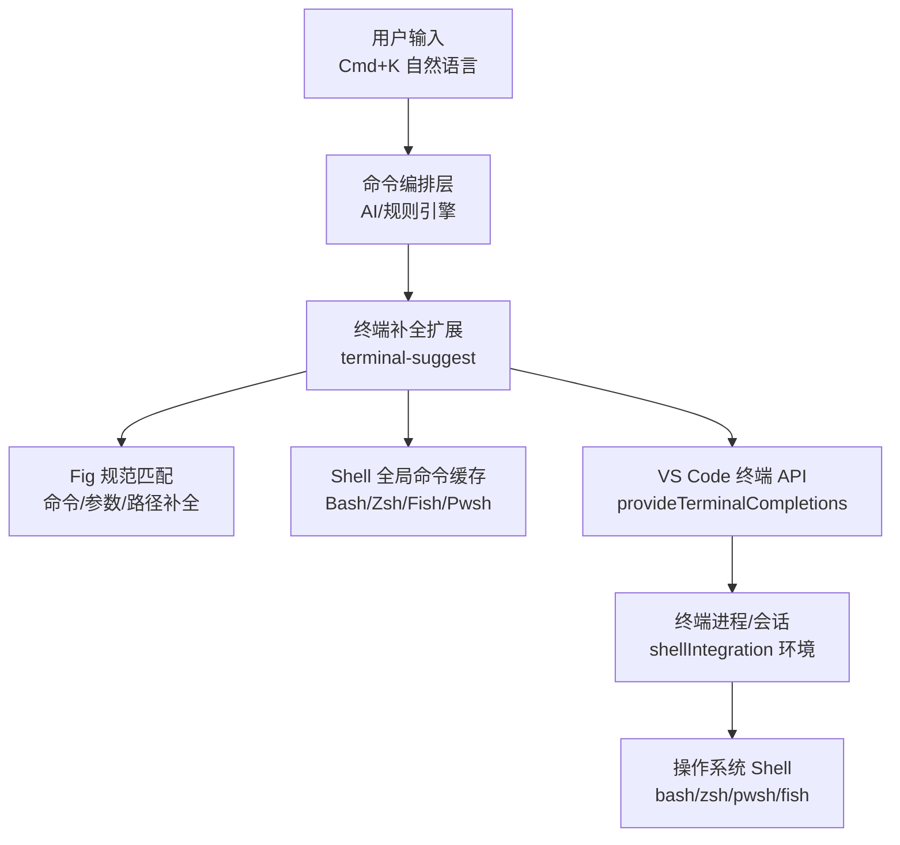
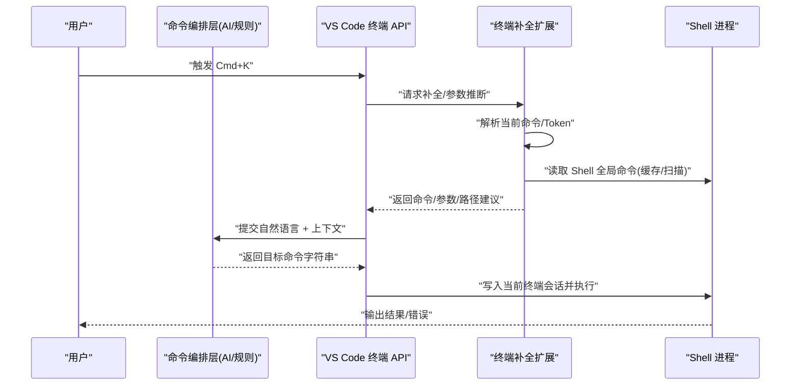
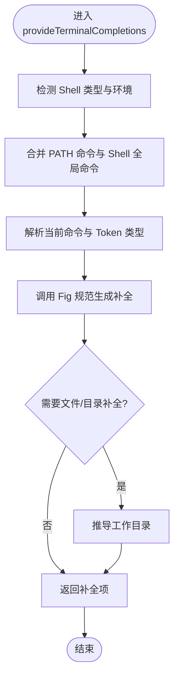
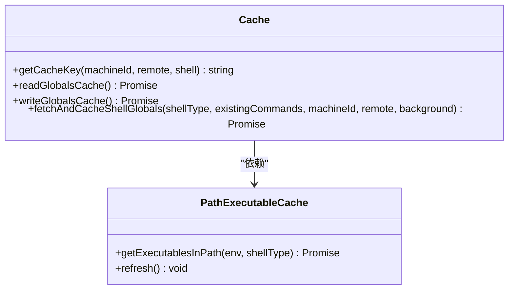
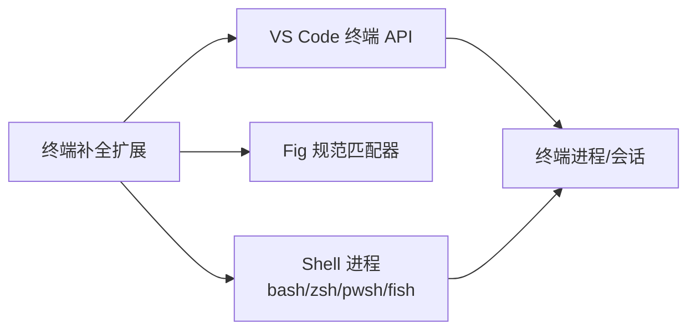

# 终端 AI

<cite>
**本文引用的文件**
- [extensions/terminal-suggest/src/terminalSuggestMain.ts](file://extensions/terminal-suggest/src/terminalSuggestMain.ts)
- [extensions/terminal-suggest/package.json](file://extensions/terminal-suggest/package.json)
- [extensions/terminal-suggest/README.md](file://extensions/terminal-suggest/README.md)
- [src/vs/workbench/contrib/terminal/common/terminalEnvironment.ts](file://src/vs/workbench/contrib/terminal/common/terminalEnvironment.ts)
- [src/vs/workbench/contrib/terminal/electron-browser/terminalProcess.ts](file://src/vs/workbench/contrib/terminal/electron-browser/terminalProcess.ts)
- [src/vs/platform/terminal/common/terminal.ts](file://src/vs/platform/terminal/common/terminal.ts)
- [src/vs/workbench/contrib/terminal/browser/terminalEditorService.ts](file://src/vs/workbench/contrib/terminal/browser/terminalEditorService.ts)
- [src/vs/workbench/api/common/extHostTerminalService.ts](file://src/vs/workbench/api/common/extHostTerminalService.ts)
- [src/vs/workbench/api/common/extHost.protocol.ts](file://src/vs/workbench/api/common/extHost.protocol.ts)
- [src/vs/workbench/services/extensions/common/extensionsApiProposals.ts](file://src/vs/workbench/services/extensions/common/extensionsApiProposals.ts)
</cite>

## 目录
1. [简介](#简介)
2. [项目结构](#项目结构)
3. [核心组件](#核心组件)
4. [架构总览](#架构总览)
5. [详细组件分析](#详细组件分析)
6. [依赖关系分析](#依赖关系分析)
7. [性能考量](#性能考量)
8. [故障排查指南](#故障排查指南)
9. [结论](#结论)
10. [附录](#附录)

## 简介
本文件面向“终端 AI”能力，聚焦 Cmd+K 自然语言命令生成与执行在 VS Code 中的落地方式。仓库中已内置的终端补全扩展（terminal-suggest）提供了强大的命令解析、参数推断、上下文感知与错误处理基础；在此基础上，可通过扩展 API 将自然语言指令转换为可执行的终端命令，并在安全策略下注入到当前终端会话执行。本文从系统架构、数据流、关键实现、配置与安全、使用示例与自定义模板等方面，给出端到端的说明与指导。

## 项目结构
围绕终端 AI 的关键代码集中在以下位置：
- 终端补全扩展：extensions/terminal-suggest
  - 入口与主逻辑：terminalSuggestMain.ts
  - 扩展元数据与激活事件：package.json
  - 功能说明：README.md
- VS Code 终端运行时与服务：
  - 终端环境、进程、协议与编辑器服务：src/vs/workbench/contrib/terminal/*
  - 平台终端类型定义：src/vs/platform/terminal/common/terminal.ts
  - 扩展宿主侧终端服务与协议：src/vs/workbench/api/common/*

图表来源
- [extensions/terminal-suggest/src/terminalSuggestMain.ts:242-326](file://extensions/terminal-suggest/src/terminalSuggestMain.ts#L242-L326)
- [src/vs/workbench/contrib/terminal/electron-browser/terminalProcess.ts:1-200](file://src/vs/workbench/contrib/terminal/electron-browser/terminalProcess.ts#L1-L200)
- [src/vs/platform/terminal/common/terminal.ts:1-200](file://src/vs/platform/terminal/common/terminal.ts#L1-L200)

章节来源
- [extensions/terminal-suggest/package.json:1-57](file://extensions/terminal-suggest/package.json#L1-L57)
- [extensions/terminal-suggest/README.md:1-8](file://extensions/terminal-suggest/README.md#L1-L8)

## 核心组件
- 终端补全提供者：注册 provideTerminalCompletions，基于 Fig 规范与 Shell 全局命令提供智能补全与参数推断。
- Shell 全局命令缓存：按机器/远程/Shell 类型缓存命令列表，避免重复扫描 PATH，提升响应速度。
- 工作目录解析：根据当前命令前缀自动推导补全的工作目录，支持相对路径与跨平台分隔符。
- 环境变量清洗：对进程环境进行安全过滤，避免敏感信息泄露给外部工具或子进程。
- 超时与降级：对补全请求设置超时保护，避免阻塞 UI。

章节来源
- [extensions/terminal-suggest/src/terminalSuggestMain.ts:58-84](file://extensions/terminal-suggest/src/terminalSuggestMain.ts#L58-L84)
- [extensions/terminal-suggest/src/terminalSuggestMain.ts:86-185](file://extensions/terminal-suggest/src/terminalSuggestMain.ts#L86-L185)
- [extensions/terminal-suggest/src/terminalSuggestMain.ts:384-427](file://extensions/terminal-suggest/src/terminalSuggestMain.ts#L384-L427)
- [extensions/terminal-suggest/src/terminalSuggestMain.ts:597-619](file://extensions/terminal-suggest/src/terminalSuggestMain.ts#L597-L619)
- [extensions/terminal-suggest/src/terminalSuggestMain.ts:281-298](file://extensions/terminal-suggest/src/terminalSuggestMain.ts#L281-L298)

## 架构总览
下图展示了从用户触发 Cmd+K 到终端执行的自然语言命令转换流程。AI/规则层负责意图识别与命令拼装，随后通过 VS Code 终端 API 写入当前终端会话。终端补全扩展在后台提供命令/参数/路径的智能补全，确保生成的命令语法正确且具备上下文。

图表来源
- [extensions/terminal-suggest/src/terminalSuggestMain.ts:242-326](file://extensions/terminal-suggest/src/terminalSuggestMain.ts#L242-L326)
- [src/vs/workbench/api/common/extHostTerminalService.ts:1-200](file://src/vs/workbench/api/common/extHostTerminalService.ts#L1-L200)
- [src/vs/workbench/api/common/extHost.protocol.ts:1-200](file://src/vs/workbench/api/common/extHost.protocol.ts#L1-L200)

## 详细组件分析

### 终端补全提供者与命令解析
- 注册终端补全提供者，监听 onTerminalShellIntegration 激活。
- 获取当前 Shell 类型与环境，合并 PATH 可执行与 Shell 全局命令。
- 解析当前命令与参数边界，调用 Fig 规范匹配器生成补全项。
- 支持文件/目录补全与工作目录推导，兼容 Windows 与类 Unix 路径。
- 为 ~ 符号补充文档与目录类型提示。

图表来源
- [extensions/terminal-suggest/src/terminalSuggestMain.ts:254-320](file://extensions/terminal-suggest/src/terminalSuggestMain.ts#L254-L320)
- [extensions/terminal-suggest/src/terminalSuggestMain.ts:469-565](file://extensions/terminal-suggest/src/terminalSuggestMain.ts#L469-L565)
- [extensions/terminal-suggest/src/terminalSuggestMain.ts:384-427](file://extensions/terminal-suggest/src/terminalSuggestMain.ts#L384-L427)

章节来源
- [extensions/terminal-suggest/src/terminalSuggestMain.ts:242-326](file://extensions/terminal-suggest/src/terminalSuggestMain.ts#L242-L326)
- [extensions/terminal-suggest/src/terminalSuggestMain.ts:469-565](file://extensions/terminal-suggest/src/terminalSuggestMain.ts#L469-L565)

### Shell 全局命令缓存与刷新
- 按 machineId、remoteAuthority、Shell 类型构建缓存键。
- 首次加载时扫描 PATH 与 Shell 内置命令，写入全局存储 JSON 缓存。
- 监听 PATH 目录变化，防抖刷新可执行文件缓存。
- 过期清理与并发请求去重，避免频繁 spawn 子进程导致卡顿。

图表来源
- [extensions/terminal-suggest/src/terminalSuggestMain.ts:54-56](file://extensions/terminal-suggest/src/terminalSuggestMain.ts#L54-L56)
- [extensions/terminal-suggest/src/terminalSuggestMain.ts:128-185](file://extensions/terminal-suggest/src/terminalSuggestMain.ts#L128-L185)
- [extensions/terminal-suggest/src/terminalSuggestMain.ts:188-238](file://extensions/terminal-suggest/src/terminalSuggestMain.ts#L188-L238)
- [extensions/terminal-suggest/src/terminalSuggestMain.ts:328-376](file://extensions/terminal-suggest/src/terminalSuggestMain.ts#L328-L376)

章节来源
- [extensions/terminal-suggest/src/terminalSuggestMain.ts:54-56](file://extensions/terminal-suggest/src/terminalSuggestMain.ts#L54-L56)
- [extensions/terminal-suggest/src/terminalSuggestMain.ts:128-185](file://extensions/terminal-suggest/src/terminalSuggestMain.ts#L128-L185)
- [extensions/terminal-suggest/src/terminalSuggestMain.ts:188-238](file://extensions/terminal-suggest/src/terminalSuggestMain.ts#L188-L238)
- [extensions/terminal-suggest/src/terminalSuggestMain.ts:328-376](file://extensions/terminal-suggest/src/terminalSuggestMain.ts#L328-L376)

### 工作目录推导与路径补全
- 根据当前命令前缀提取最近目录片段，忽略包含 .. 的路径以避免双重导航。
- 使用 vscode.Uri.joinPath 解析绝对/相对路径，校验是否为目录。
- 结合文件扩展名生成 glob 模式，驱动终端的文件/目录补全。

章节来源
- [extensions/terminal-suggest/src/terminalSuggestMain.ts:384-427](file://extensions/terminal-suggest/src/terminalSuggestMain.ts#L384-L427)
- [extensions/terminal-suggest/src/terminalSuggestMain.ts:621-630](file://extensions/terminal-suggest/src/terminalSuggestMain.ts#L621-L630)

### 环境变量清洗与安全
- 对进程环境进行白名单过滤，移除可能泄露敏感信息的变量。
- 当无 shellIntegration 环境时，使用 sanitizeProcessEnvironment 清理后再传递给外部工具。

章节来源
- [extensions/terminal-suggest/src/terminalSuggestMain.ts:567-578](file://extensions/terminal-suggest/src/terminalSuggestMain.ts#L567-L578)
- [extensions/terminal-suggest/src/terminalSuggestMain.ts:597-619](file://extensions/terminal-suggest/src/terminalSuggestMain.ts#L597-L619)

### 超时与错误处理
- 对补全请求设置 5 秒超时，避免长时间阻塞。
- 捕获并记录异常，保证用户体验稳定。
- 在后台任务中抑制错误日志，减少噪音。

章节来源
- [extensions/terminal-suggest/src/terminalSuggestMain.ts:281-298](file://extensions/terminal-suggest/src/terminalSuggestMain.ts#L281-L298)
- [extensions/terminal-suggest/src/terminalSuggestMain.ts:170-178](file://extensions/terminal-suggest/src/terminalSuggestMain.ts#L170-L178)

## 依赖关系分析
- 终端补全扩展依赖 VS Code 终端 API 提供的 provideTerminalCompletions 与 shellIntegration 环境。
- 通过 Fig 规范匹配器完成命令/参数/路径的智能补全。
- 与 Shell 进程交互以获取内置命令与 PATH 可执行文件。
- 受限于平台差异（Windows/类 Unix），需处理路径分隔符与命令后缀。

图表来源
- [extensions/terminal-suggest/src/terminalSuggestMain.ts:242-326](file://extensions/terminal-suggest/src/terminalSuggestMain.ts#L242-L326)
- [src/vs/workbench/contrib/terminal/electron-browser/terminalProcess.ts:1-200](file://src/vs/workbench/contrib/terminal/electron-browser/terminalProcess.ts#L1-L200)
- [src/vs/platform/terminal/common/terminal.ts:1-200](file://src/vs/platform/terminal/common/terminal.ts#L1-L200)

章节来源
- [extensions/terminal-suggest/package.json:16-45](file://extensions/terminal-suggest/package.json#L16-L45)
- [extensions/terminal-suggest/src/terminalSuggestMain.ts:242-326](file://extensions/terminal-suggest/src/terminalSuggestMain.ts#L242-L326)

## 性能考量
- 缓存策略：按机器/远程/Shell 类型缓存全局命令，降低重复扫描开销。
- 并发控制：同一缓存键的请求去重，避免多次 spawn。
- 超时保护：补全请求设置超时，防止 UI 卡顿。
- 文件监听：对 PATH 目录变更进行防抖刷新，平衡实时性与性能。
- 环境变量最小化：仅传递必要的环境变量，减少外部工具负担。

[本节为通用性能建议，不直接分析具体文件]

## 故障排查指南
- 补全无响应或超时
  - 检查是否启用 terminal.integrated.suggest.enabled。
  - 查看控制台日志中关于 #terminalCompletions 的调试信息。
  - 确认 shellIntegration 可用，PATH 目录存在且可访问。
- 命令补全不完整
  - 清除全局缓存后重试：terminal.integrated.suggest.clearCachedGlobals。
  - 检查 PATH 目录是否被监控，必要时手动刷新。
- 路径补全异常
  - 确认当前命令前缀是否包含有效目录片段。
  - 检查工作目录推导逻辑是否因 .. 被跳过。
- 环境变量问题
  - 确认 sanitizeProcessEnvironment 未误删必要变量。
  - 在远程/容器环境中验证 shellIntegration.env 是否正确注入。

章节来源
- [extensions/terminal-suggest/src/terminalSuggestMain.ts:254-326](file://extensions/terminal-suggest/src/terminalSuggestMain.ts#L254-L326)
- [extensions/terminal-suggest/src/terminalSuggestMain.ts:328-376](file://extensions/terminal-suggest/src/terminalSuggestMain.ts#L328-L376)
- [extensions/terminal-suggest/src/terminalSuggestMain.ts:597-619](file://extensions/terminal-suggest/src/terminalSuggestMain.ts#L597-L619)

## 结论
终端 AI 的核心在于“自然语言 → 可执行命令”的可靠转换与执行。VS Code 终端补全扩展提供了完善的命令解析、参数推断、路径补全与错误处理机制；通过扩展 API，可将 AI 生成的命令安全地注入到当前终端会话执行。配合缓存、超时、环境变量清洗等策略，可在保证性能与安全的前提下，为用户提供流畅的终端 AI 体验。

[本节为总结性内容，不直接分析具体文件]

## 附录

### 支持的命令类型与语法规范
- 内置命令：git、npm、npx、pnpm、yarn、gh、azd、code、cd、set-location 等。
- Shell 全局命令：bash/zsh/fish/pwsh 的内置命令与 PATH 可执行文件。
- 参数与标志：由 Fig 规范驱动，自动补全常用参数与选项。
- 路径补全：支持相对/绝对路径、文件与目录过滤、扩展名筛选。

章节来源
- [extensions/terminal-suggest/src/terminalSuggestMain.ts:58-74](file://extensions/terminal-suggest/src/terminalSuggestMain.ts#L58-L74)
- [extensions/terminal-suggest/src/terminalSuggestMain.ts:469-565](file://extensions/terminal-suggest/src/terminalSuggestMain.ts#L469-L565)

### 安全限制与配置选项
- 环境变量清洗：移除潜在敏感变量，避免泄露。
- 超时保护：补全请求默认 5 秒超时。
- 缓存策略：全局命令缓存有效期 7 天，支持手动清除。
- 扩展激活：onTerminalShellIntegration:*，仅在终端集成就绪时生效。
- 功能开关：terminal.integrated.suggest.enabled 控制补全启用。

章节来源
- [extensions/terminal-suggest/src/terminalSuggestMain.ts:597-619](file://extensions/terminal-suggest/src/terminalSuggestMain.ts#L597-L619)
- [extensions/terminal-suggest/src/terminalSuggestMain.ts:281-298](file://extensions/terminal-suggest/src/terminalSuggestMain.ts#L281-L298)
- [extensions/terminal-suggest/src/terminalSuggestMain.ts:188-238](file://extensions/terminal-suggest/src/terminalSuggestMain.ts#L188-L238)
- [extensions/terminal-suggest/package.json:16-45](file://extensions/terminal-suggest/package.json#L16-L45)

### 使用示例（常见终端操作场景）
- 文件操作
  - 自然语言：“在当前目录创建 test.txt 并写入 Hello World”
  - 生成命令：touch test.txt && echo "Hello World" > test.txt
- Git 命令
  - 自然语言：“列出最近 5 次提交并显示简要统计”
  - 生成命令：git log --oneline -5
- 构建脚本执行
  - 自然语言：“运行 npm 构建并输出日志到 build.log”
  - 生成命令：npm run build > build.log 2>&1

[本节为概念性示例，不直接分析具体文件]

### 自定义命令模板开发与调试
- 开发步骤
  - 在扩展中添加新的 Fig 规范描述，定义命令、参数与路径补全规则。
  - 在 availableSpecs 中注册新规范，使其参与补全匹配。
  - 使用 VS Code 终端调试面板观察补全行为与日志。
- 调试要点
  - 检查 tokenType 与当前命令边界是否正确解析。
  - 验证工作目录推导是否符合预期。
  - 确认环境变量是否被正确传递与清洗。
  - 使用 clearCachedGlobals 命令刷新缓存，排除缓存干扰。

章节来源
- [extensions/terminal-suggest/src/terminalSuggestMain.ts:58-74](file://extensions/terminal-suggest/src/terminalSuggestMain.ts#L58-L74)
- [extensions/terminal-suggest/src/terminalSuggestMain.ts:254-326](file://extensions/terminal-suggest/src/terminalSuggestMain.ts#L254-L326)
- [extensions/terminal-suggest/src/terminalSuggestMain.ts:328-376](file://extensions/terminal-suggest/src/terminalSuggestMain.ts#L328-L376)