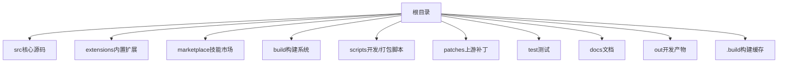
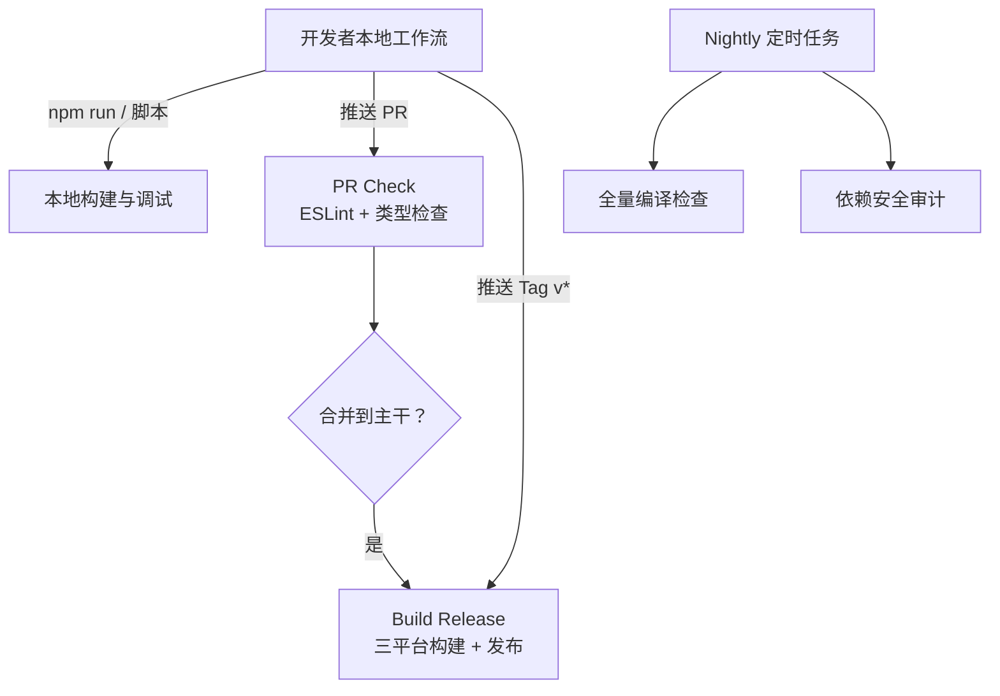
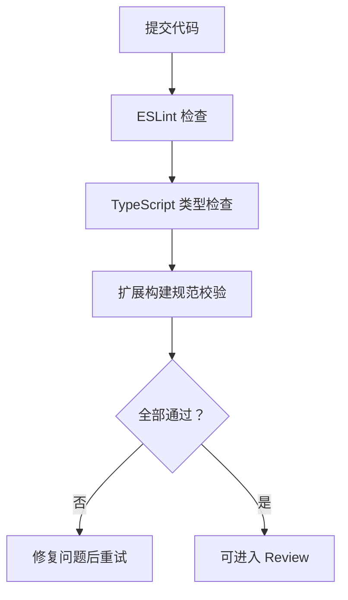
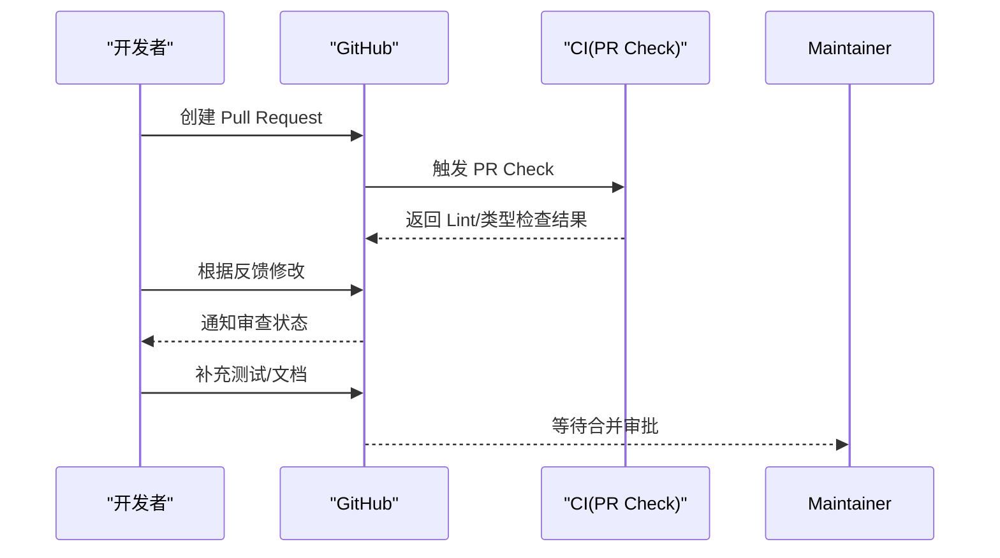
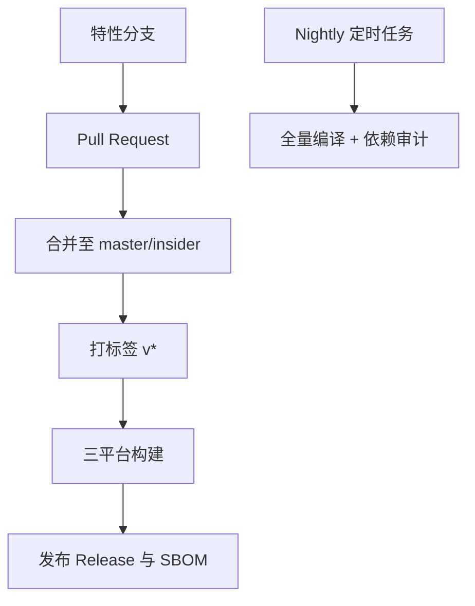
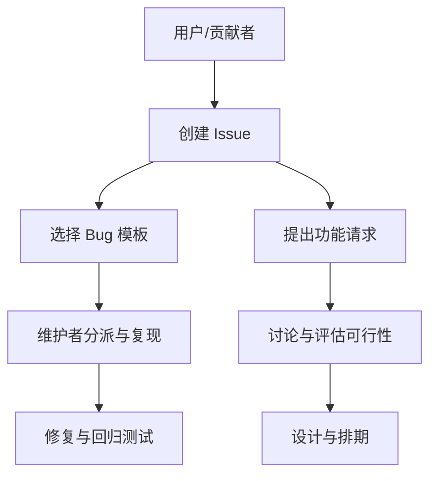
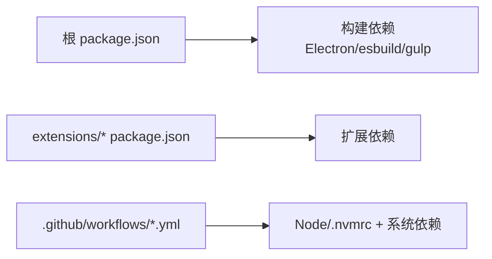

# 贡献指南

<cite>
**本文引用的文件**   
- [README.md](file://README.md)
- [package.json](file://package.json)
- [product.json](file://product.json)
- [.github/PULL_REQUEST_TEMPLATE.md](file://.github/PULL_REQUEST_TEMPLATE.md)
- [.github/ISSUE_TEMPLATE/bug_report.md](file://.github/ISSUE_TEMPLATE/bug_report.md)
- [.github/workflows/build.yml](file://.github/workflows/build.yml)
- [.github/workflows/pr-check.yml](file://.github/workflows/pr-check.yml)
- [.github/workflows/nightly.yml](file://.github/workflows/nightly.yml)
- [extensions/CONTRIBUTING.md](file://extensions/CONTRIBUTING.md)
- [cli/CONTRIBUTING.md](file://cli/CONTRIBUTING.md)
- [extensions/copilot/CODE_OF_CONDUCT.md](file://extensions/copilot/CODE_OF_CONDUCT.md)
- [.eslint-plugin-local/vscode-dts-use-export.ts](file://.eslint-plugin-local/vscode-dts-use-export.ts)
</cite>

## 目录
1. [简介](#简介)
2. [项目结构](#项目结构)
3. [核心组件](#核心组件)
4. [架构总览](#架构总览)
5. [详细组件分析](#详细组件分析)
6. [依赖关系分析](#依赖关系分析)
7. [性能与构建注意事项](#性能与构建注意事项)
8. [故障排查指南](#故障排查指南)
9. [结论](#结论)
10. [附录](#附录)

## 简介
Kodrix Code 是基于 VS Code / VSCodium 的 AI 原生代码编辑器分支，集成多 Agent 协作、智能补全、Idea Flow 等能力。本贡献指南面向新贡献者，说明如何搭建开发环境、遵循代码规范、提交变更、参与 Pull Request 审核，并介绍分支管理、版本发布流程、Bug 报告与功能请求渠道、社区行为准则与沟通方式。

## 项目结构
仓库采用“核心 + 内置扩展”的组织方式：
- src：核心源码（TypeScript / VS Code 框架）
- extensions：内置扩展（含 kodrix-*、copilot、git 等）
- marketplace：Skill 示例包与 catalog
- build：gulp + esbuild 构建系统
- scripts：开发 / 打包 / 修复脚本
- patches：VSCodium 上游补丁
- test：unit / smoke / mcp
- docs：文档与体检 / 审计报告
- out：编译输出（开发）
- .build：构建缓存（electron / 扩展等）

**图示来源**
- [README.md:69-85](file://README.md#L69-L85)

**章节来源**
- [README.md:69-85](file://README.md#L69-L85)

## 核心组件
- 产品配置与品牌：product.json 定义产品品牌与运行时配置项。
- 构建与脚本：package.json 提供 npm 脚本与依赖；根级 gulpfile.mjs 驱动构建任务。
- 内置扩展：extensions 下每个子目录为独立扩展，遵循统一结构与构建约定。
- CLI：cli 目录为 Rust 实现的命令行工具，有独立的贡献说明。

**章节来源**
- [product.json:628-701](file://product.json#L628-L701)
- [package.json:201-244](file://package.json#L201-L244)
- [extensions/CONTRIBUTING.md:1-33](file://extensions/CONTRIBUTING.md#L1-L33)
- [cli/CONTRIBUTING.md:1-21](file://cli/CONTRIBUTING.md#L1-L21)

## 架构总览
Kodrix Code 的开发与发布由本地脚本与 GitHub Actions 协同完成：
- 本地开发：通过 debug.bat / debug-rebuild.bat / build.bat 或 npm 脚本进行快速调试、增量编译与打包。
- CI/CD：PR Check 执行 ESLint 与类型检查；Nightly 定时全量编译与依赖审计；Build Release 在打 tag 时构建三平台产物并发布 Release。

**图示来源**
- [.github/workflows/pr-check.yml:1-79](file://.github/workflows/pr-check.yml#L1-L79)
- [.github/workflows/nightly.yml:1-44](file://.github/workflows/nightly.yml#L1-L44)
- [.github/workflows/build.yml:1-336](file://.github/workflows/build.yml#L1-L336)
- [README.md:36-67](file://README.md#L36-L67)

## 详细组件分析

### 开发环境与快速开始
- Node.js 版本需匹配 .nvmrc（当前基线 Node 24.x），npm < 12。
- Windows 推荐 PowerShell；安装包需本机构建工具链。
- 首次依赖安装与 Copilot 扩展打包可能耗时较长。
- 常用命令：
  - 带日志启动：debug.bat
  - 热更新：debug.bat -Watch
  - 一键重编译+启动：debug-rebuild.bat
  - 打包 EXE：build.bat
  - npm 脚本：dev:prepare、package:win32、compile

**章节来源**
- [README.md:36-67](file://README.md#L36-L67)

### 代码规范与质量门禁
- ESLint 规则：根目录 eslint.config.js 与自定义插件 .eslint-plugin-local 提供强约束。
- TypeScript 类型检查：typecheck-client 作为 PR 门禁。
- 内置扩展规范：遵循 extensions/CONTRIBUTING.md 的结构与构建约定。
- CLI 规范：Rust 侧参考 cli/CONTRIBUTING.md。
- 公共 API 导出规范：自定义 ESLint 规则要求对外暴露的类型必须使用 export。

**图示来源**
- [.github/workflows/pr-check.yml:18-32](file://.github/workflows/pr-check.yml#L18-L32)
- [extensions/CONTRIBUTING.md:1-33](file://extensions/CONTRIBUTING.md#L1-L33)
- [.eslint-plugin-local/vscode-dts-use-export.ts:1-32](file://.eslint-plugin-local/vscode-dts-use-export.ts#L1-L32)

**章节来源**
- [.github/workflows/pr-check.yml:18-32](file://.github/workflows/pr-check.yml#L18-L32)
- [extensions/CONTRIBUTING.md:1-33](file://extensions/CONTRIBUTING.md#L1-L33)
- [cli/CONTRIBUTING.md:1-21](file://cli/CONTRIBUTING.md#L1-L21)
- [.eslint-plugin-local/vscode-dts-use-export.ts:1-32](file://.eslint-plugin-local/vscode-dts-use-export.ts#L1-L32)

### 提交流程与 Pull Request 模板
- 创建 PR 时使用 .github/PULL_REQUEST_TEMPLATE.md，填写摘要、类型、领域、测试计划与检查清单。
- 建议包含单元测试与集成测试用例；避免 console.warn/log，使用 OutputChannel；妥善清理定时器与资源。
- 路径遍历保护、网络请求超时与大小限制、JSON 反序列化校验等安全要点需在 Checklist 中确认。

**图示来源**
- [.github/PULL_REQUEST_TEMPLATE.md:1-40](file://.github/PULL_REQUEST_TEMPLATE.md#L1-L40)
- [.github/workflows/pr-check.yml:1-79](file://.github/workflows/pr-check.yml#L1-L79)

**章节来源**
- [.github/PULL_REQUEST_TEMPLATE.md:1-40](file://.github/PULL_REQUEST_TEMPLATE.md#L1-L40)

### 分支管理与版本发布流程
- 分支策略：PR Check 监听 master 与 insider 分支，日常开发基于 feature 分支发起 PR。
- 版本发布：推送 v* tag 触发 Build Release，构建 Windows/Linux/macOS 三平台产物，生成 SBOM 与 SHA256SUMS，并发布 GitHub Release。
- 夜间质量：Nightly 定时任务执行全量编译与依赖审计，保障主干稳定性。

**图示来源**
- [.github/workflows/build.yml:21-35](file://.github/workflows/build.yml#L21-L35)
- [.github/workflows/build.yml:81-112](file://.github/workflows/build.yml#L81-L112)
- [.github/workflows/build.yml:222-324](file://.github/workflows/build.yml#L222-L324)
- [.github/workflows/nightly.yml:1-44](file://.github/workflows/nightly.yml#L1-L44)
- [.github/workflows/pr-check.yml:1-11](file://.github/workflows/pr-check.yml#L1-L11)

**章节来源**
- [.github/workflows/build.yml:21-35](file://.github/workflows/build.yml#L21-L35)
- [.github/workflows/build.yml:81-112](file://.github/workflows/build.yml#L81-L112)
- [.github/workflows/build.yml:222-324](file://.github/workflows/build.yml#L222-L324)
- [.github/workflows/nightly.yml:1-44](file://.github/workflows/nightly.yml#L1-L44)
- [.github/workflows/pr-check.yml:1-11](file://.github/workflows/pr-check.yml#L1-L11)

### Bug 报告与功能请求
- Bug 报告：使用 .github/ISSUE_TEMPLATE/bug_report.md，描述复现步骤、预期行为、截图与环境信息。
- 功能请求：建议在 Issue 中明确需求背景、影响范围与验收标准；必要时附上设计草案或原型。
- 安全漏洞：遵循 SECURITY.md 披露流程（仓库内存在该文件）。

**图示来源**
- [.github/ISSUE_TEMPLATE/bug_report.md:1-41](file://.github/ISSUE_TEMPLATE/bug_report.md#L1-L41)

**章节来源**
- [.github/ISSUE_TEMPLATE/bug_report.md:1-41](file://.github/ISSUE_TEMPLATE/bug_report.md#L1-L41)

### 社区行为准则与沟通渠道
- 行为准则：遵循 Microsoft Open Source Code of Conduct（extensions/copilot/CODE_OF_CONDUCT.md 引用）。
- 沟通渠道：Issues、PR 评论、Actions 日志；安全问题按 SECURITY.md 披露。
- 帮助途径：阅读 README、AGENTS.md、REPAIR-NOTES.md 与各扩展 CONTRIBUTING.md。

**章节来源**
- [extensions/copilot/CODE_OF_CONDUCT.md:1-10](file://extensions/copilot/CODE_OF_CONDUCT.md#L1-L10)
- [README.md:106-115](file://README.md#L106-L115)

## 依赖关系分析
- 构建依赖：Electron、esbuild、gulp 等由 package.json 声明。
- 扩展依赖：各扩展拥有独立 package.json 与构建脚本，遵循统一 tsconfig.base.json 与 esbuild 配置。
- CI 依赖：Node 版本由 .nvmrc 锁定；Linux 构建需要 libkrb5-dev 与 build-essential。

**图示来源**
- [package.json:201-244](file://package.json#L201-L244)
- [.github/workflows/build.yml:138-147](file://.github/workflows/build.yml#L138-L147)

**章节来源**
- [package.json:201-244](file://package.json#L201-L244)
- [.github/workflows/build.yml:138-147](file://.github/workflows/build.yml#L138-L147)

## 性能与构建注意事项
- Copilot 扩展首次 esbuild 打包耗时较长属正常现象。
- preinstall.ts 严格校验 Node 版本；npm < 12。
- Electron 经 @vscode/gulp-electron 下载到 .build/electron/。
- dev-fast.ps1 设置 VSCODE_SKIP_PRELAUNCH 加速启动；客户端过期时走 build-fast。

**章节来源**
- [README.md:97-104](file://README.md#L97-L104)

## 故障排查指南
- 常见问题：启动卡死、native 模块缺失、中文语言包异常等，详见 REPAIR-NOTES.md。
- 构建失败：检查 Node/npm 版本、系统依赖（Linux 需 libkrb5-dev、build-essential）、磁盘空间与权限。
- 安全扫描：PR 与 nightly 均运行 npm audit 与 gitleaks，出现告警需及时修复。

**章节来源**
- [README.md:106-115](file://README.md#L106-L115)
- [.github/workflows/pr-check.yml:58-79](file://.github/workflows/pr-check.yml#L58-L79)
- [.github/workflows/nightly.yml:28-44](file://.github/workflows/nightly.yml#L28-L44)

## 结论
Kodrix Code 提供了清晰的本地开发与 CI 流水线，配合严格的代码规范与安全扫描，确保贡献质量。新贡献者可从 README 与 extensions/cli 的贡献说明入手，遵循 PR 模板与 Checklist，逐步参与特性开发、缺陷修复与文档改进。

## 附录
- 关键配置文件：
  - product.json：产品品牌与运行时配置
  - .nvmrc：Node.js 版本要求
  - .npmrc：npm + Electron 构建配置
  - package.json：脚本与依赖
  - .vscode/launch.json：调试启动配置

**章节来源**
- [README.md:87-96](file://README.md#L87-L96)