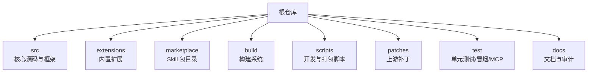
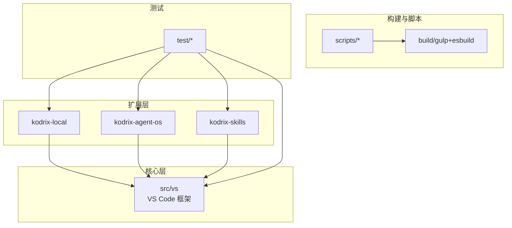
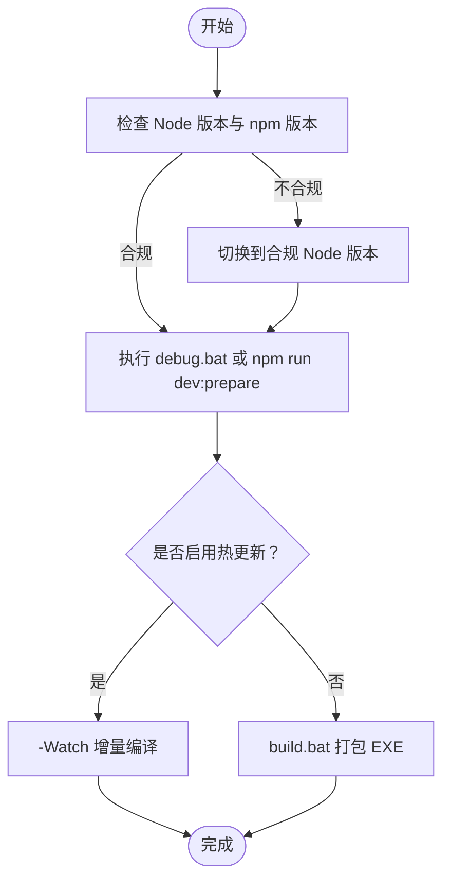
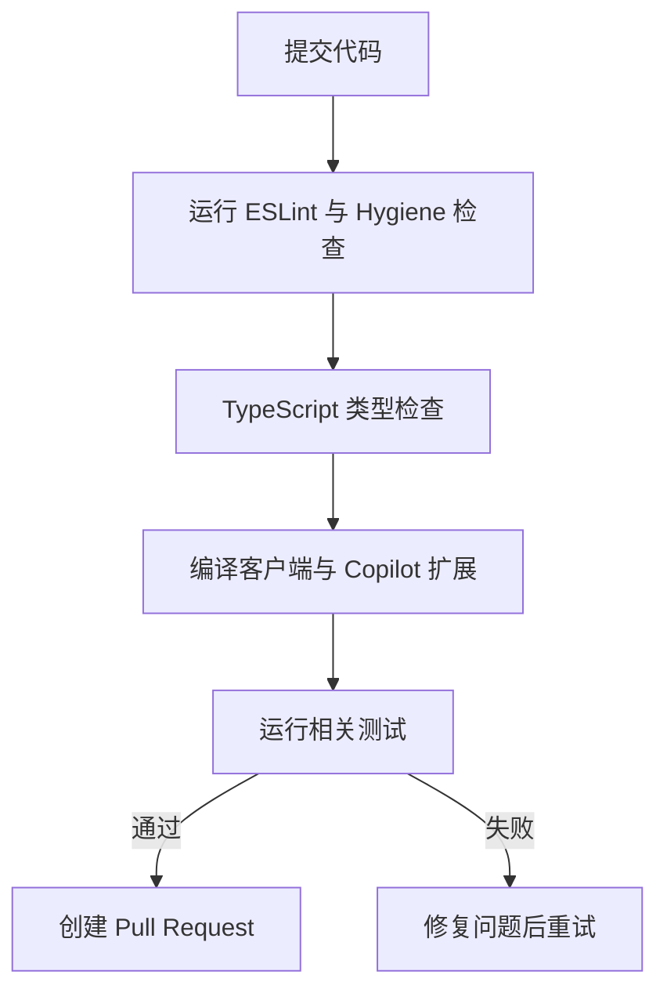
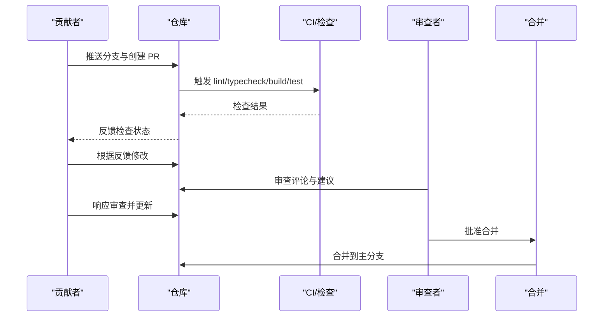
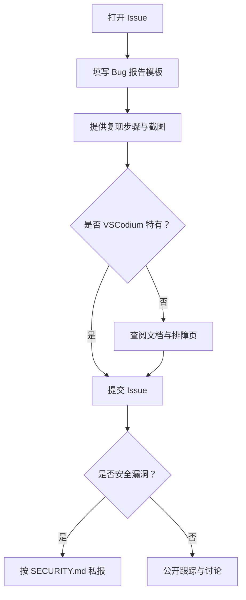
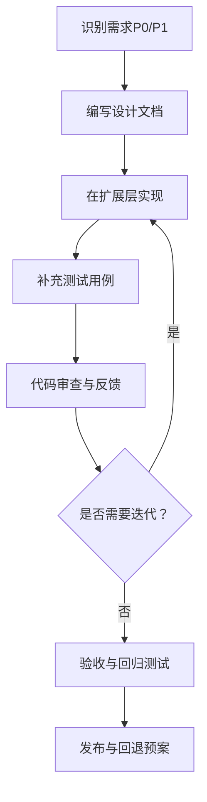
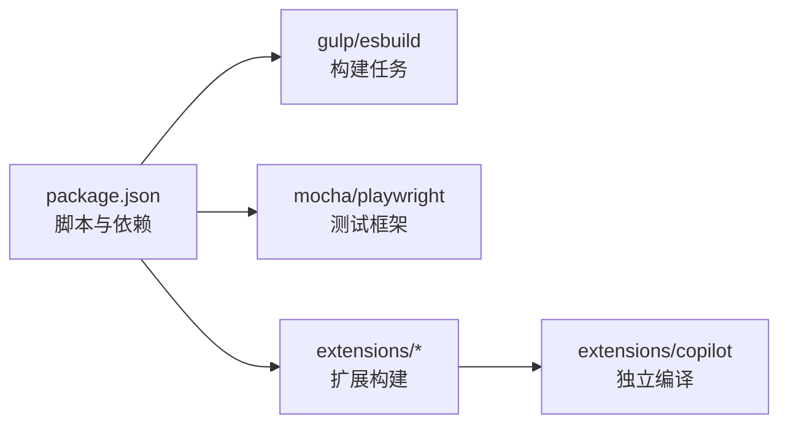

# 贡献指南

<cite>
**本文引用的文件**   
- [README.md](file://README.md)
- [AGENTS.md](file://AGENTS.md)
- [package.json](file://package.json)
- [.editorconfig](file://.editorconfig)
- [eslint.config.js](file://eslint.config.js)
- [.github/PULL_REQUEST_TEMPLATE.md](file://.github/PULL_REQUEST_TEMPLATE.md)
- [.github/ISSUE_TEMPLATE/bug_report.md](file://.github/ISSUE_TEMPLATE/bug_report.md)
- [SECURITY.md](file://SECURITY.md)
- [extensions/CONTRIBUTING.md](file://extensions/CONTRIBUTING.md)
- [cli/CONTRIBUTING.md](file://cli/CONTRIBUTING.md)
- [docs/项目非常有必要新实现的核心功能总报告.md](file://docs/项目非常有必要新实现的核心功能总报告.md)
</cite>

## 目录
1. [引言](#引言)
2. [项目结构](#项目结构)
3. [核心贡献方式](#核心贡献方式)
4. [架构总览](#架构总览)
5. [详细组件与流程分析](#详细组件与流程分析)
6. [依赖与协作关系分析](#依赖与协作关系分析)
7. [性能与构建注意事项](#性能与构建注意事项)
8. [故障排查与安全实践](#故障排查与安全实践)
9. [结论](#结论)
10. [附录：快速命令与清单](#附录快速命令与清单)

## 引言
本指南面向希望参与 Kodrix 代码贡献的开发者，涵盖环境搭建、开发工作流、代码规范、提交与审查流程、问题报告、新功能开发路径以及社区行为准则。Kodrix 是基于 VS Code / VSCodium 的深度定制分支，集成多 Agent 协作、智能补全、Idea Flow 等能力；贡献者应优先在扩展层（kodrix-local、kodrix-agent-os、kodrix-skills）进行改动，谨慎修改核心框架 src/vs。

## 项目结构
仓库采用“核心 + 内置扩展 + 构建脚本 + 测试 + 文档”的分层组织：
- src：核心源码与 VS Code 框架层
- extensions：内置扩展（含 kodrix-*、copilot、git 等）
- marketplace：Skill 包目录与 catalog
- build：gulp + esbuild 构建系统
- scripts：开发、打包、修复脚本
- patches：VSCodium 上游补丁
- test：unit / smoke / mcp 等测试
- docs：文档与体检 / 审计报告

**图表来源**
- [AGENTS.md:9-54](file://AGENTS.md#L9-L54)
- [README.md:69-85](file://README.md#L69-L85)

**章节来源**
- [AGENTS.md:9-54](file://AGENTS.md#L9-L54)
- [README.md:69-85](file://README.md#L69-L85)

## 核心贡献方式
- 代码贡献：通过 Fork → 分支开发 → 本地验证 → 提交 Pull Request → 响应审查 → 合并的流程推进。
- 文档贡献：更新 README、AGENTS、docs 下的文档，保持与产品能力一致。
- 问题报告：使用 GitHub Issue 模板提交 Bug 报告，遵循安全策略不公开漏洞细节。
- 扩展贡献：遵循 extensions/CONTRIBUTING.md 的结构与构建约定。
- CLI 贡献：遵循 cli/CONTRIBUTING.md 的环境与构建要求。

**章节来源**
- [.github/PULL_REQUEST_TEMPLATE.md:1-40](file://.github/PULL_REQUEST_TEMPLATE.md#L1-L40)
- [.github/ISSUE_TEMPLATE/bug_report.md:1-41](file://.github/ISSUE_TEMPLATE/bug_report.md#L1-L41)
- [extensions/CONTRIBUTING.md:1-33](file://extensions/CONTRIBUTING.md#L1-L33)
- [cli/CONTRIBUTING.md:1-21](file://cli/CONTRIBUTING.md#L1-L21)

## 架构总览
Kodrix 的贡献架构围绕“扩展优先、核心保守”的原则展开：
- 扩展层：kodrix-local、kodrix-agent-os、kodrix-skills 承载主要差异化能力。
- 核心层：src/vs 为 VS Code 框架层，改动需评估影响面并尽量复用已有模式。
- 构建与脚本：scripts 提供 dev-fast、build-exe 等一键脚本；build 提供 gulp/esbuild 任务。
- 测试：test 目录覆盖 unit/smoke/mcp 等场景，PR 需保证相关测试通过。

**图表来源**
- [AGENTS.md:9-54](file://AGENTS.md#L9-L54)
- [README.md:69-85](file://README.md#L69-L85)

## 详细组件与流程分析

### 开发环境与启动
- Node.js 版本须匹配 .nvmrc（同 major 且 ≥ 指定版本），npm < 12。
- Windows 推荐 PowerShell；安装包需本机构建工具链。
- 常用入口：
  - debug.bat：带实时日志的控制台调试启动（esbuild 快编译）。
  - debug.bat -Watch：热更新。
  - debug-rebuild.bat：全量重编译 + 带日志启动。
  - build.bat：一键重新编译打包 EXE 安装包。
- npm 脚本：dev:prepare、compile、package:win32 等。

**图表来源**
- [README.md:36-67](file://README.md#L36-L67)
- [AGENTS.md:58-95](file://AGENTS.md#L58-L95)

**章节来源**
- [README.md:36-67](file://README.md#L36-L67)
- [AGENTS.md:58-95](file://AGENTS.md#L58-L95)

### 代码规范与质量门禁
- EditorConfig：统一缩进、换行、字符集与尾部空白处理。
- ESLint：通过 eslint.config.js 配置规则；PR 模板要求 `npm run eslint` 零警告。
- TypeScript：使用 tsgo 与 tsconfig 校验类型；precommit 触发 hygiene 检查。
- 扩展构建：遵循 extensions/CONTRIBUTING.md 的输出目录与浏览器目标配置。

**图表来源**
- [.editorconfig:1-26](file://.editorconfig#L1-L26)
- [eslint.config.js](file://eslint.config.js)
- [package.json:55-89](file://package.json#L55-L89)
- [extensions/CONTRIBUTING.md:1-33](file://extensions/CONTRIBUTING.md#L1-L33)

**章节来源**
- [.editorconfig:1-26](file://.editorconfig#L1-L26)
- [eslint.config.js](file://eslint.config.js)
- [package.json:55-89](file://package.json#L55-L89)
- [extensions/CONTRIBUTING.md:1-33](file://extensions/CONTRIBUTING.md#L1-L33)

### 提交与审查流程（Pull Request）
- 分支与提交：每个特性/修复独立分支，提交信息清晰描述变更范围与动机。
- PR 模板：填写 Summary、Type、Area、Test Plan、Checklist。
- 审查要点：
  - 资源清理：context.subscriptions、setTimeout/setInterval 句柄管理。
  - 日志输出：扩展中禁止 console.warn/log，使用 OutputChannel。
  - 安全性：JSON 反序列化校验、路径穿越防护、网络请求超时与大小限制。
- 合并条件：ESLint 零警告、编译无错误、测试通过、审查意见已响应。

**图表来源**
- [.github/PULL_REQUEST_TEMPLATE.md:1-40](file://.github/PULL_REQUEST_TEMPLATE.md#L1-L40)
- [package.json:55-89](file://package.json#L55-L89)

**章节来源**
- [.github/PULL_REQUEST_TEMPLATE.md:1-40](file://.github/PULL_REQUEST_TEMPLATE.md#L1-L40)

### 问题报告（Bug Report）
- 使用 .github/ISSUE_TEMPLATE/bug_report.md 模板，包含复现步骤、预期行为、截图与环境信息。
- 确认是否为 VSCodium 特有现象，并排除文档已覆盖的问题。
- 安全漏洞不得在公开 Issue 中粘贴利用细节，按 SECURITY.md 渠道私报。

**图表来源**
- [.github/ISSUE_TEMPLATE/bug_report.md:1-41](file://.github/ISSUE_TEMPLATE/bug_report.md#L1-L41)
- [SECURITY.md:1-65](file://SECURITY.md#L1-L65)

**章节来源**
- [.github/ISSUE_TEMPLATE/bug_report.md:1-41](file://.github/ISSUE_TEMPLATE/bug_report.md#L1-L41)
- [SECURITY.md:1-65](file://SECURITY.md#L1-L65)

### 新功能开发指导（端到端流程）
- 需求分析：参考 docs/项目非常有必要新实现的核心功能总报告.md，明确 P0/P1 优先级与验收标准。
- 设计文档：在扩展层提出设计方案（如 Learning Engine 2.0、主动上下文感知、Checkpoint 时间线等），说明数据流、接口与风险点。
- 实现方案：优先在 kodrix-* 扩展内实现，复用现有 logger/paths/配置读写模式；避免直接改动 src/vs。
- 测试验证：补充单元/集成测试，确保 PR 模板中的 Test Plan 可执行并通过。
- 发布与回退：结合 Checkpoint 机制与 Diff 画廊进行可视化审阅与回滚。

**图表来源**
- [docs/项目非常有必要新实现的核心功能总报告.md:36-91](file://docs/项目非常有必要新实现的核心功能总报告.md#L36-L91)
- [AGENTS.md:97-103](file://AGENTS.md#L97-L103)

**章节来源**
- [docs/项目非常有必要新实现的核心功能总报告.md:36-91](file://docs/项目非常有必要新实现的核心功能总报告.md#L36-L91)
- [AGENTS.md:97-103](file://AGENTS.md#L97-L103)

### 扩展与 CLI 贡献要点
- 内置扩展：遵循 package.json、src、tsconfig、esbuild.mts、.vscodeignore 的标准结构；如需支持浏览器，增加 browser 入口与 tsconfig.browser.json。
- CLI（Rust）：Windows 需 OpenSSL（vcpkg），安装后可 cargo build；调试任务已配置。

**章节来源**
- [extensions/CONTRIBUTING.md:1-33](file://extensions/CONTRIBUTING.md#L1-L33)
- [cli/CONTRIBUTING.md:1-21](file://cli/CONTRIBUTING.md#L1-L21)

## 依赖与协作关系分析
- 构建与脚本依赖：package.json 定义了 compile、watch、hygiene、smoketest 等脚本；gulp 与 esbuild 负责编译与打包。
- 扩展依赖：extensions/copilot 有独立的 compile/watch 脚本；其他扩展遵循通用结构。
- 测试依赖：mocha、playwright、vscode-test 等用于不同场景的测试。

**图表来源**
- [package.json:12-100](file://package.json#L12-L100)

**章节来源**
- [package.json:12-100](file://package.json#L12-L100)

## 性能与构建注意事项
- Copilot 扩展首次 esbuild 打包耗时较长（多路并行），属正常现象。
- preinstall.ts 严格校验 Node 版本与 npm 版本；Cursor 沙箱 PATH 可能指向旧版 Node，请使用系统合规 Node。
- Electron 经 @vscode/gulp-electron 下载到 .build/electron/。
- dev-fast.ps1 设置 VSCODE_SKIP_PRELAUNCH 以加快启动；客户端过期时走 build-fast。

**章节来源**
- [README.md:97-104](file://README.md#L97-L104)
- [AGENTS.md:88-95](file://AGENTS.md#L88-L95)

## 故障排查与安全实践
- 常见启动/native 模块/语言包问题：优先查阅 REPAIR-NOTES.md（若存在）与 AGENTS.md 的排障顺序。
- 安全实践：
  - 永不提交密钥，使用 SecretStorage 或环境变量。
  - 优先 child_process.spawn + 参数数组，禁止拼接 shell 字符串。
  - 校验路径防目录穿越（迁移/Skill 安装/MCP）。
  - 网络请求与进程 stdout/stderr 须有超时与大小上限。
  - 合并前运行 npm audit；security job 对 critical 会拦截。

**章节来源**
- [SECURITY.md:1-65](file://SECURITY.md#L1-L65)
- [AGENTS.md:97-103](file://AGENTS.md#L97-L103)

## 结论
Kodrix 的贡献流程强调“扩展优先、核心保守”，通过严格的代码规范、构建与测试门禁，以及清晰的 PR 审查与安全策略，保障代码质量与协作效率。新贡献者可从扩展层入手，逐步深入核心；长期参与者可关注 P0/P1 核心能力落地，推动项目差异化优势。

## 附录：快速命令与清单
- 开发启动：debug.bat / debug.bat -Watch / debug-rebuild.bat
- 打包：build.bat
- npm 脚本：dev:prepare、compile、package:win32、eslint、typecheck-client、smoketest
- 扩展构建：npm --prefix extensions/copilot run compile/watch
- 安全检查：npm audit、eslint、hygiene

**章节来源**
- [README.md:45-67](file://README.md#L45-L67)
- [package.json:12-100](file://package.json#L12-L100)