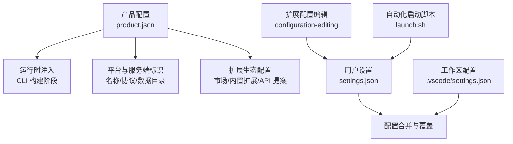
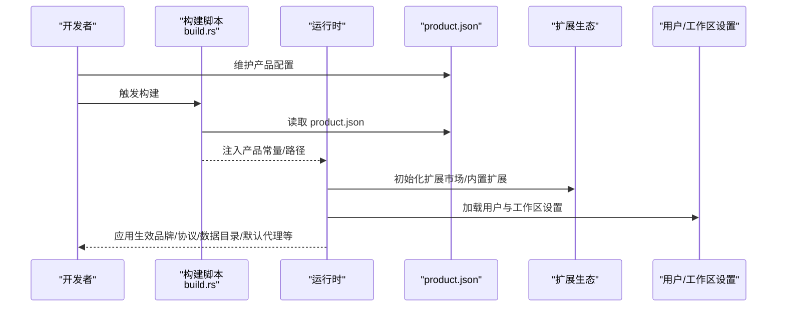
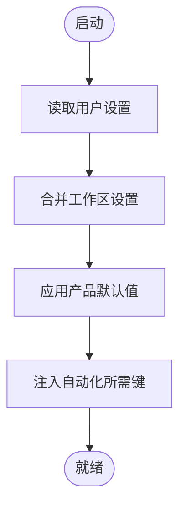
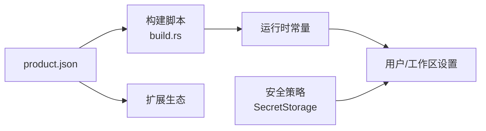

# 配置管理

<cite>
**本文引用的文件**
- [product.json](file://product.json)
- [REPAIR-NOTES.md](file://REPAIR-NOTES.md)
- [SECURITY.md](file://SECURITY.md)
- [AGENTS.md](file://AGENTS.md)
- [README.md](file://README.md)
- [build.rs](file://cli/build.rs)
- [constants.rs](file://cli/src/constants.rs)
- [update_api.sh](file://dev/update_api.sh)
- [launch.sh](file:.agents/skills/launch/scripts/launch.sh)
- [configuration-editing/package.json](file://extensions/configuration-editing/package.json)
</cite>

## 目录
1. [简介](#简介)
2. [项目结构](#项目结构)
3. [核心组件](#核心组件)
4. [架构总览](#架构总览)
5. [详细组件分析](#详细组件分析)
6. [依赖关系分析](#依赖关系分析)
7. [性能考虑](#性能考虑)
8. [故障排查指南](#故障排查指南)
9. [结论](#结论)
10. [附录](#附录)

## 简介
本文件面向管理员与用户，系统化说明 Kodrix 的配置体系：产品级配置（product.json）、用户设置、工作区配置等多层次结构；关键配置项的作用与默认值（模型供应商、功能开关、UI 定制等）；配置的优先级与继承机制；配置验证与错误处理；配置模板与最佳实践；以及迁移与版本兼容性管理。目标是帮助团队统一配置标准，降低排错成本，提升可维护性。

## 项目结构
Kodrix 的配置由“产品层 + 用户层 + 工作区级”构成，并通过构建脚本与扩展能力进行加载、校验与编辑支持。

图示来源
- [product.json:1-806](file://product.json#L1-L806)
- [build.rs:137-168](file://cli/build.rs#L137-L168)
- [launch.sh:129-177](file://.agents/skills/launch/scripts/launch.sh#L129-L177)
- [configuration-editing/package.json:56-93](file://extensions/configuration-editing/package.json#L56-L93)

章节来源
- [product.json:1-806](file://product.json#L1-L806)
- [build.rs:137-168](file://cli/build.rs#L137-L168)
- [launch.sh:129-177](file://.agents/skills/launch/scripts/launch.sh#L129-L177)
- [configuration-editing/package.json:56-93](file://extensions/configuration-editing/package.json#L56-L93)

## 核心组件
- 产品配置（product.json）
  - 品牌与运行元信息：应用名、数据目录、URL 协议、许可证信息等
  - 服务端与隧道配置：服务器应用名、隧道服务名、认证提供商作用域
  - 扩展生态：扩展市场地址、内置扩展白名单、API 提案启用列表、扩展运行位置策略
  - 默认聊天代理与提供商：默认 Agent、提供商映射、权限范围、配额与链接
  - 安全与信任：可信扩展授权访问列表、徽章域名白名单
- 用户与工作区设置
  - 用户设置：用户级 settings.json，用于个性化偏好
  - 工作区设置：.vscode/settings.json，用于项目级覆盖
  - 自动化启动：launch.sh 在启动时向用户 settings.json 写入特定键以适配自动化场景
- 配置编辑与校验
  - configuration-editing 扩展提供对 settings.json 的编辑与提示
  - 构建期从 product.json 注入常量，确保 CLI/主进程一致性
- 安全与合规
  - 密钥必须通过 SecretStorage 管理，禁止明文写入 settings.json
  - product.json 中外部端点需审计

章节来源
- [product.json:1-806](file://product.json#L1-L806)
- [launch.sh:129-177](file://.agents/skills/launch/scripts/launch.sh#L129-L177)
- [configuration-editing/package.json:56-93](file://extensions/configuration-editing/package.json#L56-L93)
- [SECURITY.md:46-63](file://SECURITY.md#L46-L63)

## 架构总览
下图展示产品配置如何贯穿构建期与运行期，并影响扩展生态、默认代理与安全策略。

图示来源
- [build.rs:137-168](file://cli/build.rs#L137-L168)
- [product.json:1-806](file://product.json#L1-L806)

## 详细组件分析

### 产品配置（product.json）
- 品牌与运行元信息
  - 应用名、短名、长名、数据目录、共享数据目录、服务器数据目录
  - URL 协议、许可证信息与文件名
  - Windows 相关标识（互斥量、注册表值、AppId、Tunnel 互斥量等）
- 服务端与隧道
  - 服务器应用名
  - 隧道应用名与配置（编辑器 Web 地址、扩展友好名与 ID、认证提供商作用域）
- 扩展生态
  - 扩展市场服务地址、资源与最新版本模板
  - 内置扩展及自动更新白名单
  - API 提案启用列表与按扩展维度的能力白名单
  - 扩展运行位置策略（ui/workspace）
  - 虚拟工作空间支持默认值
- 默认聊天代理与提供商
  - 默认扩展与输出日志通道
  - 提供商映射（GitHub、Enterprise、Google、Apple、Microsoft）
  - 提供商扩展 ID、URI 设置、作用域集合
  - 配额、许可、管理与跳转链接
- 安全与信任
  - 可信扩展对认证提供商的访问白名单
  - 徽章域名白名单与正则匹配规则

章节来源
- [product.json:1-806](file://product.json#L1-L806)

### 用户设置与工作区配置
- 用户设置（settings.json）
  - 存放于用户数据目录，承载用户级偏好
  - 可通过扩展提供的配置编辑界面进行编辑与提示
- 工作区设置（.vscode/settings.json）
  - 针对当前工作区的覆盖配置
- 自动化启动注入
  - launch.sh 在启动时将特定键写入用户 settings.json，以满足自动化场景需求（例如启用简单对话框）

图示来源
- [launch.sh:129-177](file://.agents/skills/launch/scripts/launch.sh#L129-L177)
- [configuration-editing/package.json:56-93](file://extensions/configuration-editing/package.json#L56-L93)

章节来源
- [launch.sh:129-177](file://.agents/skills/launch/scripts/launch.sh#L129-L177)
- [configuration-editing/package.json:56-93](file://extensions/configuration-editing/package.json#L56-L93)

### 配置优先级与继承机制
- 层级顺序（从低到高）
  - 产品默认（product.json 注入的默认值）
  - 用户设置（settings.json）
  - 工作区设置（.vscode/settings.json）
- 覆盖规则
  - 上层配置覆盖下层同名键
  - 数组/对象通常按语义合并或替换，具体取决于键的定义
- 自动化注入
  - 启动脚本可在每次启动时写入必要键，保证自动化环境一致

章节来源
- [launch.sh:129-177](file://.agents/skills/launch/scripts/launch.sh#L129-L177)

### 关键配置项与作用
- 模型供应商与聊天代理
  - 默认聊天代理扩展与输出日志通道
  - 提供商映射（id/name），提供商扩展 ID、URI 设置与 scopes
  - 配额、许可与管理链接，便于企业治理
- 功能开关
  - 内置扩展与自动更新白名单
  - API 提案启用列表与按扩展的能力白名单
  - 扩展运行位置策略（ui/workspace）
- UI 定制
  - 品牌名、协议、图标、许可证信息
  - 数据目录命名（用户/共享/服务器）
- 安全与信任
  - 可信扩展对认证提供商的访问白名单
  - 徽章域名白名单与正则匹配

章节来源
- [product.json:1-806](file://product.json#L1-L806)

### 配置验证与错误处理
- 构建期校验
  - 构建脚本从 product.json 读取并注入常量，缺失字段可能导致运行时异常
- 运行时保护
  - 某些缺失字段会导致崩溃（如数据目录相关），应通过幂等修复脚本补齐
- 安全约束
  - 密钥不得写入 settings.json，须使用 SecretStorage
  - 审计 product.json 中的外部端点

章节来源
- [build.rs:137-168](file://cli/build.rs#L137-L168)
- [constants.rs:97-97](file://cli/src/constants.rs#L97-L97)
- [REPAIR-NOTES.md:61-68](file://REPAIR-NOTES.md#L61-L68)
- [SECURITY.md:46-63](file://SECURITY.md#L46-L63)

### 配置模板与最佳实践
- 模板建议
  - 为不同环境（开发/测试/生产）准备 product.json 变体，仅变更必要字段（如市场地址、协议、数据目录）
  - 为用户与工作区提供最小化 settings.json 模板，避免冗余
- 最佳实践
  - 将敏感信息放入 SecretStorage，不在仓库提交任何密钥
  - 使用工作区设置统一团队风格，用户设置保留个人偏好
  - 通过扩展配置编辑界面进行可视化编辑，减少手写错误
  - 定期审计 product.json 的外部端点与白名单

章节来源
- [SECURITY.md:46-63](file://SECURITY.md#L46-L63)
- [configuration-editing/package.json:56-93](file://extensions/configuration-editing/package.json#L56-L93)

### 配置迁移与版本兼容性
- 构建期同步
  - 通过脚本从上游版本提取 API 提案列表并回填到 product.json，保持兼容
- 向后兼容
  - 新增字段时尽量提供默认值，避免破坏旧配置
  - 对破坏性变更提供迁移指引与工具

章节来源
- [update_api.sh:39-45](file://dev/update_api.sh#L39-L45)

## 依赖关系分析
- 构建期依赖
  - build.rs 依赖 product.json 生成常量，确保 CLI 与主进程一致
- 运行期依赖
  - 运行时读取 product.json 注入的品牌/协议/数据目录
  - 扩展生态依赖 market 地址与白名单
  - 用户/工作区设置被合并后生效
- 安全依赖
  - 密钥通过 SecretStorage 管理，避免泄露

图示来源
- [build.rs:137-168](file://cli/build.rs#L137-L168)
- [product.json:1-806](file://product.json#L1-L806)
- [SECURITY.md:46-63](file://SECURITY.md#L46-L63)

章节来源
- [build.rs:137-168](file://cli/build.rs#L137-L168)
- [product.json:1-806](file://product.json#L1-L806)
- [SECURITY.md:46-63](file://SECURITY.md#L46-L63)

## 性能考虑
- 配置加载开销
  - 尽量减少大型 JSON 结构与深层嵌套，避免启动时解析耗时
- 缓存与增量
  - 对频繁读取的配置项（如默认代理、市场地址）进行内存缓存
- 网络端点
  - 合理设置超时与重试，避免阻塞启动流程

[本节为通用指导，不直接分析具体文件]

## 故障排查指南
- 常见症状
  - 启动崩溃：检查 product.json 是否包含必需字段（如共享数据目录）
  - 无法连接市场：核对扩展市场地址与受信任域名
  - 密钥无效：确认未将密钥写入 settings.json，改用 SecretStorage
- 诊断步骤
  - 查看构建日志，确认 product.json 是否被正确读取与注入
  - 检查用户与工作区设置是否存在语法错误或冲突
  - 使用配置编辑扩展进行可视化校验与提示
- 修复建议
  - 使用幂等修复脚本补齐缺失字段
  - 清理冲突的工作区设置，逐步回退定位问题
  - 审计外部端点与白名单，移除不再使用的域名

章节来源
- [REPAIR-NOTES.md:61-68](file://REPAIR-NOTES.md#L61-L68)
- [SECURITY.md:46-63](file://SECURITY.md#L46-L63)
- [configuration-editing/package.json:56-93](file://extensions/configuration-editing/package.json#L56-L93)

## 结论
Kodrix 的配置体系以 product.json 为核心，结合用户与工作区设置形成清晰的优先级与覆盖机制。通过构建期注入、扩展生态配置与安全策略，实现品牌、功能与安全的统一管理。遵循最佳实践与故障排查流程，可显著提升团队的配置一致性与可维护性。

## 附录
- 快速参考
  - 产品配置关键字段：应用名、数据目录、协议、许可证、市场地址、默认代理、提供商映射、白名单
  - 用户/工作区设置：优先使用工作区设置统一团队规范，用户设置保留个人偏好
  - 安全：密钥走 SecretStorage，外部端点需审计
- 常用命令与脚本
  - 构建期同步 API 提案：参考 update_api.sh
  - 自动化启动注入：参考 launch.sh

章节来源
- [product.json:1-806](file://product.json#L1-L806)
- [update_api.sh:39-45](file://dev/update_api.sh#L39-L45)
- [launch.sh:129-177](file://.agents/skills/launch/scripts/launch.sh#L129-L177)