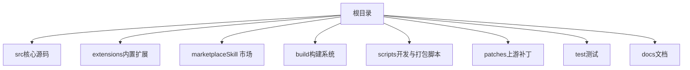
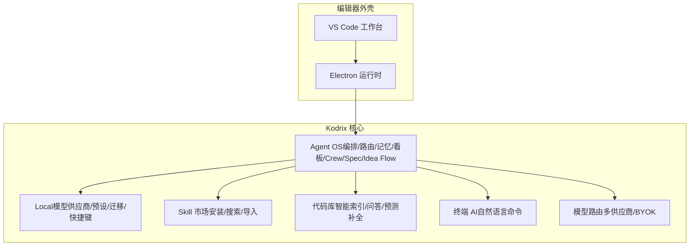
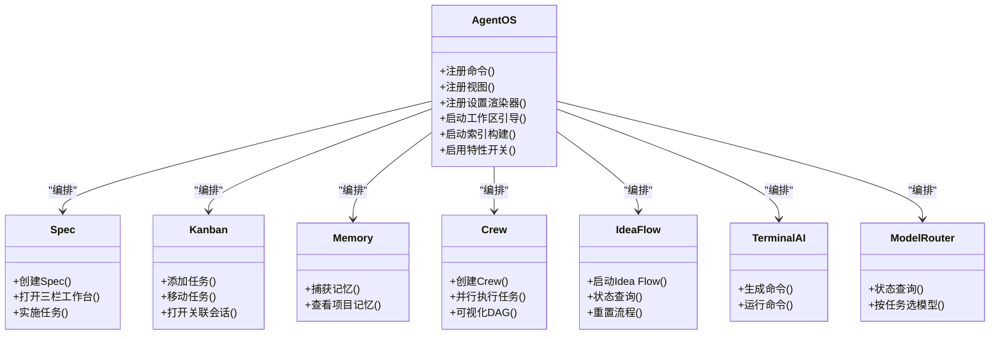
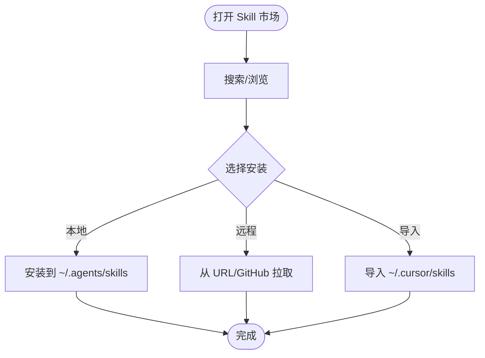
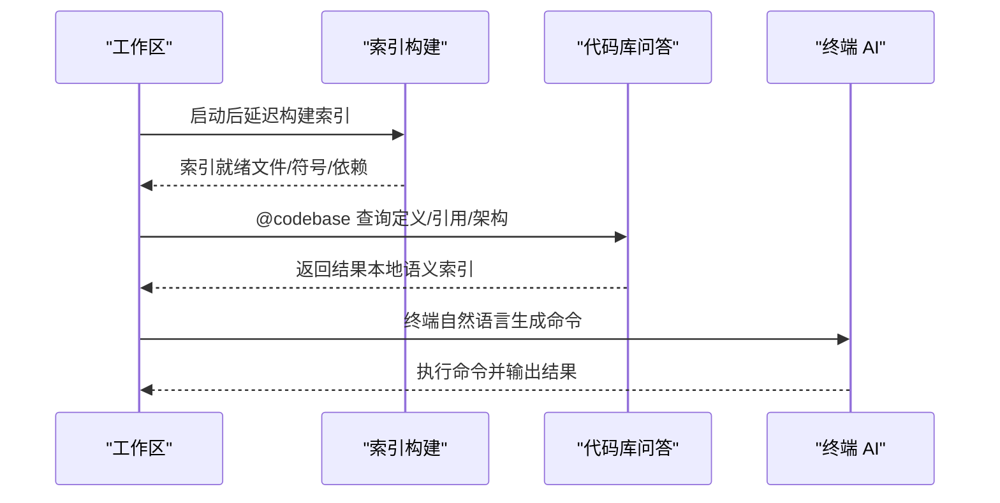
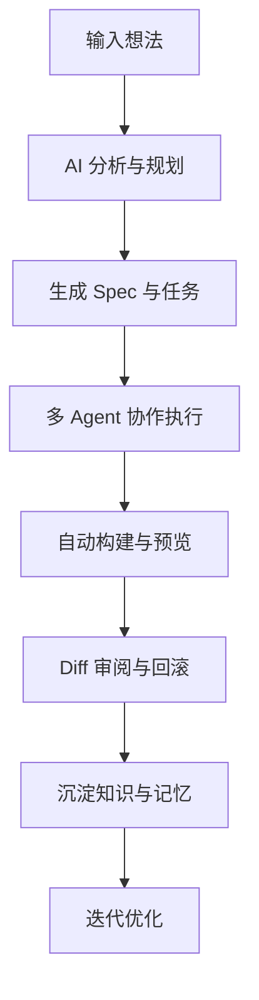
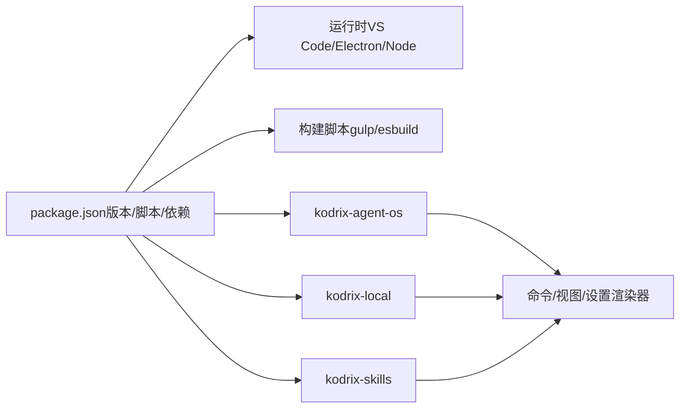

# 项目概述

<cite>
**本文引用的文件**
- [README.md](file://README.md)
- [package.json](file://package.json)
- [AGENTS.md](file://AGENTS.md)
- [extensions/kodrix-agent-os/package.json](file://extensions/kodrix-agent-os/package.json)
- [extensions/kodrix-agent-os/src/extension.ts](file://extensions/kodrix-agent-os/src/extension.ts)
- [extensions/kodrix-local/package.json](file://extensions/kodrix-local/package.json)
- [extensions/kodrix-local/src/extension.ts](file://extensions/kodrix-local/src/extension.ts)
- [extensions/kodrix-skills/package.json](file://extensions/kodrix-skills/package.json)
- [docs/项目非常有必要新实现的核心功能总报告.md](file://docs/项目非常有必要新实现的核心功能总报告.md)
- [docs/kodrix体检与Cursor对标差距文档.html](file://docs/kodrix体检与Cursor对标差距文档.html)
</cite>

## 更新摘要
**变更内容**
- 更新了核心功能实现状态：P0/P1/P2 共9项功能已全部实现（2026-09-25）
- 更新了项目成熟度评估：从开发阶段进入体验打磨期
- 更新了功能架构图：反映已实现的完整功能集
- 更新了技术栈说明：确认VS Code 1.128.0、Electron 42.x、Node 24.17+基线

## 目录
1. [简介](#简介)
2. [项目结构](#项目结构)
3. [核心组件](#核心组件)
4. [架构总览](#架构总览)
5. [详细组件分析](#详细组件分析)
6. [依赖关系分析](#依赖关系分析)
7. [性能考量](#性能考量)
8. [故障排查指南](#故障排查指南)
9. [结论](#结论)
10. [附录](#附录)

## 简介
Kodrix Code 是基于 VS Code / VSCodium 的 AI 原生代码编辑器，定位为"让软件开发回归想法本身"的本地可构建、可调试工程级 IDE。它在 VS Code 1.128.0、Electron 42.x、Node 24.17+ 的基础上，深度集成多 Agent 协作、智能补全、Idea Flow、Spec 驱动开发、Agent OS、Codebase Intelligence、终端 AI、Skill 市场等能力，提供与 Cursor/Windsurf/Qoder/Kiro 等竞品对标且持续超越的体验。

**重要更新**：截至2026年9月25日，项目已完成所有P0/P1/P2优先级功能（共9项），包括Learning Engine 2.0、Checkpoint时间线画廊、主动上下文感知、Vibe Coding迭代、Wiki 2.0、Agent Crew冲突检测、性能优化、Code Lens for Agents和自然语言命令面板。项目现已进入体验打磨阶段。

与传统编辑器的区别在于：
- 以 Agent 为中心：从需求到交付由多 Agent 协同完成，支持 Crew 编排、看板与任务流转。
- 越用越聪明：通过 Memory、Learning Engine、语义索引与主动上下文注入，使编辑器随使用积累项目知识。
- 本地优先：强调本地可构建、可调试、可审计；同时兼容云端模型路由与 BYOK。
- 工作流内嵌：Spec、Wiki、Checkpoint、Apply/Diff 审阅、Terminal AI 等能力直接融入编辑体验。

核心价值主张
- 从模糊想法到可运行应用的全自动流水线（Idea Flow）。
- 面向复杂工程的"代码库智能 + 多 Agent 协作"。
- 开箱即用的 Skill 生态与供应商管理。
- 大厂级工程化体验：快速启动、热更新、健壮的错误边界与可观测性。

**章节来源**
- [README.md:1-34](file://README.md#L1-L34)
- [AGENTS.md:1-10](file://AGENTS.md#L1-L10)

## 项目结构
仓库采用"核心 + 扩展"的分层组织：
- src：VS Code 核心框架与主进程入口（TypeScript），包含平台服务、编辑器、工作台、会话与服务端等模块。
- extensions：内置扩展集合，包括 kodrix-agent-os、kodrix-local、kodrix-skills、copilot、git 等。
- marketplace：Skill 包目录与 catalog。
- build/scripts：构建系统（gulp + esbuild）与开发/打包脚本。
- patches：对上游 VSCodium 的补丁。
- test/docs：测试与文档。

**图表来源**
- [AGENTS.md:9-54](file://AGENTS.md#L9-L54)

**章节来源**
- [AGENTS.md:9-54](file://AGENTS.md#L9-L54)
- [README.md:69-85](file://README.md#L69-L85)

## 核心组件
- Kodrix Agent OS：统一编排 Spec、Kanban、Memory、Crew、Arena、Hooks、ACP、Model Router、Tab Completion、Background Agent、Idea Flow、Vibe Coding、Terminal AI、Checkpoints、Apply/Diff 审阅等。
- Kodrix Local：本地/云端模型供应商配置、预设、迁移、Cursor 风格快捷键与一键导入、Agents 窗口、Composer、@Codebase 上下文等。
- Kodrix Skills：Skill 市场（卡片安装、搜索、GitHub/URL 安装、导入 Cursor Skills）。
- 代码库智能：AST 级符号/依赖/调用图索引、自然语言问答、预测补全、索引管理与统计。
- 终端 AI：自然语言生成命令并执行，提升命令行效率。
- 模型路由：多供应商预设与 BYOK，按任务类型选择模型。

这些能力在激活时注册命令、视图、设置渲染器与事件监听，形成统一的 Agent 工作流。

**章节来源**
- [extensions/kodrix-agent-os/package.json:23-54](file://extensions/kodrix-agent-os/package.json#L23-L54)
- [extensions/kodrix-agent-os/src/extension.ts:158-239](file://extensions/kodrix-agent-os/src/extension.ts#L158-L239)
- [extensions/kodrix-local/package.json:23-144](file://extensions/kodrix-local/package.json#L23-L144)
- [extensions/kodrix-local/src/extension.ts:84-212](file://extensions/kodrix-local/src/extension.ts#L84-L212)
- [extensions/kodrix-skills/package.json:33-90](file://extensions/kodrix-skills/package.json#L33-L90)

## 架构总览
Kodrix 的架构围绕"Agent OS 中枢 + 能力扩展 + 代码库智能 + 终端 AI + 技能市场"展开。Agent OS 作为中枢协调各子系统，Local 负责模型与供应商接入，Skills 提供可插拔能力，代码库智能为所有 Agent 提供上下文基础。

**图表来源**
- [extensions/kodrix-agent-os/src/extension.ts:158-239](file://extensions/kodrix-agent-os/src/extension.ts#L158-L239)
- [extensions/kodrix-local/src/extension.ts:84-212](file://extensions/kodrix-local/src/extension.ts#L84-L212)
- [extensions/kodrix-skills/package.json:33-90](file://extensions/kodrix-skills/package.json#L33-L90)

## 详细组件分析

### Agent OS 组件
Agent OS 是 Kodrix 的"操作系统"，负责将用户需求转化为可执行的 Agent 工作流。它暴露大量命令与视图，覆盖 Spec、Kanban、Memory、Crew、Arena、Hooks、ACP、Model Router、Tab Completion、Background Agent、Idea Flow、Vibe Coding、Terminal AI、Checkpoints、Apply/Diff 审阅等。

**图表来源**
- [extensions/kodrix-agent-os/package.json:23-54](file://extensions/kodrix-agent-os/package.json#L23-L54)
- [extensions/kodrix-agent-os/src/extension.ts:158-239](file://extensions/kodrix-agent-os/src/extension.ts#L158-L239)

**章节来源**
- [extensions/kodrix-agent-os/package.json:23-54](file://extensions/kodrix-agent-os/package.json#L23-L54)
- [extensions/kodrix-agent-os/src/extension.ts:158-239](file://extensions/kodrix-agent-os/src/extension.ts#L158-L239)

### Local 组件（模型与供应商）
Local 扩展聚焦于模型供应商配置、预设、迁移、快捷键与 Agents 窗口体验，提供 Cursor 风格的交互与一键导入能力。

```mermaid
sequenceDiagram
participant U as "用户"
participant L as "Kodrix Local"
participant P as "供应商预设"
participant M as "模型路由"
participant A as "Agent OS"
U->>L : 打开欢迎向导/应用预设
L->>P : 加载预设列表
L->>U : 提示输入 API Key如需
L->>M : 写入模型路由配置
L->>A : 触发首次迁移/默认行为
A-->>U : 显示 Agents 窗口/Hub/Chat
```

**图表来源**
- [extensions/kodrix-local/src/extension.ts:84-212](file://extensions/kodrix-local/src/extension.ts#L84-L212)
- [extensions/kodrix-local/package.json:23-144](file://extensions/kodrix-local/package.json#L23-L144)

**章节来源**
- [extensions/kodrix-local/src/extension.ts:84-212](file://extensions/kodrix-local/src/extension.ts#L84-L212)
- [extensions/kodrix-local/package.json:23-144](file://extensions/kodrix-local/package.json#L23-L144)

### Skill 市场组件
Skill 市场提供卡片式安装、搜索、GitHub/URL 安装与导入 Cursor Skills 的能力，并通过活动栏视图集中展示。

**图表来源**
- [extensions/kodrix-skills/package.json:33-90](file://extensions/kodrix-skills/package.json#L33-L90)

**章节来源**
- [extensions/kodrix-skills/package.json:33-90](file://extensions/kodrix-skills/package.json#L33-L90)

### 代码库智能与终端 AI
- 代码库智能：启动后延迟构建全工程 AST 级索引，提供自然语言问答、预测补全与索引管理面板。
- 终端 AI：在终端中通过自然语言生成命令并执行，提升命令行效率。

**图表来源**
- [extensions/kodrix-agent-os/src/extension.ts:214-259](file://extensions/kodrix-agent-os/src/extension.ts#L214-L259)

**章节来源**
- [extensions/kodrix-agent-os/src/extension.ts:214-259](file://extensions/kodrix-agent-os/src/extension.ts#L214-L259)

### 概念总览（面向初学者）
AI 编辑器不是简单的"聊天框 + 代码"，而是把"想法→设计→实现→验证→部署"的工作流内嵌到编辑器中。Kodrix 通过 Agent OS 将多 Agent 协作、Spec 驱动、记忆与学习、代码库智能与终端 AI 整合在一起，让用户专注于业务目标，而非工具细节。

[本图为概念流程图，不直接映射具体源码]

## 依赖关系分析
- 运行时基线：VS Code 1.128.0、Electron 42.x、Node 24.17+（同 major 且 ≥ .nvmrc）。
- 构建与脚本：gulp + esbuild，配合 scripts 中的 dev-fast、build-exe 等脚本。
- 扩展依赖：kodrix-agent-os、kodrix-local、kodrix-skills 通过 package.json 的 contributes 注册命令、视图、设置渲染器与快捷键。
- 外部集成：Copilot 扩展、Git、语言特性等内置扩展提供基础能力。

**图表来源**
- [package.json:1-100](file://package.json#L1-L100)
- [extensions/kodrix-agent-os/package.json:23-54](file://extensions/kodrix-agent-os/package.json#L23-L54)
- [extensions/kodrix-local/package.json:23-144](file://extensions/kodrix-local/package.json#L23-L144)
- [extensions/kodrix-skills/package.json:33-90](file://extensions/kodrix-skills/package.json#L33-L90)

**章节来源**
- [package.json:1-100](file://package.json#L1-L100)
- [README.md:8-10](file://README.md#L8-L10)
- [AGENTS.md:78-95](file://AGENTS.md#L78-L95)

## 性能考量
- 首次编译与 Copilot 扩展打包耗时较长属正常现象（esbuild 多路并行）。
- 预安装阶段严格校验 Node 版本，避免环境不一致导致的启动失败。
- Electron 经 gulp-electron 下载到缓存目录，减少重复下载。
- 开发模式支持跳过 preLaunch 以提升启动速度；客户端过期时走快速构建路径。
- 索引构建延迟启动，尊重"索引新文件夹"开关，避免不必要的 IO 压力。

建议
- 使用 dev-fast 脚本进行增量开发，减少冷启动时间。
- 合理配置索引范围与忽略规则，控制索引规模。
- 按需启用特性开关（如 Tab 补全、Terminal AI），降低资源占用。

**章节来源**
- [README.md:97-104](file://README.md#L97-L104)
- [AGENTS.md:88-95](file://AGENTS.md#L88-L95)

## 故障排查指南
常见问题与定位要点
- 启动卡死：优先检查日志、REPAIR-NOTES 与相关审计报告。
- Native 模块问题：确认 Node 版本与 npm 版本符合约束；必要时重新安装依赖。
- 中文语言包：确保语言包注入脚本执行成功。
- 索引构建失败：查看索引重建命令的输出与错误日志；确认工作区已打开且权限正常。
- 模型供应商配置：通过 Provider Workbench 或预设应用，确保 API Key 正确且网络可达。

排障顺序
- 日志 → REPAIR-NOTES → 审计报告 → 再改代码。
- 对于迁移与导入操作，注意重试上限与失败记录。

**章节来源**
- [AGENTS.md:97-103](file://AGENTS.md#L97-L103)
- [extensions/kodrix-local/src/extension.ts:181-204](file://extensions/kodrix-local/src/extension.ts#L181-L204)

## 结论
Kodrix Code 以 Agent OS 为核心，将多 Agent 协作、代码库智能、终端 AI、Skill 市场与模型路由深度融合，提供从想法到产品的全自动流水线与"越用越聪明"的工程体验。其技术栈基于成熟的 VS Code 体系，结合本地优先与厂商无关的模型路由策略，既满足专业开发者对可控性与可审计性的要求，也为初学者提供了低门槛的 AI 编程体验。

**重要里程碑**：截至2026年9月25日，项目已完成所有P0/P1/P2优先级功能（共9项），包括：
- **Phase 1 (P0)**：Learning Engine 2.0、Checkpoint时间线画廊、主动上下文感知增强
- **Phase 2 (P1)**：Vibe Coding迭代、Wiki 2.0 + Code Smell检测、Agent Crew冲突检测  
- **Phase 3 (P2)**：性能优化、Code Lens for Agents、自然语言命令面板

项目现已进入体验打磨阶段，重点转向界面动画、微交互和差异化壁垒深化。

**章节来源**
- [docs/项目非常有必要新实现的核心功能总报告.md:1-13](file://docs/项目非常有必要新实现的核心功能总报告.md#L1-L13)
- [docs/kodrix体检与Cursor对标差距文档.html:258-292](file://docs/kodrix体检与Cursor对标差距文档.html#L258-L292)

## 附录
- 快速开始与构建说明见 README 与 AGENTS。
- 产品品牌与运行时配置位于 product.json。
- 关键脚本与依赖集中在 package.json。

**章节来源**
- [README.md:36-67](file://README.md#L36-L67)
- [AGENTS.md:58-86](file://AGENTS.md#L58-L86)
- [package.json:1-100](file://package.json#L1-L100)