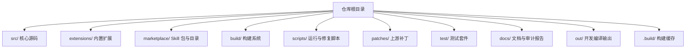
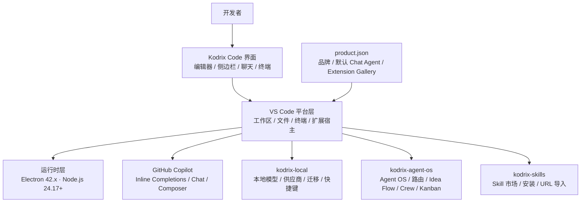
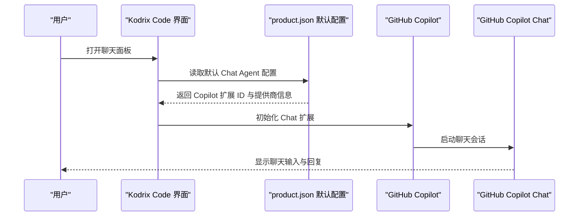
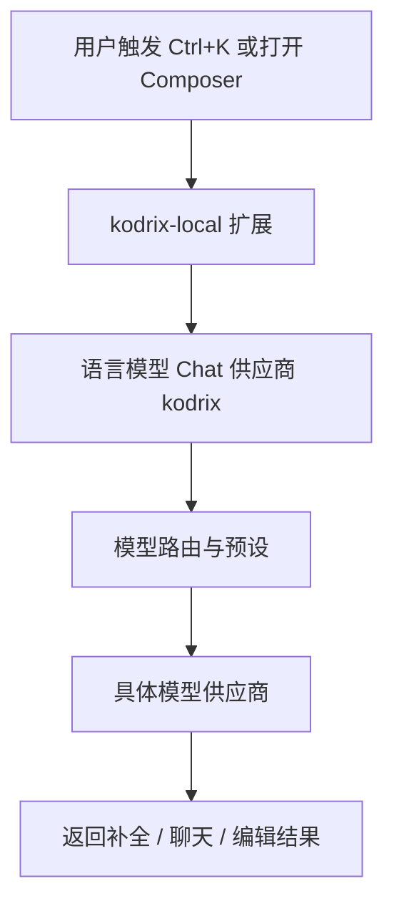
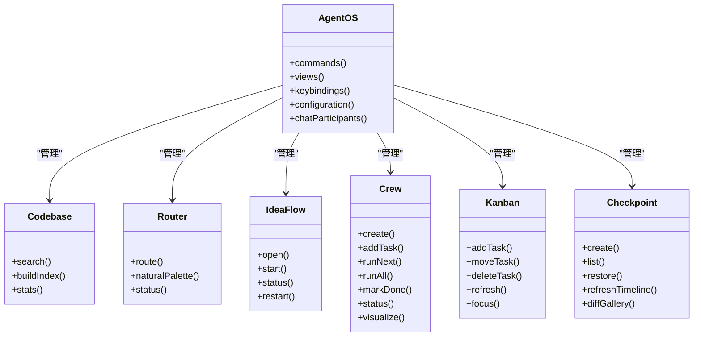
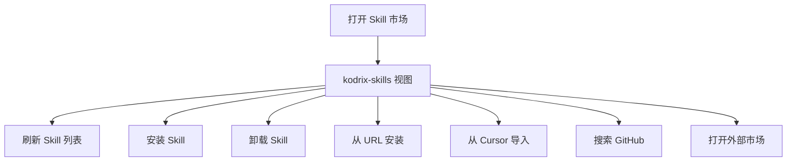
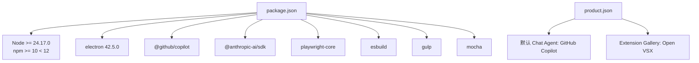

# 项目概述

<cite>
**本文引用的文件**   
- [README.md](file://README.md)
- [package.json](file://package.json)
- [product.json](file://product.json)
- [AGENTS.md](file://AGENTS.md)
- [.nvmrc](file://.nvmrc)
- [extensions/kodrix-agent-os/package.json](file://extensions/kodrix-agent-os/package.json)
- [extensions/kodrix-local/package.json](file://extensions/kodrix-local/package.json)
- [extensions/kodrix-skills/package.json](file://extensions/kodrix-skills/package.json)
</cite>

## 目录
1. [引言](#引言)
2. [项目结构](#项目结构)
3. [核心组件](#核心组件)
4. [架构总览](#架构总览)
5. [详细组件分析](#详细组件分析)
6. [依赖关系分析](#依赖关系分析)
7. [性能与构建特性](#性能与构建特性)
8. [快速开始与环境要求](#快速开始与环境要求)
9. [关键配置说明](#关键配置说明)
10. [常见问题与排障建议](#常见问题与排障建议)
11. [结论](#结论)

## 引言
Kodrix Code 是基于 VS Code / VSCodium 深度定制的 AI 原生代码编辑器。它在 VS Code 1.128.0 基线上，集成多 Agent 协作、智能补全、Idea Flow、模型路由、Skill 市场等能力，面向本地可构建、可调试的完整源码工程。项目同时内置 GitHub Copilot 扩展，并提供 `kodrix-local`、`kodrix-agent-os`、`kodrix-skills` 等自有扩展，用于实现 Cursor 风格体验、Agent OS 编排与 Skill 生态。

从产品定位看，Kodrix Code 不是简单的主题或插件集合，而是以“AI 工作流 + 编辑器内核”的方式重构开发体验：用户可以在同一窗口内完成需求构思、代码生成、多 Agent 协作、任务看板、记忆沉淀、终端 AI 指令执行以及 Skill 安装与复用。

**章节来源**
- [README.md:1-34](file://README.md#L1-L34)

## 项目结构
仓库采用“核心框架 + 内置扩展 + 构建脚本 + 补丁体系”的结构：

- `src/`：VS Code 核心 TypeScript 源码与 Electron 主进程入口。
- `extensions/`：内置扩展，包括 `copilot`、`git`、`typescript-language-features` 等通用扩展，以及 Kodrix 自研扩展 `kodrix-local`、`kodrix-agent-os`、`kodrix-skills`。
- `marketplace/`：Skill 示例包与 catalog，配合 `kodrix-skills` 使用。
- `build/`：gulp + esbuild 构建系统，负责编译客户端、Copilot 扩展、打包 Electron 产物等。
- `scripts/`：开发、打包、修复脚本，如 `debug.bat`、`dev-fast.ps1`、`apply-zh-langpack.mjs`。
- `patches/`：VSCodium 上游补丁，用于品牌、更新、安全、UI 等定制。
- `test/`：单元测试、冒烟测试、MCP 相关测试。
- `docs/`：文档、体检报告、缺陷审计与必做功能报告。
- `out/`：开发模式编译输出。
- `.build/`：构建缓存，包含 Electron、扩展产物等。

**图表来源**
- [AGENTS.md:9-54](file://AGENTS.md#L9-L54)
- [README.md:69-85](file://README.md#L69-L85)

**章节来源**
- [AGENTS.md:9-54](file://AGENTS.md#L9-L54)
- [README.md:69-85](file://README.md#L69-L85)

## 核心组件
Kodrix Code 的核心能力由以下组件共同构成：

| 组件 | 职责 | 主要体现 |
|---|---|---|
| VS Code 内核 | 提供编辑器、工作台、Electron 运行时、语言服务基础能力 | `src/`、`package.json` 中的 `main` 与依赖 |
| GitHub Copilot | 提供 Inline Completions、Chat、Composer、Agent 等 AI 能力 | `extensions/copilot`、`product.json` 默认 Chat Agent |
| kodrix-local | 本地模型供应商、Cursor 风格体验、Ctrl+K 编辑、Composer、模型路由预设 | `extensions/kodrix-local/package.json` |
| kodrix-agent-os | Agent OS：codebase、路由、Idea Flow、Crew、Kanban、记忆、Checkpoint 等 | `extensions/kodrix-agent-os/package.json` |
| kodrix-skills | Skill 市场、安装、卸载、GitHub 搜索、URL 安装 | `extensions/kodrix-skills/package.json` |
| product.json | 产品品牌、数据目录、扩展 API 提案、默认 Chat Agent、Extension Gallery | `product.json` |
| package.json | Node/npm 引擎约束、脚本、依赖、Electron 版本 | `package.json` |

这些组件通过 VS Code 扩展机制、命令、视图、菜单、配置项和语言模型 API 组合成完整的 AI 开发体验。

**章节来源**
- [package.json:1-14](file://package.json#L1-L14)
- [product.json:1-10](file://product.json#L1-L10)
- [extensions/kodrix-local/package.json:1-20](file://extensions/kodrix-local/package.json#L1-L20)
- [extensions/kodrix-agent-os/package.json:1-20](file://extensions/kodrix-agent-os/package.json#L1-L20)
- [extensions/kodrix-skills/package.json:1-20](file://extensions/kodrix-skills/package.json#L1-L20)

## 架构总览
Kodrix Code 的整体架构可以理解为三层：

1. **运行时层**：Electron 42.x + Node.js 24.17+，承载 VS Code 主进程、渲染进程、扩展宿主。
2. **平台层**：VS Code 核心框架、语言服务、终端、文件系统、网络、策略、遥测等。
3. **能力层**：GitHub Copilot 与 Kodrix 自研扩展提供的 AI 能力，包括补全、聊天、Agent、模型路由、Skill 市场、Idea Flow 等。

**图表来源**
- [package.json:9-14](file://package.json#L9-L14)
- [product.json:1-10](file://product.json#L1-L10)
- [product.json:723-789](file://product.json#L723-L789)
- [extensions/kodrix-local/package.json:40-45](file://extensions/kodrix-local/package.json#L40-L45)
- [extensions/kodrix-agent-os/package.json:28-54](file://extensions/kodrix-agent-os/package.json#L28-L54)
- [extensions/kodrix-skills/package.json:32-50](file://extensions/kodrix-skills/package.json#L32-L50)

## 详细组件分析

### GitHub Copilot 与默认 Chat Agent
Kodrix Code 将 GitHub Copilot 作为默认 Chat Agent，并通过 `product.json` 配置默认 Chat 扩展、日志输出、提供商信息与相关命令。这意味着用户在打开聊天面板时，默认会进入 Copilot Chat 流程；同时，产品还暴露了多个与 Copilot 相关的设置、配额、计划、注册与管理链接。

**图表来源**
- [product.json:723-789](file://product.json#L723-L789)

**章节来源**
- [product.json:723-789](file://product.json#L723-L789)

### kodrix-local：本地模型与 Cursor 风格体验
`kodrix-local` 扩展提供本地模型供应商、模型路由预设、Cursor 迁移、Ctrl+K 编辑、Composer、Agent 窗口、Codebase 索引等能力。它通过 `languageModelChatProviders` 注册 `kodrix` 供应商，并通过命令和配置项暴露大量功能开关。

关键特征：
- 注册本地 Chat 供应商 `kodrix`。
- 提供 `kodrix.openInlineEdit`、`kodrix.openComposer`、`kodrix.openAgentsWindow` 等命令。
- 提供 `kodrix.modelRoutes` 模型路由配置。
- 提供 `kodrix.features.*` 系列开关，控制背景 Agent、Cloud Agent、Composer UI、Codebase Index、Agent Window 等行为。
- 提供 `ctrl+k`、`ctrl+l`、`ctrl+i` 等快捷键，贴近 Cursor 习惯。

**图表来源**
- [extensions/kodrix-local/package.json:40-45](file://extensions/kodrix-local/package.json#L40-L45)
- [extensions/kodrix-local/package.json:46-141](file://extensions/kodrix-local/package.json#L46-L141)
- [extensions/kodrix-local/package.json:143-227](file://extensions/kodrix-local/package.json#L143-L227)
- [extensions/kodrix-local/package.json:229-267](file://extensions/kodrix-local/package.json#L229-L267)

**章节来源**
- [extensions/kodrix-local/package.json:1-281](file://extensions/kodrix-local/package.json#L1-L281)

### kodrix-agent-os：Agent OS、Idea Flow、模型路由与 Crew
`kodrix-agent-os` 是 Kodrix 的 Agent 操作系统扩展，承担更复杂的编排能力。它注册了 `kodrix.codebase` 聊天参与者、多种命令、视图、快捷键、配置项，并启用 `chatContextProvider` 等 API 提案。

典型能力包括：
- Codebase 查询、索引、统计。
- 模型路由状态查看与自然语言调色板。
- Idea Flow 命令：打开、启动、状态、重启。
- Crew 管理：创建、添加任务、运行下一个、运行全部、标记完成、状态、可视化。
- Kanban 看板：添加任务、移动任务、删除任务、刷新、聚焦。
- Checkpoint 检查点：创建、列表、恢复、时间线刷新、差异画廊。
- 学习与会话学习：捕获、仪表盘、Hook 安装、会话状态、处理待处理会话。
- 终端 AI：AI Prompt、AI Run。
- Tab Completion 统计。

**图表来源**
- [extensions/kodrix-agent-os/package.json:28-54](file://extensions/kodrix-agent-os/package.json#L28-L54)
- [extensions/kodrix-agent-os/package.json:86-483](file://extensions/kodrix-agent-os/package.json#L86-L483)
- [extensions/kodrix-agent-os/package.json:485-546](file://extensions/kodrix-agent-os/package.json#L485-L546)
- [extensions/kodrix-agent-os/package.json:588-800](file://extensions/kodrix-agent-os/package.json#L588-L800)

**章节来源**
- [extensions/kodrix-agent-os/package.json:1-800](file://extensions/kodrix-agent-os/package.json#L1-L800)

### kodrix-skills：Skill 市场与安装
`kodrix-skills` 扩展提供 Skill 市场视图、刷新、安装、卸载、从 URL 安装、从 Cursor 导入、GitHub 搜索、打开市场等功能。它通过活动栏容器和 webview 展示 Skill 市场，并通过配置项控制安装目录与注册表地址。

**图表来源**
- [extensions/kodrix-skills/package.json:32-50](file://extensions/kodrix-skills/package.json#L32-L50)
- [extensions/kodrix-skills/package.json:51-102](file://extensions/kodrix-skills/package.json#L51-L102)
- [extensions/kodrix-skills/package.json:104-121](file://extensions/kodrix-skills/package.json#L104-L121)

**章节来源**
- [extensions/kodrix-skills/package.json:1-135](file://extensions/kodrix-skills/package.json#L1-L135)

## 依赖关系分析
Kodrix Code 的依赖关系可以分为三类：

1. **运行时依赖**：Electron、Node.js、npm 版本约束。
2. **VS Code 扩展依赖**：GitHub Copilot、Git、TypeScript 语言特性、xterm、vscode-languagedetection 等。
3. **AI 与工具链依赖**：Anthropic SDK、OpenAI Codex、Playwright、esbuild、gulp、mocha 等。

**图表来源**
- [package.json:9-14](file://package.json#L9-L14)
- [package.json:105-169](file://package.json#L105-L169)
- [package.json:218-220](file://package.json#L218-L220)
- [product.json:53-60](file://product.json#L53-L60)
- [product.json:723-789](file://product.json#L723-L789)

**章节来源**
- [package.json:9-14](file://package.json#L9-L14)
- [package.json:105-169](file://package.json#L105-L169)
- [package.json:218-220](file://package.json#L218-L220)
- [product.json:53-60](file://product.json#L53-L60)
- [product.json:723-789](file://product.json#L723-L789)

## 性能与构建特性
Kodrix Code 在构建与开发体验上做了多项优化：

- 使用 esbuild 进行快编译，支持热更新。
- 通过 `dev-fast.ps1` 设置 `VSCODE_SKIP_PRELAUNCH` 跳过预启动阶段，加快启动速度。
- 首次 Copilot 扩展 esbuild 打包可能耗时较长，属于正常现象。
- Electron 通过 `@vscode/gulp-electron` 下载到 `.build/electron/`。
- 构建脚本区分客户端编译、Copilot 编译、扩展编译与打包。
- 提供 `compile`、`build-fast`、`watch`、`package:win32` 等 npm 脚本。

这些特性适合本地开发、调试与持续集成场景，但也意味着首次构建需要一定时间和磁盘空间。

**章节来源**
- [README.md:97-104](file://README.md#L97-L104)
- [AGENTS.md:88-95](file://AGENTS.md#L88-L95)
- [package.json:16-104](file://package.json#L16-L104)

## 快速开始与环境要求

### 环境要求
- Node.js：必须匹配 `.nvmrc`（当前为 `24.17.0`），同 major 且不低于该版本；npm 需小于 12。
- Windows：推荐使用 PowerShell；打安装包需要本机构建工具链。
- 首次依赖安装与 Copilot 扩展打包可能较慢，属正常现象。
- 如果 Cursor 沙箱 PATH 指向 Node 22，请使用系统合规 Node 24 安装依赖。

**章节来源**
- [README.md:38-43](file://README.md#L38-L43)
- [.nvmrc:1-2](file://.nvmrc#L1-L2)

### 开发入口
Windows 根目录常用命令：
- `.\debug.bat`：带实时日志的控制台调试启动。
- `.\debug.bat -Watch`：热更新，修改 `src/` 后自动增量重编译。
- `.\debug-rebuild.bat`：一键全量重编译并带日志启动。
- `.\build.bat`：一键重新编译打包 EXE 安装包。

等价 npm 脚本：
- `npm run dev:prepare`：准备开发产物，不启动。
- `npm run package:win32`：打包 Windows EXE。
- `npm run compile`：编译客户端与 Copilot。

**章节来源**
- [README.md:45-67](file://README.md#L45-L67)

## 关键配置说明

### 产品配置
`product.json` 定义产品品牌、数据目录、Extension Gallery、默认 Chat Agent、许可证、崩溃上报等信息。其中：
- `nameShort`、`nameLong`、`applicationName` 决定产品名称与应用标识。
- `dataFolderName`、`sharedDataFolderName`、`serverDataFolderName` 决定数据存储目录。
- `extensionsGallery.serviceUrl` 指向 Open VSX。
- `defaultChatAgent` 指定默认 Chat 扩展与提供商。

**章节来源**
- [product.json:1-10](file://product.json#L1-L10)
- [product.json:43-60](file://product.json#L43-L60)
- [product.json:723-789](file://product.json#L723-L789)

### Node 与 npm 引擎
`package.json` 中声明 Node 与 npm 引擎约束，确保构建环境与预期一致。

**章节来源**
- [package.json:9-14](file://package.json#L9-L14)

### 扩展配置
- `kodrix-local`：提供本地模型供应商、模型路由、Composer、Agent 窗口、快捷键等配置。
- `kodrix-agent-os`：提供 Agent OS、Idea Flow、Crew、Kanban、Checkpoint、Terminal AI、Tab Completion 等配置。
- `kodrix-skills`：提供 Skill 安装目录与注册表地址配置。

**章节来源**
- [extensions/kodrix-local/package.json:143-227](file://extensions/kodrix-local/package.json#L143-L227)
- [extensions/kodrix-agent-os/package.json:588-800](file://extensions/kodrix-agent-os/package.json#L588-L800)
- [extensions/kodrix-skills/package.json:104-121](file://extensions/kodrix-skills/package.json#L104-L121)

## 常见问题与排障建议
根据 README 与 AGENTS 文档，常见启动与构建问题包括：

- 启动卡死：优先查看日志与 `REPAIR-NOTES.md`。
- Native 模块问题：确认 Node 版本与 npm 版本是否符合约束。
- 中文语言包注入：使用 `scripts/apply-zh-langpack.mjs` 或相关脚本。
- Copilot 扩展首次打包慢：等待 esbuild 并行打包完成。
- Electron 下载路径：位于 `.build/electron/`。
- 开发启动加速：使用 `VSCODE_SKIP_PRELAUNCH` 环境变量。

**章节来源**
- [README.md:97-104](file://README.md#L97-L104)
- [AGENTS.md:88-95](file://AGENTS.md#L88-L95)

## 结论
Kodrix Code 是一个以 VS Code 为基础、以 AI 工作流为核心的代码编辑器分支。它通过 GitHub Copilot 与自研扩展组合，实现了从智能补全、聊天、Composer、Agent 协作到 Skill 市场的完整闭环。对于初学者，它可以降低 AI 辅助开发的门槛；对于有经验的开发者，它提供了足够的扩展点、配置项与构建能力，便于二次开发与团队定制。

在实际使用中，建议先明确自身需求：如果只是需要 Cursor 风格的本地模型与快捷键体验，优先关注 `kodrix-local`；如果需要多 Agent 编排、Idea Flow、Crew 与 Kanban，则重点使用 `kodrix-agent-os`；如果需要扩展 Skill 生态，则结合 `kodrix-skills` 与 `marketplace/`。